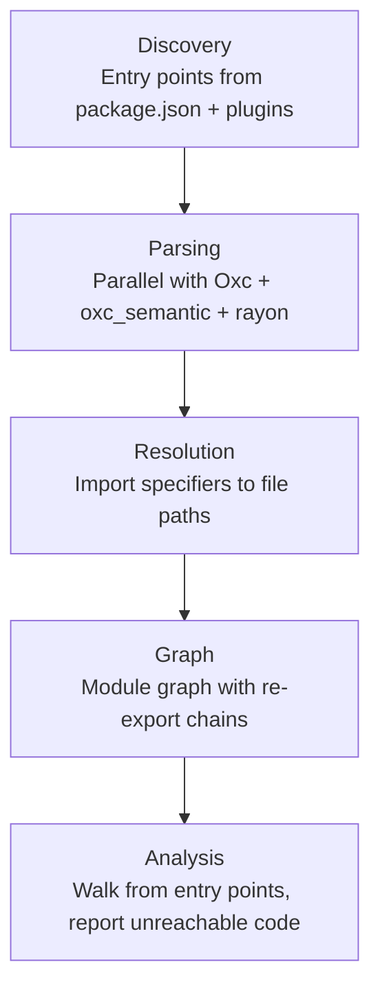
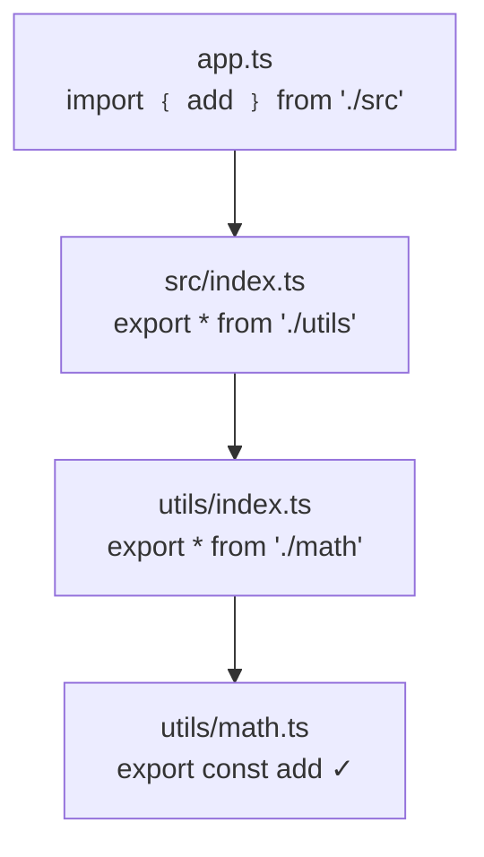

`fallow check` performs dead code analysis on your JavaScript/TypeScript project. It builds a module graph from your <Tooltip tip="Files that serve as roots of the module graph. Anything reachable from them is considered used.">entry points</Tooltip> and reports anything that isn't reachable.

This analysis requires building and traversing a complete module graph. It can't be approximated by reading files individually. Fallow does this deterministically in milliseconds, giving agents, developers, and CI pipelines the same reliable results.

```bash
fallow check
```

## Issue types

Fallow detects 13 types of dead code:

| Issue type | Description |
|:-----------|:------------|
| **Unused files** | Files not reachable from any entry point |
| **Unused exports** | Exported symbols never imported elsewhere |
| **Unused types** | Type aliases and interfaces never referenced |
| **Unused dependencies** | Packages in `dependencies` never imported or used as script binaries |
| **Unused devDependencies** | Packages in `devDependencies` never imported or used as script binaries |
| **Unused optionalDependencies** | Packages in `optionalDependencies` never imported or used as script binaries |
| **Unused enum members** | Enum values never referenced |
| **Unused class members** | Class methods and properties never referenced |
| **Unresolved imports** | Import specifiers that cannot be resolved |
| **Unlisted dependencies** | Imported packages missing from `package.json` |
| **Duplicate exports** | Same symbol exported from multiple modules |
| **Circular dependencies** | Modules that import each other directly or transitively |
| **Type-only dependencies** | Production dependencies only imported via `import type` (should be devDependencies) |

<Tip>
Most projects find 50+ unused exports on first run. Start with `--unused-exports` for quick wins.
</Tip>

Here's what typical output looks like when fallow finds multiple issue types:

```bash title="$ fallow check"
Unused files (16)
  src/server/jobs/worker.ts
  src/server/jobs/cron.ts
  src/features/savings/hooks/usePotGroups.ts
  src/features/tax/hooks/useKiaSuggestion.ts
  src/features/forecasting/hooks/useTargetProgress.ts
  ... and 11 more

Unused exports (20)
  src/components/Card/index.ts
    :1  CardFooter
  src/providers/trpc-provider/index.tsx
    :12 TRPCProvider
  src/server/jobs/queue.ts
    :61  enqueueJobDelayed
    :206 sweepStuckProcessingJobs

Unused type exports (314)
  ... across 87 files

Unused dependencies (1)
  @trpc/react-query

Duplicate exports (50)
  ... across 23 files

Found 401 issues in 0.16s
```

## Filtering by issue type

Report only specific issue types:

```bash
fallow check --unused-files
fallow check --unused-exports --unused-types
fallow check --unresolved-imports --unlisted-deps
```

## Output formats

<Tabs>
  <Tab title="Human (default)">
    Colored terminal output designed for readability.

    ```bash
    fallow check --format human
    ```

    ```ansi
    src/components/Card/index.ts
      unused-export  CardFooter  (line 1)

    src/server/jobs/queue.ts
      unused-export  enqueueJobDelayed  (line 61)
      unused-export  sweepStuckProcessingJobs  (line 206)

    src/server/jobs/worker.ts
      unused-file  Not reachable from any entry point

    Found 401 issues (17 errors, 384 warnings)
    ```
  </Tab>
  <Tab title="JSON">
    Machine-readable JSON for scripting and tooling integration.

    ```bash
    fallow check --format json
    ```

    ```json
    {
      "issues": [
        {
          "type": "unused-export",
          "file": "src/server/jobs/queue.ts",
          "symbol": "enqueueJobDelayed",
          "line": 61,
          "severity": "warning"
        }
      ],
      "summary": {
        "total": 401,
        "errors": 17,
        "warnings": 384
      }
    }
    ```
  </Tab>
  <Tab title="SARIF">
    <Tooltip tip="Static Analysis Results Interchange Format, a JSON-based standard for static analysis tool output">SARIF</Tooltip> format for GitHub Code Scanning and other static analysis tools.

    ```bash
    fallow check --format sarif
    ```

    ```json
    {
      "$schema": "https://raw.githubusercontent.com/oasis-tcs/sarif-spec/main/sarif-2.1/schema/sarif-schema-2.1.0.json",
      "version": "2.1.0",
      "runs": [{
        "tool": { "driver": { "name": "fallow" } },
        "results": [
          {
            "ruleId": "unused-export",
            "message": { "text": "Export 'enqueueJobDelayed' is never imported" },
            "locations": [{ "physicalLocation": { "artifactLocation": { "uri": "src/server/jobs/queue.ts" } } }]
          }
        ]
      }]
    }
    ```
  </Tab>
  <Tab title="Compact">
    One-line-per-issue output, ideal for grep and editor integration.

    ```bash
    fallow check --format compact
    ```

    ```text
    unused-file:src/server/jobs/worker.ts
    unused-file:src/server/jobs/cron.ts
    unused-export:src/server/jobs/queue.ts:61:enqueueJobDelayed
    unused-export:src/components/Card/index.ts:1:CardFooter
    ```
  </Tab>
  <Tab title="Markdown">
    Formatted markdown output for PR comments and documentation.

    ```bash
    fallow check --format markdown
    ```

    ```markdown
    ## Fallow: 4 issues found

    ### Unused files (2)

    - `src/server/jobs/worker.ts`
    - `src/server/jobs/cron.ts`

    ### Unused exports (2)

    - `src/server/jobs/queue.ts`
      - :61 `enqueueJobDelayed`
      - :206 `sweepStuckProcessingJobs`
    ```

    Pipe directly to `gh pr comment`:

    ```bash
    fallow check --format markdown | gh pr comment --body-file -
    ```
  </Tab>
</Tabs>

## Incremental analysis

Only check files changed since a git ref:

```bash
fallow check --changed-since main
fallow check --changed-since HEAD~5
```

This is useful in CI to only report new issues in a pull request.

```bash title="$ fallow check --changed-since main"
Checking 12 changed files...

Unused exports (2)
  src/features/savings/hooks/usePotGroups.ts
    :8  usePotGroupTotals
  src/server/jobs/queue.ts
    :276 getDeadLetterJobs

Found 2 issues in 0.04s
```

## Baseline comparison

Adopt fallow incrementally by saving a baseline of existing issues:

```bash
# Save current issues as baseline
fallow check --save-baseline

# Only fail on new issues (compared to baseline)
fallow check --baseline
```

## Debugging

Trace why an export is or isn't considered used:

```bash
fallow check --trace src/utils.ts:formatDate
fallow check --trace-file src/utils.ts
fallow check --trace-dependency lodash
```

## How it works

Fallow uses syntactic analysis with scope-aware binding resolution via Oxc: no TypeScript compiler, no type information. This is what makes it fast.



This graph-based approach guarantees completeness regardless of project size.

<Note>
Fallow works best with projects using `isolatedModules: true` (required for esbuild, swc, and Vite). `oxc_semantic` scope analysis detects unused import bindings (imports where the bound name is never read), but legacy tsc-only projects without `isolatedModules` may still see edge cases with type-only imports.
</Note>

## Script binary analysis

Fallow parses `package.json` scripts to detect CLI tool usage, reducing false positives in unused dependency detection. When you have a script like `"lint": "eslint src/"`, fallow recognizes that `eslint` is a binary provided by the `eslint` package and marks it as used.

This works in several ways:

- **Binary name to package name mapping:** Script commands like `tsc`, `vitest`, or `next` are mapped back to their parent packages (`typescript`, `vitest`, `next`). This prevents these packages from being reported as unused even when they're never `import`-ed in source code.
- **`--config` arguments as entry points:** When a script references a config file (e.g., `jest --config jest.e2e.config.ts`), fallow treats that config file as an entry point. This ensures config files are not flagged as unused.
- **File path arguments:** Direct file references in scripts (e.g., `node scripts/seed.js`) are also recognized as entry points.
- **Env wrappers and package manager runners:** Commands prefixed with `cross-env`, `npx`, `pnpx`, `yarn dlx`, or `node -r` are unwrapped to find the actual tool binary underneath.

```json
{
  "scripts": {
    "build": "tsc && vite build",
    "test": "vitest --config vitest.config.ts",
    "lint": "cross-env NODE_ENV=production eslint src/"
  }
}
```

In this example, fallow detects `typescript`, `vite`, `vitest`, and `eslint` as used dependencies, and `vitest.config.ts` as an entry point.

## Dynamic import resolution

Fallow resolves dynamic imports that use patterns rather than static strings. When you write `import(\`./locales/${lang}.json\`)`, the import target is not known at static analysis time. Fallow converts these patterns into glob expressions and matches them against discovered files.

Supported patterns:

| Pattern | Example | Resolved as |
|:--------|:--------|:------------|
| Template literals | `` import(`./icons/${name}.svg`) `` | `./icons/*.svg` |
| String concatenation | `import("./routes/" + path)` | `./routes/*` |
| `import.meta.glob` | `import.meta.glob("./modules/*.ts")` | `./modules/*.ts` |
| `require.context` | `require.context("./themes", true, /\.css$/)` | `./themes/**/*.css` |

Files matched by these glob patterns are marked as reachable in the module graph, preventing them from being reported as unused. This is useful for locale files, icon sets, route modules, and other convention-based directory structures.

<Note>
Dynamic imports with fully runtime-computed paths (e.g., `import(userInput)`) cannot be resolved statically. Use `entry` in your config to mark those directories as entry points.
</Note>

## Re-export chain resolution

Barrel files (`index.ts` files that re-export from other modules) are common in JavaScript projects. Fallow fully resolves `export *` chains through multiple levels of barrel files with cycle detection.

```typescript
// utils/math.ts
export const add = (a: number, b: number) => a + b;

// utils/index.ts (barrel)
export * from './math';

// src/index.ts (barrel)
export * from './utils';

// app.ts
import { add } from './src';
```



In this example, fallow traces the import of `add` in `app.ts` through `src/index.ts` and `utils/index.ts` back to `utils/math.ts`. The `add` export is correctly marked as used across the entire chain.

This resolution handles:

- **Multi-level chains:** Any depth of `export *` re-exports is followed until the original declaration is found.
- **Cycle detection:** Circular re-export chains (e.g., `a` re-exports from `b`, `b` re-exports from `a`) are detected and handled without infinite loops.
- **Mixed re-exports:** Named re-exports (`export { foo } from './bar'`) and namespace re-exports (`export * from './bar'`) are both tracked.

## Namespace import narrowing

When a file uses `import * as ns from './module'`, fallow narrows which exports are actually consumed by scanning for member accesses (`ns.foo`, `ns.bar`) and destructuring patterns (`const { foo, bar } = ns`) in the importing file.

```ts
import * as utils from './utils';

// Only foo and bar are marked as used — baz remains unused
const { foo } = utils;
utils.bar();
```

This works with static imports, dynamic imports (`const mod = await import('./x')`), and require (`const mod = require('./x')`).

Fallow also uses `oxc_semantic` scope analysis to detect imports where the binding is never read. An `import { foo } from './utils'` where `foo` is never referenced in the file does not count as a reference to the `foo` export — improving unused-export detection precision.

<Note>
Whole-object consumption patterns like `Object.values(ns)`, `{ ...ns }`, `for (const k in ns)`, and rest destructuring (`const { a, ...rest } = ns`) conservatively mark all exports as used, since the tool cannot determine which specific members are accessed.
</Note>

## Cross-reference with duplication

When you run `fallow check --include-dupes`, fallow cross-references dead code findings with code duplication analysis. Clone instances that appear in unused files or overlap with unused exports are flagged as **combined high-priority findings**.

```bash
fallow check --include-dupes
```

Use `--include-dupes` to prioritize cleanup: if a block of code is both duplicated *and* unused, removing it eliminates dead code and reduces duplication at the same time.

The cross-reference identifies:

- **Clone instances in unused files:** If a file is unreachable from entry points and contains duplicated code, the duplication finding is elevated.
- **Clone instances overlapping unused exports:** If an unused export contains code that is duplicated elsewhere, both findings are reported together.

<Tip>
Use `--include-dupes` in CI to catch the highest-impact cleanup opportunities first.
</Tip>

## Circular dependency benchmarks

Fallow detects dependency cycles during module graph construction with zero extra cost. Standalone tools like madge and dpdm build their own graph from scratch.

| Project | Files | fallow | madge | dpdm | vs madge | vs dpdm |
|:--------|------:|-------:|------:|-----:|---------:|--------:|
| [zod](https://github.com/colinhacks/zod) | 174 | **17ms** | 540ms | 190ms | **32x** | **11x** |
| [preact](https://github.com/preactjs/preact) | 244 | **19ms** | 298ms | 132ms | **16x** | **7x** |
| [fastify](https://github.com/fastify/fastify) | 286 | **20ms** | 165ms | 132ms | **8x** | **7x** |
| [vue/core](https://github.com/vuejs/core) | 522 | **59ms** | 175ms | 143ms | **3x** | **2x** |
| [TanStack/query](https://github.com/TanStack/query) | 901 | **134ms** | 168ms | 137ms | **1.3x** | **1.0x** |

<Info>
  3-32x faster than madge, 2-11x faster than dpdm on small-to-medium projects. Fallow uses 5-7x less memory because it reuses the module graph already built for dead code analysis.
</Info>

## See also

<CardGroup cols={3}>
  <Card title="CLI: check" icon="terminal" href="/cli/check">
    Full reference for the `fallow check` command and its flags.
  </Card>
  <Card title="Rules & Severity" icon="scale-balanced" href="/configuration/rules">
    Control which issue types are errors, warnings, or disabled.
  </Card>
  <Card title="Auto-fix" icon="wand-magic-sparkles" href="/analysis/auto-fix">
    Automatically remove the dead code fallow finds.
  </Card>
</CardGroup>
