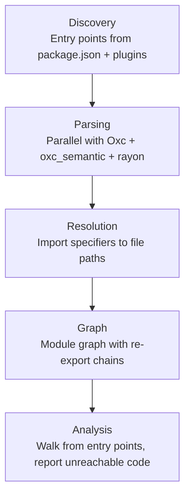
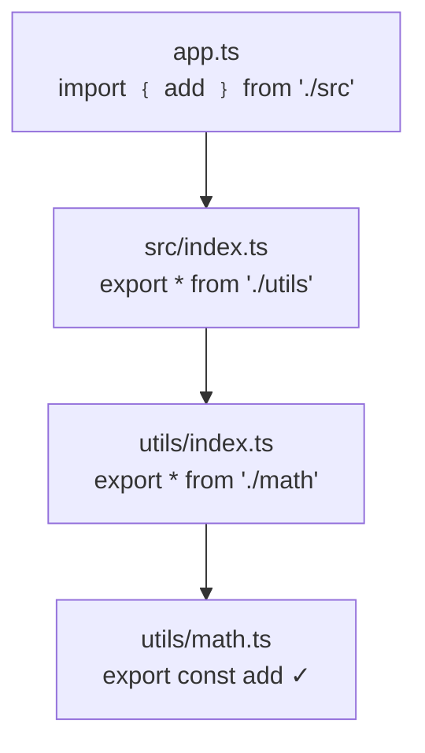

`fallow dead-code` performs dead code analysis on your TypeScript project. It builds a module graph from your <Tooltip tip="Files that serve as roots of the module graph. Anything reachable from them is considered used.">entry points</Tooltip> and reports anything that isn't reachable.

Finding dead code requires building a complete module graph. Fallow does this deterministically in milliseconds, giving agents, developers, and CI pipelines the same reliable results.

```bash
fallow dead-code
```

## Issue types

Fallow detects 15 types of dead code:

| Issue type | Description |
|:-----------|:------------|
| **Unused files** | Files not reachable from any entry point |
| **Unused exports** | Exported symbols never imported elsewhere |
| **Unused types** | Type aliases and interfaces never referenced |
| **Unused dependencies** | Packages in `dependencies` never imported or used as script binaries |
| **Unused devDependencies** | Packages in `devDependencies` never imported or used as script binaries |
| **Unused optionalDependencies** | Packages in `optionalDependencies` never imported or used as script binaries |
| **Unused enum members** | Enum values never referenced |
| **Unused class members** | Class methods and properties never referenced |
| **Unresolved imports** | Import specifiers that cannot be resolved |
| **Unlisted dependencies** | Imported packages missing from `package.json` |
| **Duplicate exports** | Same symbol exported from multiple modules |
| **Circular dependencies** | Modules that import each other directly or transitively |
| **Boundary violations** | Imports that cross user-defined architecture zone boundaries |
| **Type-only dependencies** | Production dependencies only imported via `import type` (should be devDependencies) |
| **Test-only dependencies** | Production dependencies only imported by test files (should be devDependencies) |

<Tip>
Most projects find 50+ unused exports on first run. Start with `--unused-exports` for the most impactful cleanup.
</Tip>

Here's what typical output looks like when fallow finds multiple issue types:

```bash title="$ fallow dead-code"
● Unused files (9)
  scripts/check-db.ts
  src/features/forecasting/hooks/useCashFlowForecast.ts
  src/features/forecasting/hooks/useIncomeForecast.ts
  src/features/forecasting/hooks/useTargetProgress.ts
  src/features/forecasting/hooks/useYearComparison.ts
  ... and 4 more
  Files not imported or referenced by any entry point — https://docs.fallow.tools/explanations/dead-code#unused-files

● Unused exports (24)
  test/component-helpers.tsx (5)
    :33 ThemeContext
    :58 ToastContext
    :1 within (re-export)
    :1 waitFor (re-export)
    :1 act (re-export)
  src/server/jobs/queue.ts (3)
    :61 enqueueJobDelayed
    :206 sweepStuckProcessingJobs
    :276 getDeadLetterJobs
  Exported symbols with zero references — https://docs.fallow.tools/explanations/dead-code#unused-exports

✗ 401 issues (0.16s)
```

## Filtering by issue type

Report only specific issue types:

```bash
fallow dead-code --unused-files
fallow dead-code --unused-exports --unused-types
fallow dead-code --unresolved-imports --unlisted-deps
```

## Output formats

<Tabs>
  <Tab title="Human (default)">
    Colored terminal output designed for readability.

    ```bash
    fallow dead-code --format human
    ```

    ```ansi
    src/components/Card/index.ts
      unused-export  CardFooter  (line 1)

    src/server/jobs/queue.ts
      unused-export  enqueueJobDelayed  (line 61)
      unused-export  sweepStuckProcessingJobs  (line 206)

    src/server/jobs/worker.ts
      unused-file  Not reachable from any entry point

    Found 401 issues (17 errors, 384 warnings)
    ```
  </Tab>
  <Tab title="JSON">
    Machine-readable JSON for scripting and tooling integration.

    ```bash
    fallow dead-code --format json
    ```

    ```json
    {
      "schema_version": 3,
      "version": "2.25.1",
      "elapsed_ms": 160,
      "total_issues": 401,
      "unused_files": [
        { "path": "src/server/jobs/worker.ts" }
      ],
      "unused_exports": [
        {
          "path": "src/server/jobs/queue.ts",
          "export_name": "enqueueJobDelayed",
          "is_type_only": false,
          "line": 61,
          "col": 0,
          "span_start": 1420,
          "is_re_export": false
        }
      ],
      "unused_dependencies": [
        {
          "package_name": "@trpc/react-query",
          "location": "dependencies",
          "path": "package.json",
          "line": 18
        }
      ]
    }
    ```
  </Tab>
  <Tab title="SARIF">
    <Tooltip tip="Static Analysis Results Interchange Format, a JSON-based standard for static analysis tool output">SARIF</Tooltip> format for GitHub Code Scanning and other static analysis tools.

    ```bash
    fallow dead-code --format sarif
    ```

    ```json
    {
      "$schema": "https://json.schemastore.org/sarif-2.1.0.json",
      "version": "2.1.0",
      "runs": [{
        "tool": { "driver": { "name": "fallow", "version": "2.25.1" } },
        "results": [
          {
            "ruleId": "fallow/unused-export",
            "level": "error",
            "message": { "text": "Export 'enqueueJobDelayed' is never imported by other modules" },
            "locations": [{
              "physicalLocation": {
                "artifactLocation": { "uri": "src/server/jobs/queue.ts" },
                "region": { "startLine": 61, "startColumn": 1 }
              }
            }]
          }
        ]
      }]
    }
    ```
  </Tab>
  <Tab title="Compact">
    One-line-per-issue output, ideal for grep and editor integration.

    ```bash
    fallow dead-code --format compact
    ```

    ```text
    unused-file:src/server/jobs/worker.ts
    unused-file:src/server/jobs/cron.ts
    unused-export:src/server/jobs/queue.ts:61:enqueueJobDelayed
    unused-export:src/components/Card/index.ts:1:CardFooter
    ```
  </Tab>
  <Tab title="Markdown">
    Formatted markdown output for PR comments and documentation.

    ```bash
    fallow dead-code --format markdown
    ```

    ```markdown
    ## Fallow: 4 issues found

    ### Unused files (2)

    - `src/server/jobs/worker.ts`
    - `src/server/jobs/cron.ts`

    ### Unused exports (2)

    - `src/server/jobs/queue.ts`
      - :61 `enqueueJobDelayed`
      - :206 `sweepStuckProcessingJobs`
    ```

    Pipe directly to `gh pr comment`:

    ```bash
    fallow dead-code --format markdown | gh pr comment --body-file -
    ```
  </Tab>
  <Tab title="CodeClimate">
    CodeClimate JSON for GitLab Code Quality inline MR annotations.

    ```bash
    fallow dead-code --format codeclimate
    ```

    ```json
    [
      {
        "type": "issue",
        "check_name": "fallow/unused-file",
        "description": "File is not reachable from any entry point",
        "categories": ["Bug Risk"],
        "severity": "major",
        "fingerprint": "a1b2c3d4e5f67890",
        "location": {
          "path": "src/server/jobs/worker.ts",
          "lines": { "begin": 1 }
        }
      },
      {
        "type": "issue",
        "check_name": "fallow/unused-export",
        "description": "Export 'enqueueJobDelayed' is never imported by other modules",
        "categories": ["Bug Risk"],
        "severity": "major",
        "fingerprint": "b2c3d4e5f6789012",
        "location": {
          "path": "src/server/jobs/queue.ts",
          "lines": { "begin": 61 }
        }
      }
    ]
    ```

    Use in GitLab CI for inline annotations:

    ```yaml
    fallow:
      script: npx fallow dead-code --format codeclimate > gl-code-quality-report.json
      artifacts:
        reports:
          codequality: gl-code-quality-report.json
    ```
  </Tab>
</Tabs>

## Incremental analysis

Only check files changed since a git ref:

```bash
fallow dead-code --changed-since main
fallow dead-code --changed-since HEAD~5
```

This is useful in CI to only report new issues in a pull request.

```bash title="$ fallow dead-code --changed-since main"
● Unused exports (2)
  src/features/savings/hooks/usePotGroups.ts
    :8  usePotGroupTotals
  src/server/jobs/queue.ts
    :276 getDeadLetterJobs
  Exported symbols with zero references — https://docs.fallow.tools/explanations/dead-code#unused-exports

✗ 2 issues (0.04s)
```

## Baseline comparison

Adopt fallow incrementally by saving a baseline of existing issues:

```bash
# Save current issues as baseline
fallow dead-code --save-baseline

# Only fail on new issues (compared to baseline)
fallow dead-code --baseline
```

## Debugging

Trace why an export is or isn't considered used:

```bash
fallow dead-code --trace src/utils.ts:formatDate
fallow dead-code --trace-file src/utils.ts
fallow dead-code --trace-dependency lodash
```

## How it works

Fallow uses syntactic analysis with scope-aware binding resolution via Oxc. No TypeScript compiler, no type information. That's what makes it fast.



The graph-based approach guarantees completeness regardless of project size.

<Note>
Fallow works best with projects using `isolatedModules: true` (required for esbuild, swc, and Vite). `oxc_semantic` scope analysis detects unused import bindings (imports where the bound name is never read), but legacy tsc-only projects without `isolatedModules` may still see edge cases with type-only imports.
</Note>

## Script binary analysis

Fallow parses `package.json` scripts to detect CLI tool usage. This reduces false positives in unused dependency detection. When you have a script like `"lint": "eslint src/"`, fallow recognizes that `eslint` is a binary provided by the `eslint` package and marks it as used.

How it works:

- **Binary name to package name mapping:** Script commands like `tsc`, `vitest`, or `next` are mapped back to their parent packages (`typescript`, `vitest`, `next`). These packages won't be reported as unused even when they're never `import`-ed in source code.
- **`--config` arguments as entry points:** When a script references a config file (e.g., `jest --config jest.e2e.config.ts`), fallow treats that config file as an entry point. Config files won't be flagged as unused.
- **File path arguments:** Direct file references in scripts (e.g., `node scripts/seed.js`) are also recognized as entry points.
- **Env wrappers and package manager runners:** Commands prefixed with `cross-env`, `npx`, `pnpx`, `yarn dlx`, or `node -r` are unwrapped to find the actual tool binary.

```json
{
  "scripts": {
    "build": "tsc && vite build",
    "test": "vitest --config vitest.config.ts",
    "lint": "cross-env NODE_ENV=production eslint src/"
  }
}
```

In this example, fallow detects `typescript`, `vite`, `vitest`, and `eslint` as used dependencies, and `vitest.config.ts` as an entry point.

## Infrastructure entry points

Fallow scans infrastructure config files for source file references and treats them as entry points. Worker processes, migration scripts, and other infrastructure-defined files won't be reported as unused.

Supported files:

| File type | What fallow extracts |
|:----------|:--------------------|
| **Dockerfiles** (`Dockerfile`, `Dockerfile.*`, `*.Dockerfile`) | `RUN node`, `CMD`, `ENTRYPOINT`, esbuild invocations |
| **Procfiles** | Process definitions (e.g., `worker: node dist/worker.js`) |
| **fly.toml** / **fly.*.toml** | `release_command` and process definitions |
| **CI pipelines** (`.gitlab-ci.yml`, `.github/workflows/*.yml`) | `npx` and binary invocations in CI steps |

Fallow searches the project root and common subdirectories (`config/`, `docker/`, `deploy/`) for these files.

```dockerfile
# Fallow detects scripts/migrate.ts and src/worker.ts as entry points
FROM node:20
RUN node scripts/migrate.ts
CMD ["node", "src/worker.ts"]
```

## Dynamic import resolution

Fallow resolves dynamic imports that use patterns rather than static strings. When you write `import(\`./locales/${lang}.json\`)`, the import target isn't known at analysis time. Fallow converts these patterns into glob expressions and matches them against discovered files.

Supported patterns:

| Pattern | Example | Resolved as |
|:--------|:--------|:------------|
| Template literals | `` import(`./icons/${name}.svg`) `` | `./icons/*.svg` |
| String concatenation | `import("./routes/" + path)` | `./routes/*` |
| `import.meta.glob` | `import.meta.glob("./modules/*.ts")` | `./modules/*.ts` |
| `require.context` | `require.context("./themes", true, /\.css$/)` | `./themes/**/*.css` |

Matched files are marked as reachable in the module graph, so they won't be reported as unused. Useful for locale files, icon sets, route modules, and other convention-based directory structures.

<Note>
Dynamic imports with fully runtime-computed paths (e.g., `import(userInput)`) cannot be resolved statically. Use `entry` in your config to mark those directories as entry points.
</Note>

## Re-export chain resolution

Fallow resolves `export *` chains through multiple levels of barrel files with cycle detection.

```typescript
// utils/math.ts
export const add = (a: number, b: number) => a + b;

// utils/index.ts (barrel)
export * from './math';

// src/index.ts (barrel)
export * from './utils';

// app.ts
import { add } from './src';
```



In this example, fallow traces the import of `add` in `app.ts` through `src/index.ts` and `utils/index.ts` back to `utils/math.ts`. The `add` export is correctly marked as used across the entire chain.

Resolution handles:

- **Multi-level chains:** Any depth of `export *` re-exports is followed until the original declaration is found.
- **Cycle detection:** Circular re-export chains (e.g., `a` re-exports from `b`, `b` re-exports from `a`) are detected and handled gracefully.
- **Mixed re-exports:** Named re-exports (`export { foo } from './bar'`) and namespace re-exports (`export * from './bar'`) are both tracked.

## Namespace import narrowing

When a file uses `import * as ns from './module'`, fallow narrows which exports are actually consumed by scanning for member accesses (`ns.foo`, `ns.bar`) and destructuring patterns (`const { foo, bar } = ns`) in the importing file.

```ts
import * as utils from './utils';

// Only foo and bar are marked as used — baz remains unused
const { foo } = utils;
utils.bar();
```

Works with static imports, dynamic imports (`const mod = await import('./x')`), and require (`const mod = require('./x')`).

Fallow also uses `oxc_semantic` scope analysis to detect imports where the binding is never read. An `import { foo } from './utils'` where `foo` is never referenced in the file does not count as a reference to the `foo` export. This improves unused-export detection precision.

<Note>
Whole-object consumption patterns like `Object.values(ns)`, `{ ...ns }`, `for (const k in ns)`, and rest destructuring (`const { a, ...rest } = ns`) conservatively mark all exports as used. Fallow can't determine which specific members are accessed in these cases.
</Note>

## Entry-point partial unused exports

When a file is an entry point (matched by a plugin or the `entry` config), fallow traditionally marks all its exports as used. Starting in v2.15.0, fallow can detect partially unused exports in entry-point files: exports that exist in an entry file but are never imported by any other module in the project.

This is especially useful for framework convention files (Next.js pages, SvelteKit routes) where the framework consumes specific named exports (like `default`, `loader`, or `getStaticProps`) but the file may also export helper functions that nothing uses.

<Note>
Entry-point files are still considered used (never reported as unused files), but individual exports within them that have zero references are now reported as unused exports.
</Note>

## Cross-reference with duplication

Running `fallow dead-code --include-dupes` cross-references dead code findings with code duplication analysis. Clone instances in unused files, or overlapping with unused exports, are flagged as **combined high-priority findings**.

```bash
fallow dead-code --include-dupes
```

Use `--include-dupes` to prioritize cleanup: if a block of code is both duplicated *and* unused, removing it eliminates dead code and reduces duplication at the same time.

What the cross-reference finds:

- **Clone instances in unused files:** If a file is unreachable from entry points and contains duplicated code, the duplication finding is elevated.
- **Clone instances overlapping unused exports:** If an unused export contains code that is duplicated elsewhere, both findings are reported together.

<Tip>
Use `--include-dupes` in CI to surface code that is both unused and duplicated.
</Tip>

## Circular dependency benchmarks

Fallow detects dependency cycles during module graph construction at no extra cost. Standalone tools like madge and dpdm build their own graph from scratch.

| Project | Files | fallow | madge | dpdm | vs madge | vs dpdm |
|:--------|------:|-------:|------:|-----:|---------:|--------:|
| [zod](https://github.com/colinhacks/zod) | 174 | **17ms** | 540ms | 190ms | **32x** | **11x** |
| [preact](https://github.com/preactjs/preact) | 244 | **19ms** | 298ms | 132ms | **16x** | **7x** |
| [fastify](https://github.com/fastify/fastify) | 286 | **20ms** | 165ms | 132ms | **8x** | **7x** |
| [vue/core](https://github.com/vuejs/core) | 522 | **59ms** | 175ms | 143ms | **3x** | **2x** |
| [TanStack/query](https://github.com/TanStack/query) | 901 | **134ms** | 168ms | 137ms | **1.3x** | **1.0x** |

<Info>
  3-32x faster than madge, 2-11x faster than dpdm on small-to-medium projects. Fallow uses 5-7x less memory by reusing the module graph already built for dead code analysis.
</Info>

## See also

<CardGroup cols={3}>
  <Card title="CLI: dead-code" icon="terminal" href="/cli/dead-code">
    Full reference for the `fallow dead-code` command and its flags.
  </Card>
  <Card title="Rules & Severity" icon="scale-balanced" href="/configuration/rules">
    Control which issue types are errors, warnings, or disabled.
  </Card>
  <Card title="Auto-fix" icon="wand-magic-sparkles" href="/analysis/auto-fix">
    Automatically remove the dead code fallow finds.
  </Card>
</CardGroup>
