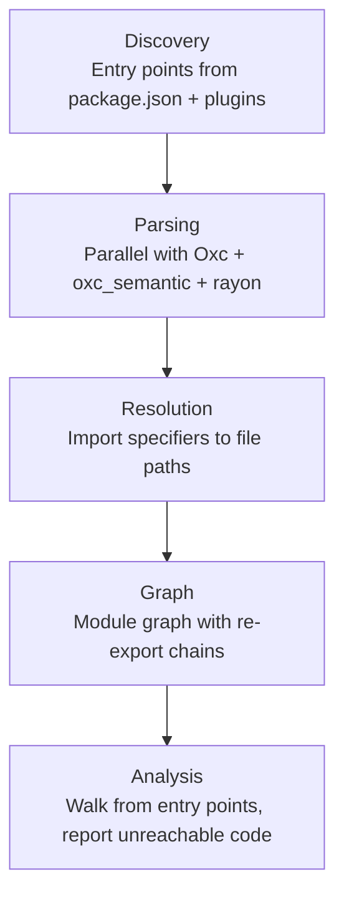
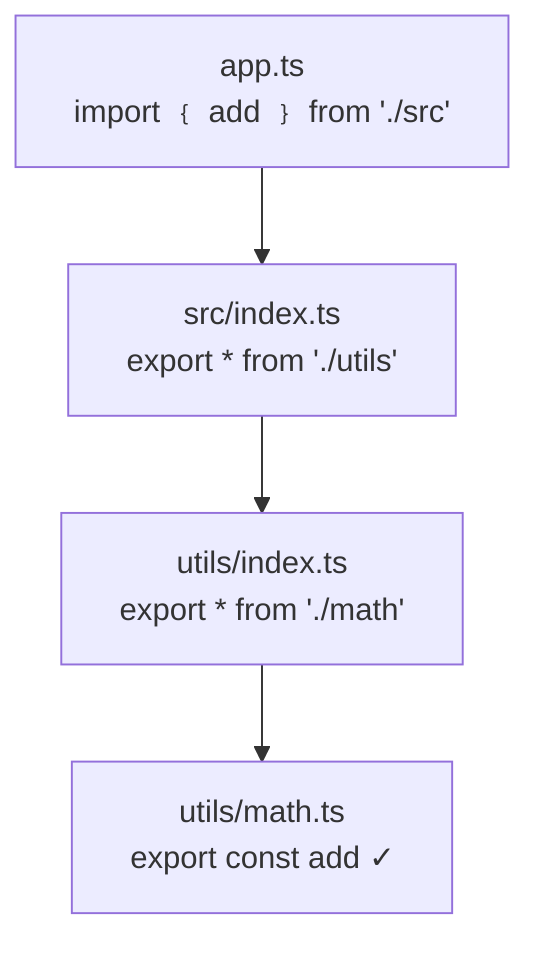

`fallow dead-code` tells you which files, exports, and dependencies you can delete. It builds a module graph from your <Tooltip tip="Files that are the roots of the module graph. Fallow counts anything reachable from them as used.">entry points</Tooltip> and reports everything that the graph does not reach.

The graph build is deterministic, so a developer, a CI pipeline, and a coding assistant get the same result for the same code.

```bash
fallow dead-code
```

## Issue types

Fallow reports these core issue types:

| Issue type | Description |
|:-----------|:------------|
| **Unused files** | Files not reachable from any entry point |
| **Unused exports** | Exported symbols never imported elsewhere |
| **Unused types** | Type aliases and interfaces never referenced |
| **Unused dependencies** | Packages in `dependencies` never imported or used as script binaries |
| **Unused devDependencies** | Packages in `devDependencies` never imported or used as script binaries |
| **Unused optionalDependencies** | Packages in `optionalDependencies` never imported or used as script binaries |
| **Unused enum members** | Enum values never referenced |
| **Unused class members** | Class methods and properties never referenced outside their class. Tracks inheritance, skips framework lifecycle methods, and lets you exclude decorators with `ignoreDecorators` |
| **Unused catalog entries** | Entries in the `catalog:` or `catalogs:` maps of `pnpm-workspace.yaml` that no workspace package references with the `catalog:` protocol |
| **Unresolved imports** | Import specifiers that cannot be resolved |
| **Unlisted dependencies** | Imported packages missing from `package.json` |
| **Duplicate exports** | Same symbol exported from multiple modules |
| **Circular dependencies** | Modules that import each other directly or transitively |
| **Boundary violations** | Imports that cross user-defined architecture zone boundaries |
| **Type-only dependencies** | Production dependencies that only `import type` statements use (move them to devDependencies) |
| **Test-only dependencies** | Production dependencies that only test files import (move them to devDependencies) |
| **Stale suppressions** | `fallow-ignore` comments or `@expected-unused` JSDoc tags that no longer match any issue |

Fallow also has framework-specific rules, such as unused component props and route collisions, and opt-in rules, such as private type leaks. To set the severity of a rule, see [Rules & severity](/configuration/rules). To see the filter flag of each issue type, run `fallow dead-code --help`.

Typical output with more than one issue type:

```bash title="$ fallow dead-code"
── Unused Code ─────────────────────────────────────

● Unused files (3)
  scripts/check-db.ts
  src/features/forecasting/hooks/useCashFlowForecast.ts
  src/features/forecasting/hooks/useIncomeForecast.ts
  Files not reachable from any entry point: https://docs.fallow.tools/explanations/dead-code#unused-files
  To suppress: // fallow-ignore-file unused-file

● Unused exports (8)
  test/component-helpers.tsx (5)
    :1 act (re-export)
    :1 waitFor (re-export)
    :1 within (re-export)
    :33 ThemeContext
    :58 ToastContext
  src/server/jobs/queue.ts (3)
    :61 enqueueJobDelayed
    :206 sweepStuckProcessingJobs
    :276 getDeadLetterJobs
  Exported symbols with no known consumers: https://docs.fallow.tools/explanations/dead-code#unused-exports
  To auto-fix: fallow fix --dry-run
  To suppress: // fallow-ignore-next-line unused-export
  3 in src, 5 in test directories

✗ 3 files · 8 exports (0.16s)
```

## Filtering by issue type

To report only some issue types, pass their flags:

```bash
fallow dead-code --unused-files
fallow dead-code --unused-exports --unused-types
fallow dead-code --unresolved-imports --unlisted-deps
```

## Output formats

<Tabs>
  <Tab title="Human (default)">
    Colored terminal output for people to read.

    ```bash
    fallow dead-code --format human
    ```

    ```ansi
    ── Unused Code ─────────────────────────────────────

    ● Unused files (1)
      src/server/jobs/worker.ts
      Files not reachable from any entry point: https://docs.fallow.tools/explanations/dead-code#unused-files

    ● Unused exports (3)
      src/server/jobs/queue.ts (2)
        :61 enqueueJobDelayed
        :206 sweepStuckProcessingJobs
      src/components/Card/index.ts
        :1 CardFooter
      Exported symbols with no known consumers: https://docs.fallow.tools/explanations/dead-code#unused-exports
      To auto-fix: fallow fix --dry-run
      To suppress: // fallow-ignore-next-line unused-export

    ✗ 1 file · 3 exports (0.16s)
    ```
  </Tab>
  <Tab title="JSON">
    JSON for scripts and tools.

    ```bash
    fallow dead-code --format json
    ```

    ```json
    {
      "kind": "dead-code",
      "schema_version": 9,
      "version": "3.28.0",
      "elapsed_ms": 160,
      "total_issues": 401,
      "unused_files": [
        { "path": "src/server/jobs/worker.ts" }
      ],
      "unused_exports": [
        {
          "path": "src/server/jobs/queue.ts",
          "export_name": "enqueueJobDelayed",
          "is_type_only": false,
          "line": 61,
          "col": 0,
          "span_start": 1420,
          "is_re_export": false
        }
      ],
      "unused_dependencies": [
        {
          "package_name": "@trpc/react-query",
          "location": "dependencies",
          "path": "package.json",
          "line": 18,
          "used_in_workspaces": ["apps/web"]
        }
      ]
    }
    ```
  </Tab>
  <Tab title="SARIF">
    <Tooltip tip="Static Analysis Results Interchange Format, a JSON-based standard for static analysis tool output">SARIF</Tooltip> output for GitHub Code Scanning and other static analysis tools.

    ```bash
    fallow dead-code --format sarif
    ```

    ```json
    {
      "$schema": "https://json.schemastore.org/sarif-2.1.0.json",
      "version": "2.1.0",
      "runs": [{
        "tool": { "driver": { "name": "fallow", "version": "3.28.0" } },
        "results": [
          {
            "ruleId": "fallow/unused-export",
            "level": "error",
            "message": { "text": "Export 'enqueueJobDelayed' is never imported by other modules" },
            "locations": [{
              "physicalLocation": {
                "artifactLocation": { "uri": "src/server/jobs/queue.ts" },
                "region": { "startLine": 61, "startColumn": 1 }
              }
            }]
          }
        ]
      }]
    }
    ```
  </Tab>
  <Tab title="Compact">
    One line per issue, for `grep` and editor integrations.

    ```bash
    fallow dead-code --format compact
    ```

    ```text
    unused-file:src/server/jobs/worker.ts
    unused-file:src/server/jobs/cron.ts
    unused-export:src/server/jobs/queue.ts:61:enqueueJobDelayed
    unused-export:src/components/Card/index.ts:1:CardFooter
    ```
  </Tab>
  <Tab title="Markdown">
    Markdown for PR comments and documentation.

    ```bash
    fallow dead-code --format markdown
    ```

    ```markdown
    ## Fallow: 4 issues found

    ### Unused files (2)

    - `src/server/jobs/worker.ts`
    - `src/server/jobs/cron.ts`

    ### Unused exports (2)

    - `src/server/jobs/queue.ts`
      - :61 `enqueueJobDelayed`
      - :206 `sweepStuckProcessingJobs`
    ```

    To post it as a PR comment, pipe it to `gh pr comment`:

    ```bash
    fallow dead-code --format markdown | gh pr comment --body-file -
    ```
  </Tab>
  <Tab title="CodeClimate">
    CodeClimate JSON, which GitLab Code Quality shows as inline MR annotations.

    ```bash
    fallow dead-code --format codeclimate
    ```

    ```json
    [
      {
        "type": "issue",
        "check_name": "fallow/unused-file",
        "description": "File is not reachable from any entry point",
        "categories": ["Bug Risk"],
        "severity": "major",
        "fingerprint": "a1b2c3d4e5f67890",
        "location": {
          "path": "src/server/jobs/worker.ts",
          "lines": { "begin": 1 }
        }
      },
      {
        "type": "issue",
        "check_name": "fallow/unused-export",
        "description": "Export 'enqueueJobDelayed' is never imported by other modules",
        "categories": ["Bug Risk"],
        "severity": "major",
        "fingerprint": "b2c3d4e5f6789012",
        "location": {
          "path": "src/server/jobs/queue.ts",
          "lines": { "begin": 61 }
        }
      }
    ]
    ```

    Add this job to GitLab CI:

    ```yaml
    fallow:
      script: npx fallow dead-code --format codeclimate > gl-code-quality-report.json
      artifacts:
        reports:
          codequality: gl-code-quality-report.json
    ```
  </Tab>
</Tabs>

## Incremental analysis

To check only the files that changed since a git ref, pass `--changed-since`:

```bash
fallow dead-code --changed-since main
fallow dead-code --changed-since HEAD~5
```

In CI, this reports only the issues that a pull request adds.

```bash title="$ fallow dead-code --changed-since main"
── Unused Code ─────────────────────────────────────

● Unused exports (2)
  src/features/savings/hooks/usePotGroups.ts
    :8 usePotGroupTotals
  src/server/jobs/queue.ts
    :276 getDeadLetterJobs
  Exported symbols with no known consumers: https://docs.fallow.tools/explanations/dead-code#unused-exports

✗ 2 exports (0.04s)
```

## Baseline comparison

To adopt fallow on an existing codebase, save the current issues as a baseline. Fallow then fails only on new issues:

```bash
# Save current issues as baseline
fallow dead-code --save-baseline fallow-baselines/dead-code.json

# Only fail on new issues (compared to baseline)
fallow dead-code --baseline fallow-baselines/dead-code.json
```

## Debugging

To see why fallow counts an export, a file, or a dependency as used or unused, trace it:

```bash
fallow dead-code --trace src/utils.ts:formatDate
fallow dead-code --trace-file src/utils.ts
fallow dead-code --trace-dependency lodash
```

## How it works

Fallow parses your code with Oxc and resolves bindings with scope analysis. It does not run the TypeScript compiler and does not use type information, which keeps the analysis fast.


```mermaid
flowchart TB
  A["Discovery<br/>Entry points from package.json + plugins"] --> B["Parsing<br/>Parallel with Oxc + oxc_semantic + rayon"]
  B --> C["Resolution<br/>Import specifiers to file paths"]
  C --> D["Graph<br/>Module graph with re-export chains"]
  D --> E["Analysis<br/>Walk from entry points, report unreachable code"]
```

<Note>
Fallow works best with `isolatedModules: true`, which esbuild, swc, and Vite require. `oxc_semantic` scope analysis finds import bindings that the file never reads. Older tsc-only projects without `isolatedModules` can still get edge cases with type-only imports.
</Note>

## Script binary analysis

A package that you only use from a `package.json` script is not an unused dependency. Fallow reads your scripts to find these packages. For `"lint": "eslint src/"`, fallow sees that the `eslint` package supplies the `eslint` binary and marks the package as used.

Fallow reads these parts of a script:

- **Binary names.** Fallow maps commands such as `tsc`, `vitest`, or `next` to their packages (`typescript`, `vitest`, `next`). It does not report these packages as unused, even when no source file imports them.
- **`--config` arguments.** When a script names a config file (for example `jest --config jest.e2e.config.ts`), fallow makes that file an entry point, so it does not report the file as unused.
- **File path arguments.** Files that a script names directly (for example `node scripts/seed.js`) also become entry points.
- **Env wrappers and package manager runners.** Fallow removes the `cross-env`, `npx`, `pnpx`, `yarn dlx`, or `node -r` prefix to find the real binary.

```json
{
  "scripts": {
    "build": "tsc && vite build",
    "test": "vitest --config vitest.config.ts",
    "lint": "cross-env NODE_ENV=production eslint src/"
  }
}
```

In this example, fallow detects `typescript`, `vite`, `vitest`, and `eslint` as used dependencies, and `vitest.config.ts` as an entry point.

## Infrastructure entry points

Worker processes and migration scripts often start from a Dockerfile or a CI job, not from an import. Fallow reads these infrastructure files and makes the source files they name entry points, so it does not report those files as unused.

Fallow reads these files:

| File type | What fallow extracts |
|:----------|:--------------------|
| **Dockerfiles** (`Dockerfile`, `Dockerfile.*`, `*.Dockerfile`) | `RUN node`, `CMD`, `ENTRYPOINT`, esbuild invocations |
| **Procfiles** | Process definitions (e.g., `worker: node dist/worker.js`) |
| **fly.toml** / **fly.*.toml** | `release_command` and process definitions |
| **CI pipelines** (`.gitlab-ci.yml`, `.github/workflows/*.yml`) | `npx` and binary invocations in CI steps |

Fallow looks for these files in the project root and in common subdirectories (`config/`, `docker/`, `deploy/`).

```dockerfile
# Fallow detects scripts/migrate.ts and src/worker.ts as entry points
FROM node:20
RUN node scripts/migrate.ts
CMD ["node", "src/worker.ts"]
```

## Dynamic import resolution

Files that you load with a computed path, such as locale files or icons, are not unused. For `` import(`./locales/${lang}.json`) ``, the target is not known at analysis time. Fallow converts the pattern into a glob and matches it against the project files.

Fallow supports these patterns:

| Pattern | Example | Resolved as |
|:--------|:--------|:------------|
| Template literals | `` import(`./icons/${name}.svg`) `` | `./icons/*.svg` |
| String concatenation | `import("./routes/" + path)` | `./routes/*` |
| `import.meta.glob` | `import.meta.glob("./modules/*.ts")` | `./modules/*.ts` |
| `require.context` | `require.context("./themes", true, /\.css$/)` | `./themes/**/*.css` |

Fallow marks the matched files as reachable, so it does not report them as unused. This covers locale files, icon sets, route modules, and other directories that follow a naming convention.

<Note>
Fallow cannot resolve a path that is fully computed at runtime (for example `import(userInput)`). Add those directories to `entry` in your config to make them entry points.
</Note>

## Re-export chain resolution

Fallow follows `export *` chains through any number of barrel files, so an export that you import through a barrel counts as used.

```typescript
// utils/math.ts
export const add = (a: number, b: number) => a + b;

// utils/index.ts (barrel)
export * from './math';

// src/index.ts (barrel)
export * from './utils';

// app.ts
import { add } from './src';
```


```mermaid
flowchart TB
  A["app.ts<br/>import ﹛ add ﹜ from './src'"] --> B["src/index.ts<br/>export * from './utils'"]
  B --> C["utils/index.ts<br/>export * from './math'"]
  C --> D["utils/math.ts<br/>export const add ✓"]
```

Here, fallow follows the import of `add` in `app.ts` through `src/index.ts` and `utils/index.ts` to `utils/math.ts` and marks `add` as used.

Fallow handles these cases:

- **Multi-level chains.** Fallow follows `export *` re-exports at any depth, up to the original declaration.
- **Cycles.** Fallow detects circular re-export chains (for example, `a` re-exports from `b` and `b` re-exports from `a`) and stops without an error.
- **Mixed re-exports.** Fallow tracks named re-exports (`export { foo } from './bar'`) and namespace re-exports (`export * from './bar'`).

When two `export *` sources supply the same name, ECMAScript treats the name
as ambiguous, and the barrel does not export it. Until you fix the collision,
Fallow does not report the declarations, members, components, or injections
that supply the name. Run [`fallow trace FILE:NAME`](/cli/trace) to see the
source files and whether the collision is in the type namespace, the value
namespace, or both.

## Namespace import narrowing

A namespace import does not mark every export as used. For `import * as ns from './module'`, fallow looks for member accesses (`ns.foo`, `ns.bar`) and destructuring (`const { foo, bar } = ns`) in the importing file. Only those exports count as used.

```ts
import * as utils from './utils';

// Only foo and bar are marked as used. baz remains unused
const { foo } = utils;
utils.bar();
```

This works for static imports, dynamic imports (`const mod = await import('./x')`), and `require` (`const mod = require('./x')`).

Fallow also uses `oxc_semantic` scope analysis to find imports whose binding the file never reads. If a file has `import { foo } from './utils'` and never uses `foo`, that import does not count as a reference to the `foo` export.

<Note>
Some patterns use the whole object: `Object.values(ns)`, `{ ...ns }`, `for (const k in ns)`, and rest destructuring (`const { a, ...rest } = ns`). Fallow cannot tell which members these patterns use, so it marks all exports as used.
</Note>

## Class member detection

Fallow reports public class methods and properties that no code outside the class references. It takes class inheritance, decorators, and framework conventions into account.

```typescript
class OrderService {
  // Used: called in checkout.ts
  async createOrder(items: Item[]) { /* ... */ }
  
  // Unused: never called outside this class
  private validateItems(items: Item[]) { /* ... */ }
  
  // Excluded: decorator indicates runtime wiring
  @Post('/orders')
  handleCreateOrder() { /* ... */ }
}
```

Fallow handles these cases without configuration:

- **Inheritance.** When code calls a parent class method through the parent type, fallow marks the child override as used.
- **Decorators.** By default, fallow skips decorated members. Decorators such as `@Get()`, `@Column()`, and `@Injectable()` mean that a framework calls the member at runtime.
- **Framework lifecycle methods.** Fallow never reports `componentDidMount`, `ngOnInit`, `connectedCallback`, and other framework lifecycle methods.
- **Whole-object patterns.** `Object.values(instance)`, `Object.keys()`, spread operators, and `for..in` loops mark all members as used.

### Opting decorators out via `ignoreDecorators`

Some decorators do not mean that a framework calls the method, for example Playwright's `@step("label")` or your own `@measure`, `@log`, or `@retry`. List these names in `ignoreDecorators`. Fallow then checks a method that has only these decorators like an undecorated method.

```jsonc
// .fallowrc.json
{
  "ignoreDecorators": ["@step"]
}
```

Fallow still skips a method that has any decorator that is not in the list. A method with `@step` and `@Inject` stays framework-managed.

See [`ignoreDecorators`](/configuration/overview#ignoredecorators) for the matching rules and the unmatched-entry warning.

<Note>
Class member detection uses syntactic analysis and does not run the TypeScript compiler. Fallow tracks member access through the import graph and does not resolve types.
</Note>

## CSS and SCSS tracking

Fallow tracks CSS and SCSS imports, so stylesheets that your code uses are not unused files. It resolves SCSS `@use`, `@forward`, and partials (`_prefix` files). It treats CSS Module class names as named exports and tracks them through `styles.className` accesses.

For details, see [CSS, SCSS, and Tailwind analysis](/analysis/css-analysis).

## Entry-point partial unused exports

An entry point can also export helpers that nothing uses. Before v2.15.0, fallow marked all exports of an entry point as used. Since v2.15.0, fallow reports exports of an entry file that no other module in the project imports. A plugin or the `entry` config makes a file an entry point.

This helps most with framework convention files, such as Next.js pages and SvelteKit routes. The framework uses specific named exports (such as `default`, `loader`, or `getStaticProps`), and the file can also export helpers that nothing uses.

<Note>
Fallow never reports an entry-point file as an unused file. It reports only the exports in that file that have zero references.
</Note>

## Cross-reference with duplication

Code that is duplicated and unused is a good place to start the cleanup. `fallow dead-code --include-dupes` compares dead code findings with duplication analysis. Fallow reports clone instances in unused files, or that overlap unused exports, as **combined high-priority findings**.

```bash
fallow dead-code --include-dupes
```

When you delete a block that is duplicated *and* unused, you remove dead code and duplication in one change.

The comparison finds:

- **Clone instances in unused files.** When no entry point reaches a file and the file has duplicated code, fallow raises the priority of the duplication finding.
- **Clone instances that overlap unused exports.** When an unused export has code that is duplicated elsewhere, fallow reports both findings together.

## Circular dependency benchmarks

The tools do different amounts of work. `fallow dead-code --circular-deps` runs the full analysis (dead code, dependencies, boundaries, cycles). madge and dpdm only build an import graph. dpdm reports incomplete cycle counts on these fixtures, so you cannot compare its timings directly. All runs are cold. Bold marks the fastest tool per row.

| Project | Files | Fallow | madge | vs madge | dpdm | vs dpdm |
|:--------|------:|-------:|------:|---------:|-----:|--------:|
| [zod](https://github.com/colinhacks/zod) | 174 | **43ms** | 532ms | Fallow 12.4x | 192ms | Fallow 4.5x |
| [preact](https://github.com/preactjs/preact) | 244 | **75ms** | 299ms | Fallow 4.0x | 134ms | Fallow 1.8x |
| [fastify](https://github.com/fastify/fastify) | 286 | **97ms** | 224ms | Fallow 2.3x | 165ms | Fallow 1.7x |
| [vue/core](https://github.com/vuejs/core) | 522 | **137ms** | 173ms | Fallow 1.3x | 145ms | Fallow 1.1x |
| [TypeScript](https://github.com/microsoft/TypeScript) | 38,146 | 2.18s | 5.16s | Fallow 2.4x | **136ms** | dpdm faster |
| [next.js](https://github.com/vercel/next.js) | 20,552 | 3.00s | 485ms | madge faster | **463ms** | dpdm faster |
| [astro](https://github.com/withastro/astro) | 2,859 | 3.81s | 170ms | madge faster | **138ms** | dpdm faster |

<Info>
  Fallow is faster than madge on small and mid-size projects and on the large TypeScript repo. madge is faster on large monorepos such as next.js and astro. dpdm is fast, but it reports incomplete cycle counts on these fixtures. Fallow finds cycles in the module graph that dead code analysis already builds, so cycle detection does not build a second graph.
</Info>

## See also

<CardGroup cols={3}>
  <Card title="CLI: dead-code" icon="terminal" href="/cli/dead-code">
    Full reference for the `fallow dead-code` command and its flags.
  </Card>
  <Card title="Rules & Severity" icon="scale-balanced" href="/configuration/rules">
    Control which issue types are errors, warnings, or disabled.
  </Card>
  <Card title="Auto-fix" icon="wand-magic-sparkles" href="/analysis/auto-fix">
    Remove the dead code that fallow finds.
  </Card>
</CardGroup>
