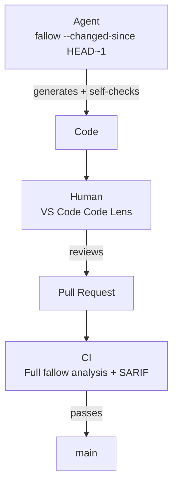

CI catches changed-code risk, cleanup opportunities, duplication, and complexity issues that get past agent workflows and editor review.

<Tabs>
  <Tab title="GitHub Action">
    <Steps>
      <Step title="Add the action">
        Add fallow to your workflow file:

        ```yaml
        name: Fallow analysis
        on: [push, pull_request]

        jobs:
          fallow:
            runs-on: ubuntu-latest
            steps:
              - uses: actions/checkout@v4
              - uses: fallow-rs/fallow@v2
                with:
                  format: sarif
        ```

        This runs all analyses (dead code + duplication + complexity) by default. Use the `command` input to run a specific analysis.
      </Step>
      <Step title="Configure inputs">
        Customize the action with these inputs:

        | Input | Default | Description |
        |:------|:--------|:------------|
        | `command` | -- (all) | Command to run (`dead-code`, `dupes`, `health`, `audit`, `fix`, or empty for all). Legacy alias: `check` = `dead-code`. |
        | `root` | `.` | Project root directory |
        | `config` | -- | Path to config file (`.fallowrc.json`, `.fallowrc.jsonc`, `fallow.toml`, or `.fallow.toml`) |
        | `format` | `sarif` | Output format |
        | `production` | `false` | Enable production mode for every analysis |
        | `production-dead-code` | `false` | Combined mode only: per-analysis production mode for dead-code |
        | `production-health` | `false` | Combined mode only: per-analysis production mode for health |
        | `production-dupes` | `false` | Combined mode only: per-analysis production mode for duplication |
        | `fail-on-issues` | `true` | Exit with code 1 if issues are found |
        | `changed-since` | -- | Only check files changed since this ref |
        | `auto-changed-since` | `true` | Automatically scope to changed files in PR context using base SHA. Ignored when `changed-since` is set. |
        | `baseline` | -- | Path to baseline file for comparison. Rejected with exit 2 when `command: audit`; use `dead-code-baseline` / `health-baseline` / `dupes-baseline` instead. |
        | `save-baseline` | -- | Save current results as a baseline file. Rejected with exit 2 when `command: audit` (audit runs three analyses with incompatible baseline formats). |
        | `version` | -- | Fallow version override. When omitted, the action uses the project `package.json` `fallow` dependency spec if present, otherwise `latest`. |
        | `workspace` | -- | Scope output to one or more workspaces (exact names, globs, `!` negation; comma-separated) |
        | `changed-workspaces` | -- | Git-derived monorepo scoping: scope to workspaces containing any file changed since `REF` (e.g. `origin/main`). Requires `fetch-depth: 0`. Mutually exclusive with `workspace`. A missing ref is a hard error (exit 2) rather than silent full-scope fallback. |
        | `comment` | `false` | Post results as a PR comment |
        | `review-comments` | `false` | Post inline PR review comments with typed `review-github` output and reconcile resolved threads on later runs |
        | `annotations` | `true` | Emit findings as inline PR annotations via workflow commands (no Advanced Security required) |
        | `max-annotations` | `50` | Maximum number of inline annotations to emit |
        | `github-token` | `${{ github.token }}` | GitHub token for PR comments and SARIF upload |
        | `dupes-mode` | `mild` | Detection mode for dupes command |
        | `min-tokens` | -- | Minimum token count for a clone (dupes command) |
        | `min-lines` | -- | Minimum line count for a clone (dupes command) |
        | `threshold` | -- | Fail if duplication exceeds this % (dupes command) |
        | `skip-local` | `false` | Only report cross-directory duplicates (dupes command) |
        | `score` | `false` | Compute health score (0-100 with letter grade). Enables the health delta header in PR comments (health and bare command) |
        | `trend` | `false` | Compare current metrics against the most recent saved snapshot. Implies `score` (health and bare command) |
        | `save-snapshot` | -- | Save vital signs snapshot for trend tracking. Set to `true` for default path or provide a custom path (health and bare command) |
        | `dry-run` | `true` | Preview changes without modifying files (fix command) |
        | `coverage` | -- | Path to Istanbul `coverage-final.json` for accurate per-function CRAP scores (health and audit commands) |
        | `coverage-root` | -- | Absolute prefix to strip from Istanbul file paths before matching (health and audit commands). Use when coverage was generated under a different checkout root in CI / Docker (e.g., `/home/runner/work/myapp`). |
        | `max-crap` | `30.0` | CRAP score threshold (health and audit commands). Functions meeting or exceeding this score contribute to the verdict. |
        | `gate` | `new-only` | Audit verdict gate. `new-only` fails only on findings introduced by the changeset; `all` fails on every finding in changed files. |
        | `dead-code-baseline` / `health-baseline` / `dupes-baseline` | -- | Per-analysis baseline file paths for the audit command (saved by `fallow dead-code|health|dupes --save-baseline`). Used so pre-existing issues on touched files do not dominate the verdict. |
        | `args` | -- | Additional arguments to pass to fallow |
      </Step>
      <Step title="Upload SARIF (optional)">
        Upload results to GitHub Code Scanning to get inline annotations on the PR diff:

        ```yaml
        - uses: fallow-rs/fallow@v2
          with:
            format: sarif

        - uses: github/codeql-action/upload-sarif@v4
          with:
            sarif_file: fallow-results.sarif
        ```
      </Step>
    </Steps>

    ```bash title="GitHub Actions job summary"
    fallow — 8 issues found

    Dead Code (3 issues)
    | Type | File | Symbol | Line |
    |------|------|--------|------|
    | unused-export | src/utils/format.ts | formatCurrency | 12 |
    | unused-export | src/utils/format.ts | formatPercentage | 28 |
    | unused-file | src/legacy/oldApi.ts | — | — |

    Duplication (3 clone groups, 1.8%)
    | Files | Lines | Tokens |
    |-------|-------|--------|
    | src/tax/utils.ts ↔ src/savings/utils.ts | 25 | 92 |

    Complexity (2 hotspots)
    | File | Function | Cyclomatic | Cognitive |
    |------|----------|------------|-----------|
    | src/server/router.ts:42 | handleRequest | 28 | 34 |

    Completed in 48ms
    ```

    <Info>
    SARIF upload to GitHub Code Scanning shows dead code issues as inline annotations directly on the PR diff.
    </Info>

    <Info>
    GitHub Code Scanning is available on public repositories and on private repositories with GitHub Advanced Security enabled. If Code Scanning is unavailable, the action warns, skips SARIF upload, and keeps the job summary plus primary fallow output available.
    </Info>

    <Info>
    PR summary comments use fallow's native `pr-comment-github` format. Inline review comments use `review-github`, then `fallow ci reconcile-review --provider github` marks stale fallow review threads resolved when findings disappear.
    </Info>

    <Info>
    GitHub inline review comments target the current PR file state (`side: RIGHT`). Findings on deleted lines are not modeled yet; fallow's diagnostics are current-state oriented in normal use.
    </Info>

    <Info>
    The action automatically detects your package manager (npm, pnpm, or yarn) from lock files. Review comments and annotations show the correct install/uninstall commands for your project.
    </Info>
  </Tab>
  <Tab title="GitLab CI">
    <Steps>
      <Step title="Include the template">
        Add fallow to your `.gitlab-ci.yml`:

        ```yaml
        include:
          - remote: 'https://raw.githubusercontent.com/fallow-rs/fallow/main/ci/gitlab-ci.yml'

        fallow:
          extends: .fallow
        ```

        This runs all analyses (dead code + duplication + complexity) on every MR and push to the default branch.
      </Step>
      <Step title="Configure variables">
        Customize with CI/CD variables:

        | Variable | Default | Description |
        |:---------|:--------|:------------|
        | `FALLOW_COMMAND` | `""` | Command to run (`dead-code`, `dupes`, `health`, `audit`, `fix`, or empty for all). Legacy alias: `check` = `dead-code`. |
        | `FALLOW_ROOT` | `.` | Project root directory |
        | `FALLOW_CONFIG` | -- | Path to config file |
        | `FALLOW_PRODUCTION` | `""` | Set to `"true"` to enable production mode for every analysis. Empty defers to per-analysis env and config. |
        | `FALLOW_PRODUCTION_DEAD_CODE` | `""` | Combined mode only: set to `"true"`/`"false"` to override `FALLOW_PRODUCTION` for dead-code. Empty defers to it. |
        | `FALLOW_PRODUCTION_HEALTH` | `""` | Combined mode only: set to `"true"`/`"false"` to override `FALLOW_PRODUCTION` for health. Empty defers to it. |
        | `FALLOW_PRODUCTION_DUPES` | `""` | Combined mode only: set to `"true"`/`"false"` to override `FALLOW_PRODUCTION` for duplication. Empty defers to it. |
        | `FALLOW_FAIL_ON_ISSUES` | `true` | Fail pipeline if issues found |
        | `FALLOW_CHANGED_SINCE` | -- | Only check files changed since this ref (auto-detected in MR pipelines) |
        | `FALLOW_BASELINE` | -- | Path to baseline file for comparison. Rejected with exit 2 when `FALLOW_COMMAND=audit`; use `FALLOW_AUDIT_DEAD_CODE_BASELINE` / `FALLOW_AUDIT_HEALTH_BASELINE` / `FALLOW_AUDIT_DUPES_BASELINE` instead. |
        | `FALLOW_SAVE_BASELINE` | -- | Save current results as a baseline file. Rejected with exit 2 when `FALLOW_COMMAND=audit` (audit runs three analyses with incompatible baseline formats). |
        | `FALLOW_COMMENT` | `false` | Post a rich MR summary comment with collapsible sections for each analysis |
        | `FALLOW_REVIEW` | `false` | Post inline MR discussions on changed lines with suggestion blocks for auto-fixable issues |
        | `FALLOW_MAX_COMMENTS` | `50` | Maximum number of inline review comments to post (applies to `FALLOW_REVIEW`) |
        | `FALLOW_CODEQUALITY` | `true` | Generate Code Quality report (inline MR annotations) |
        | `FALLOW_VERSION` | -- | Fallow version to use. Empty auto-detects the project `package.json` `fallow` dependency and falls back to `latest`; set explicitly to override the local pin. |
        | `FALLOW_SCRIPTS_REF` | -- | Pin CI scripts to a specific git ref (tag, branch, or SHA) for reproducible builds. Empty prefers vendored scripts, then derives from an exact installed fallow version when possible. |
        | `FALLOW_WORKSPACE` | -- | Scope output to one or more workspaces (exact names, globs, `!` negation; comma-separated) |
        | `FALLOW_CHANGED_WORKSPACES` | -- | Git-derived monorepo scoping: scope to workspaces containing any file changed since `REF`. Requires full git history. Mutually exclusive with `FALLOW_WORKSPACE`. Missing ref is a hard error. |
        | `FALLOW_DUPES_MODE` | `mild` | Detection mode for dupes (`strict`, `mild`, `weak`, `semantic`) |
        | `FALLOW_SCORE` | `false` | Compute health score (0-100 with letter grade). Enables the health delta header in MR comments (health and bare command) |
        | `FALLOW_TREND` | `false` | Compare current metrics against the most recent saved snapshot. Implies `FALLOW_SCORE` (health and bare command) |
        | `FALLOW_SAVE_SNAPSHOT` | -- | Save vital signs snapshot for trend tracking. Set to `true` for default path or provide a custom path (health and bare command) |
        | `FALLOW_COVERAGE` | -- | Path to Istanbul `coverage-final.json` for accurate per-function CRAP scores (health and audit commands) |
        | `FALLOW_COVERAGE_ROOT` | -- | Rebase Istanbul file paths before matching (health and audit commands). Use when coverage was generated under a different checkout root in CI / Docker. |
        | `FALLOW_MAX_CRAP` | `30.0` | CRAP score threshold (health and audit commands) |
        | `FALLOW_AUDIT_GATE` | `new-only` | Audit verdict gate (`new-only` or `all`) |
        | `FALLOW_AUDIT_DEAD_CODE_BASELINE` / `FALLOW_AUDIT_HEALTH_BASELINE` / `FALLOW_AUDIT_DUPES_BASELINE` | -- | Per-analysis baseline file paths for the audit command (saved by `fallow dead-code|health|dupes --save-baseline`) |
        | `FALLOW_ARGS` | -- | Additional arguments (space-separated) |

        <Info>
        In MR pipelines, the template automatically passes `--changed-since` to scope analysis to files changed in the merge request. No manual configuration needed.
        </Info>

        <Info>
        The template automatically detects your package manager (npm, pnpm, or yarn) from lock files. Review comments and suggestions show the correct install/uninstall commands for your project.
        </Info>

        Example: full MR feedback with summary comment and inline review:

        ```yaml
        fallow:
          extends: .fallow
          variables:
            FALLOW_COMMENT: "true"
            FALLOW_REVIEW: "true"
        ```

        Example: dead code only with MR comments:

        ```yaml
        fallow:
          extends: .fallow
          variables:
            FALLOW_COMMAND: "dead-code"
            FALLOW_COMMENT: "true"
        ```
      </Step>
      <Step title="Code Quality reports">
        The template automatically generates a GitLab Code Quality report (CodeClimate format). This shows fallow findings as **inline annotations** directly on the MR diff, the GitLab equivalent of GitHub Code Scanning.

        No additional configuration needed. The report is uploaded as a CI artifact automatically. If you invoke fallow yourself outside the template, both `--format codeclimate` and the alias `--format gitlab-codequality` produce the same JSON array consumed by GitLab.
      </Step>
      <Step title="Rich MR comments">
        **Summary comment**: Set `FALLOW_COMMENT: "true"` to post a rich MR comment with collapsible sections for dead code, duplication, and complexity findings. The comment is updated on each push (no spam).

        **Inline review**: Set `FALLOW_REVIEW: "true"` to post inline MR discussions directly on changed lines. Auto-fixable issues include GitLab suggestion blocks that can be applied with one click. Use `FALLOW_MAX_COMMENTS` to cap the number of inline comments (default: 50). The template renders native `review-gitlab` envelopes with `position_type`, `base_sha`, `start_sha`, and `head_sha` from GitLab diff refs, then runs `fallow ci reconcile-review --provider gitlab` so stale fallow discussions are resolved after fixes.

        ```yaml
        fallow:
          extends: .fallow
          variables:
            FALLOW_COMMENT: "true"    # Rich summary comment
            FALLOW_REVIEW: "true"     # Inline discussions with suggestions
            FALLOW_MAX_COMMENTS: "30" # Limit inline comments
        ```
      </Step>
      <Step title="Authentication">
        MR summary comments (`FALLOW_COMMENT`) and inline review (`FALLOW_REVIEW`) require a `GITLAB_TOKEN` (project access token or PAT) with `api` scope. Set it as a CI/CD variable.

        <Warning>
        GitLab's documented `CI_JOB_TOKEN` permissions allow reading MR notes, but not creating, updating, or deleting them. The template skips MR comment / review posting with a warning when `GITLAB_TOKEN` is unset rather than failing the pipeline. `CI_JOB_TOKEN` is still useful for GitLab package registry authentication.
        </Warning>
      </Step>
      <Step title="Vendoring (offline runners)">
        If your runners cannot reach `raw.githubusercontent.com`, vendor the template and helper scripts into your repo. Run once locally:

        ```bash
        npx fallow ci-template gitlab --vendor
        ```

        This writes `ci/gitlab-ci.yml` plus two helper scripts (`ci/scripts/comment.sh`, `ci/scripts/review.sh`) under `ci/`. Commit the generated files and switch to a local include:

        ```yaml
        include:
          - local: 'ci/gitlab-ci.yml'

        fallow:
          extends: .fallow
        ```

        The vendored template prefers the local scripts and skips the remote fetch path entirely. Pass `--force` to overwrite files that have diverged from the bundled template.
      </Step>
    </Steps>

    <Info>
    The GitLab template caches parse results per branch via `.fallow/`, so incremental runs are fast.
    </Info>

    <Accordion title="Complete example configuration">
      A full `.gitlab-ci.yml` setup with summary comments, inline review, and Code Quality:

      ```yaml
      include:
        - remote: 'https://raw.githubusercontent.com/fallow-rs/fallow/main/ci/gitlab-ci.yml'

      fallow:
        extends: .fallow
        variables:
          FALLOW_COMMENT: "true"        # Rich MR summary with collapsible sections
          FALLOW_REVIEW: "true"         # Inline discussions with suggestion blocks
          FALLOW_MAX_COMMENTS: "50"     # Cap inline review comments (default: 50)
          FALLOW_CODEQUALITY: "true"    # Code Quality report for MR annotations
          FALLOW_FAIL_ON_ISSUES: "true" # Fail pipeline on issues
          FALLOW_PRODUCTION: "true"     # Exclude test/dev files
          # FALLOW_SCRIPTS_REF: "v1.0.0" # Pin scripts to a specific version
      ```

      The template automatically:
      - Detects your package manager (npm/pnpm/yarn) from lock files
      - Scopes analysis to changed files in MR pipelines via `--changed-since`
      - Caches parse results per branch for fast incremental runs
      - Uploads Code Quality artifacts for inline MR annotations
    </Accordion>
  </Tab>
  <Tab title="Manual Setup">
    If you prefer not to use the action or template, run fallow directly:

    ```yaml
    - run: npx fallow --ci              # All analyses (dead code + dupes + health)
    - run: npx fallow dead-code --ci    # Dead code only
    - run: npx fallow dupes --ci        # Duplication only
    - run: npx fallow health --ci       # Complexity hotspots only
    ```

    The `--ci` flag enables SARIF output, fail-on-issues, and quiet mode in one flag. Or configure individually:

    ```yaml
    - run: npx fallow --fail-on-issues --format compact
    ```

    <Info>
    The `--ci`, `--fail-on-issues`, and `--sarif-file` flags work on all commands: `dead-code`, `dupes`, `health`, and bare `fallow`.
    </Info>

    ### PR/MR comments

    Post results as a comment using markdown output:

    <Tabs>
      <Tab title="GitHub Actions">
        ```yaml
        - run: npx fallow dead-code --format markdown | gh pr comment ${{ github.event.pull_request.number }} --body-file -
        - run: npx fallow dupes --format markdown | gh pr comment ${{ github.event.pull_request.number }} --body-file -
        - run: npx fallow health --format markdown | gh pr comment ${{ github.event.pull_request.number }} --body-file -
        ```
      </Tab>
      <Tab title="GitLab CI">
        Use the built-in template with `FALLOW_COMMENT`:

        ```yaml
        fallow:
          extends: .fallow
          variables:
            FALLOW_COMMENT: "true"
        ```

        Or manually with the GitLab API:

        ```yaml
        fallow:
          script:
            - npx fallow --format markdown > fallow-report.md
            - |
              curl --request POST \
                --header "PRIVATE-TOKEN: $GITLAB_TOKEN" \
                "$CI_API_V4_URL/projects/$CI_PROJECT_ID/merge_requests/$CI_MERGE_REQUEST_IID/notes" \
                --data-urlencode "body@fallow-report.md"
          rules:
            - if: $CI_MERGE_REQUEST_IID
        ```
      </Tab>
    </Tabs>

    ### Consuming review envelopes from your own code

    Use this path when your CI runners cannot use remote includes, do not have `jq` installed, or cannot delegate API tokens to third-party binaries. Run fallow to emit the typed `review-github` or `review-gitlab` envelope, then POST the comments yourself from the same job that already holds the token. Fallow has already done the rendering, fingerprinting, and DiffNote positioning; the consumer just iterates and POSTs.

    #### Envelope shape

    ```bash
    gh pr diff $PR_NUMBER | npx fallow audit --diff-stdin --format review-github
    glab mr diff $CI_MERGE_REQUEST_IID | npx fallow audit --diff-stdin --format review-gitlab
    ```

    Output (v2 envelope, fallow >= 2.77.0):

    ```json
    {
      "event": "COMMENT",
      "body": "### Fallow audit\n\n3 inline findings selected for GitHub review.\n\n<!-- fallow-review -->\n\n<!-- fallow-fingerprint:v2: 06bf55db1c35210d -->",
      "summary": {
        "body": "### Fallow audit\n\n3 inline findings selected for GitHub review.\n\n<!-- fallow-review -->\n\n<!-- fallow-fingerprint:v2: 06bf55db1c35210d -->",
        "fingerprint": "06bf55db1c35210d"
      },
      "comments": [
        {
          "path": "src/utils.ts",
          "line": 42,
          "side": "RIGHT",
          "body": "**error** `fallow/unused-export`: ...\n\n<!-- fallow-fingerprint:v2: 9a8b7c6d5e4f3a2b -->",
          "fingerprint": "9a8b7c6d5e4f3a2b"
        },
        {
          "path": "package.json",
          "line": 5,
          "side": "RIGHT",
          "body": "**error** `fallow/unused-dependency`: ...\n\n**warn** `fallow/unused-dev-dependency`: ...\n\n<!-- fallow-fingerprint:v2: merged:37df0011a9d7ac87 -->",
          "fingerprint": "merged:37df0011a9d7ac87"
        }
      ],
      "marker_regex": "^<!-- fallow-fingerprint:v2: ((?:[a-z]+:)?[0-9a-f]{16}) -->\\s*$",
      "marker_regex_flags": "m",
      "meta": {
        "schema": "fallow-review-envelope/v2",
        "provider": "github",
        "check_conclusion": "failure"
      }
    }
    ```

    Every entry under `comments[]` is fully rendered Markdown, ready to POST as-is. The `<!-- fallow-fingerprint:v2: <fingerprint> -->` marker embedded in each body is the stable identifier used for reconciliation across runs. The top-level `marker_regex` is the canonical extraction pattern; running it (with one capture group) against any existing PR/MR comment yields the fingerprint string. fallow emits the multiline `m` flag separately in `marker_regex_flags` rather than baking `(?m)` into the pattern, because JavaScript RegExp rejects standalone inline flag groups. Consumers pass both fields to their regex engine:

    ```js
    const re = new RegExp(env.marker_regex, env.marker_regex_flags);
    ```

    ```rust
    let re = regex::RegexBuilder::new(&env.marker_regex)
        .multi_line(env.marker_regex_flags.contains('m'))
        .build()?;
    ```

    The top-level `summary: { body, fingerprint }` block carries the sticky-summary comment. `summary.body` is byte-identical to the legacy top-level `body` field (which is retained for v1 consumers); `summary.fingerprint` is what consumers match against existing comments to upsert the sticky summary in place. One fallow invocation now produces both the summary and the inline comments, so consumers no longer need a second `fallow --format pr-comment-{github,gitlab}` run.

    When multiple findings collide on the same `path:line` (e.g., three `unused-dependency` variants on `package.json:5`), they collapse into one comment with stacked body paragraphs and a `fingerprint = "merged:<16-char hash of sorted constituent fingerprints>"`. The composite identity shifts whenever the set of constituents changes, so bundled wrappers (and `fallow ci reconcile-review`) consuming only the primary fingerprint correctly skip the comment when its content is unchanged and re-post it when membership changes. Single-finding comments keep the bare 16-hex `fingerprint` shape.

    Consumers that want update-in-place reconciliation (preserving reviewer reply threads across content changes) implement their own identity tracking by extracting the fingerprint via `marker_regex`, comparing constituents by re-running fallow against the new HEAD, and calling the vendor edit endpoint (`PATCH /pulls/comments/{id}` on GitHub, `PUT /discussions/.../notes/{note_id}` on GitLab) when the constituents differ from the existing comment. fallow's bundled scripts do not implement this path; the cost (auth scopes, retry semantics, edit-on-resolved-thread 422 handling) is paid only by consumers that need thread preservation.

    Each comment may also carry a `truncated: bool` field. When `true`, the body was truncated to fit under a conservative 65,536-byte cap (GitHub PR review comments empirically reject anything larger; GitLab note bodies accept up to 1,000,000 characters per the [GitLab application limits docs](https://docs.gitlab.com/administration/instance_limits/)). Truncated bodies always contain three co-present signals: the typed `truncated: true` flag, an inline `<!-- fallow-truncated -->` HTML marker, and a `> Body truncated by fallow.` blockquote breadcrumb. The closing fallow-fingerprint marker survives truncation so reconciliation continues to work.

    For GitLab, each comment additionally carries a `position` block with `base_sha`, `start_sha`, `head_sha`, `position_type`, `old_path`, `new_path`, and `new_line`, matching the fields GitLab's discussions API expects. **For renamed files** (when fallow is run with `--diff-file` or `--diff-stdin`), `old_path` is populated with the base-side filename from the diff's `rename from` / `rename to` extended headers; inline comments on renamed files now anchor correctly via GitLab's discussion-position API. Falls back to the head-side path when no rename is present in the diff (the common case).

    #### Environment variables that feed the envelope

    | Variable | Provider | Purpose |
    |:---------|:---------|:--------|
    | `FALLOW_MAX_COMMENTS` | Both | Caps the number of inline comments (default 50). |
    | `CI_MERGE_REQUEST_DIFF_BASE_SHA` | GitLab | Auto-populates `position.base_sha`. |
    | `CI_COMMIT_SHA` | GitLab | Auto-populates `position.head_sha`. |
    | `FALLOW_GITLAB_BASE_SHA` / `FALLOW_GITLAB_START_SHA` / `FALLOW_GITLAB_HEAD_SHA` | GitLab | Overrides the auto-populated SHAs when running outside a standard GitLab MR pipeline. |

    If neither `CI_MERGE_REQUEST_DIFF_BASE_SHA` nor `FALLOW_GITLAB_BASE_SHA` is set, the `position` block is emitted with `null` SHAs and the consumer must supply them from the MR's `diff_refs` before POSTing.

    #### Minimal consumer (GitLab)

    ```bash
    fallow audit --diff-stdin --format review-gitlab < diff.patch > plan.json

    jq -c '.comments[]' plan.json | while read -r comment; do
      curl --silent --request POST \
        --header "PRIVATE-TOKEN: $GITLAB_TOKEN" \
        --header "Content-Type: application/json" \
        --data "$comment" \
        "$CI_API_V4_URL/projects/$CI_PROJECT_ID/merge_requests/$CI_MERGE_REQUEST_IID/discussions"
    done
    ```

    If `jq` is also unavailable on your runner, parse the JSON in your CI language of choice (Node, Python, Go) and POST each entry verbatim. The wire shape under `comments[].position` matches GitLab's discussions API one-for-one, so no field remapping is required.

    #### Reconciliation across runs

    To avoid duplicate threads on later pushes, fetch the existing MR discussions before POSTing and extract their fingerprints via the marker. The simplest sed-based extraction matches the marker prefix `<!-- fallow-fingerprint:v2: ` plus the fingerprint token, then compares against `comments[].fingerprint`:

    ```bash
    existing=$(curl --silent --header "PRIVATE-TOKEN: $GITLAB_TOKEN" \
      "$CI_API_V4_URL/projects/$CI_PROJECT_ID/merge_requests/$CI_MERGE_REQUEST_IID/discussions?per_page=100")

    existing_fps=$(echo "$existing" | jq -r '.[].notes[].body? // empty' \
      | sed -n 's|.*fallow-fingerprint:v2: \([^ ]*\) .*|\1|p' \
      | sort -u)

    # For each comment in plan.json, only POST when its fingerprint
    # is not already present in $existing_fps.
    ```

    Consumers that prefer to use the envelope's `marker_regex` + `marker_regex_flags` directly (e.g., from a Node or Python script rather than sed) pass both fields to their regex engine. The pattern is anchored with `^` / `$` and the `m` flag is required for those anchors to match per-line within a multi-line comment body.

    For automated stale-thread cleanup (mark threads as resolved when a finding disappears between runs), use `fallow ci reconcile-review --provider gitlab` if you can grant a token to fallow itself. If you cannot, mirror the same fingerprint diff logic in your own script: the marker convention is the contract that lets both reconciliation paths agree. The bundled reconciler accepts both v1 (`<!-- fallow-fingerprint: <hash> -->`) and v2 (`<!-- fallow-fingerprint:v2: <fingerprint> -->`) markers during the migration window, so re-processing a v1 backlog after upgrading is transparent.

    **Composite-fingerprint semantics for merged comments**: same-(`path`, `line`) findings collapse to one comment with a `merged:<16-char hash>` primary fingerprint over sorted constituent fingerprints. Content change shifts the hash, so the skip-if-fingerprint-exists logic above naturally re-posts a merged comment when its constituents change. Consumers that want true update-in-place (preserve thread replies across edits) implement their own delta tracking via `marker_regex` and the vendor edit endpoints; the bundled wrappers and `fallow ci reconcile-review` do not.

    #### Schema stability

    The envelope is tagged `meta.schema: "fallow-review-envelope/v2"` (issue #528 evolution). Field additions are backwards-compatible (consumers should ignore unknown fields). The fingerprint hash is derived from `rule_id + path + snippet`, so it survives whitespace-only changes and body Markdown evolution. Consumers running v1-shaped logic against v2 output continue to work; the v1 top-level `body` field is retained for that path. Consumers running v2-aware logic should validate the schema marker against `^fallow-review-envelope/v[0-9]+$` so the same code keeps working when fallow bumps to v3 in the future.

    ### Duplication checks

    ```yaml
    - run: npx fallow dupes --threshold 5 --format compact
    ```

    This fails if the overall duplication percentage exceeds 5%.

    Use `--changed-since` to only check duplication in files modified in the PR/MR:

    ```yaml
    - run: npx fallow dupes --changed-since origin/main --format compact
    ```

    ### Health checks

    ```yaml
    - run: npx fallow health --format compact
    ```

    Reports complexity hotspots and circular dependencies. Use `--max-cyclomatic 15` to customize the threshold.
  </Tab>
  <Tab title="Other CI">
    Fallow works in any CI environment that can run Node.js or download a binary. The pattern is the same everywhere:

    ```bash
    # Run all analyses (no install needed)
    npx fallow --format compact

    # Or individual commands
    npx fallow dead-code --format compact
    npx fallow dupes --format compact
    npx fallow health --format compact

    # Or download the binary directly
    curl -fsSL https://get.fallow.dev | sh
    fallow --format compact
    ```

    ### Exit codes

    | Code | Meaning |
    |:-----|:--------|
    | `0` | No error-severity issues found |
    | `1` | Error-severity issues found |
    | `2` | Fatal error (invalid config, parse failure) |
  </Tab>
</Tabs>

<Tip>
Both the GitHub Action and GitLab CI template automatically scope analysis to changed files in PR/MR context. No extra configuration needed.
</Tip>

### Binary verification

The `fallow-rs/fallow` GitHub Action and the GitLab CI template both install fallow via `npm install -g fallow@<spec>`. As of v2.77, each `@fallow-cli/<platform>` npm package ships an Ed25519 `.sig` next to every binary, and verification runs in two layers across two surfaces:

1. **Ed25519 signature** (offline, rooted in the workflow's signing key): the npm postinstall script (`npm/fallow/scripts/postinstall.js`) verifies all three binaries (`fallow`, `fallow-lsp`, `fallow-mcp`) against the embedded public key. A tampered binary aborts the install with exit code 1.
2. **SHA-256 digest** (online, rooted in GitHub's release integrity surface): the verifier also fetches the matching `asset.digest` field from `https://api.github.com/repos/fallow-rs/fallow/releases/tags/v<version>` and confirms each binary's SHA-256 matches. A swapped binary that somehow carried a valid signature would still fail the digest check.
3. **Action installer re-runs both layers** (`action/scripts/install.sh`) after `npm install -g --ignore-scripts`. The verifier is loaded from the checked-out Action tree, not the installed npm package, so a tampered postinstall cannot self-validate. This is defense in depth on CI runners, where secrets exposure is highest.

A failed verification produces a `::error::` annotation in the Action log and a non-zero exit, aborting the workflow before any user code reads a swapped binary.

To override verification (only when deliberately replacing the published binary, for example with a source build or a private-mirror re-pack), set `FALLOW_SKIP_BINARY_VERIFY=1` in the step's environment:

```yaml
- uses: fallow-rs/fallow@v2
  env:
    FALLOW_SKIP_BINARY_VERIFY: '1'
```

Do not set this in normal CI configurations. The public key fingerprint and the manual out-of-band verification recipe live in [`SECURITY.md`](https://github.com/fallow-rs/fallow/blob/main/SECURITY.md) on the main repo. The VS Code extension performs Ed25519 verification on its auto-downloaded binary; see [the extension docs](/integrations/vscode) for details.

### PR/MR-only analysis

Only analyze files changed in the current pull request or merge request:

<Tabs>
  <Tab title="GitHub Action">
    The action does this automatically via `auto-changed-since` (enabled by default). To disable and run a full analysis on PRs:

    ```yaml
    - uses: fallow-rs/fallow@v2
      with:
        auto-changed-since: false
    ```

    To use a custom ref instead of the PR base SHA:

    ```yaml
    - uses: fallow-rs/fallow@v2
      with:
        changed-since: origin/main
    ```
  </Tab>
  <Tab title="GitLab CI">
    The template does this automatically in MR pipelines. To use a custom ref instead:

    ```yaml
    fallow:
      extends: .fallow
      variables:
        FALLOW_CHANGED_SINCE: "origin/$CI_MERGE_REQUEST_TARGET_BRANCH_NAME"
    ```
  </Tab>
  <Tab title="Manual">
    ```yaml
    - run: npx fallow --changed-since origin/main
    ```
  </Tab>
</Tabs>

<Accordion title="Incremental adoption with baselines">
  Adopting fallow on a large codebase? Use baselines to ignore pre-existing issues while catching new ones.

  **1. Save a baseline on your main branch:**

  ```bash
  npx fallow --save-baseline fallow-baselines/dead-code.json
  git add fallow-baselines/dead-code.json && git commit -m "chore: add fallow baseline"
  ```

  **2. In your CI workflow, compare against the baseline:**

  <Tabs>
    <Tab title="GitHub Action">
      ```yaml
      - uses: fallow-rs/fallow@v2
        with:
          baseline: fallow-baselines/dead-code.json
      ```
    </Tab>
    <Tab title="GitLab CI">
      ```yaml
      fallow:
        extends: .fallow
        variables:
          FALLOW_BASELINE: "fallow-baselines/dead-code.json"
      ```
    </Tab>
    <Tab title="Manual">
      ```yaml
      - run: npx fallow --baseline fallow-baselines/dead-code.json
      ```
    </Tab>
  </Tabs>

  Only new issues (not in the baseline) get reported. As your team cleans up existing dead code, periodically regenerate the baseline on `main`.

  <Warning>
  Baselines must be committed to your repo. If you regenerate on every CI run, new issues are never reported.
  </Warning>
</Accordion>

### Severity-aware PR gate (audit)

The default combined run gates on raw issue count: any finding in the changed files fails CI. That's the right contract for a tight feedback loop, but it doesn't honor rule severity. A project with `unused-exports: warn` (or any warn-tier rule) still fails CI when a PR touches a file with pre-existing warn-tier findings.

`fallow audit` is the severity-aware alternative. It combines dead-code, complexity, and duplication analysis scoped to changed files and returns a verdict (`pass` / `warn` / `fail`):

- **`pass`**: no issues in changed files
- **`warn`**: only warn-tier issues; CI does not fail
- **`fail`**: error-tier issues found; CI fails

By default audit runs in `gate: new-only` mode, so only findings *introduced* by the current changeset affect the verdict. Pre-existing findings show up in the PR comment as inherited (with a count), but they do not gate the merge.

<Tabs>
  <Tab title="GitHub Action">
    ```yaml
    - uses: fallow-rs/fallow@v2
      with:
        command: audit
        gate: new-only        # default; fails only on findings introduced by this PR
        fail-on-issues: true
    ```

    The action exposes `outputs.verdict` (`pass`/`warn`/`fail`) and `outputs.gate` so downstream steps can branch on the verdict:

    ```yaml
    - uses: fallow-rs/fallow@v2
      id: fallow
      with:
        command: audit

    - name: Block release on regression
      if: steps.fallow.outputs.verdict == 'fail'
      run: exit 1
    ```
  </Tab>
  <Tab title="GitLab CI">
    ```yaml
    fallow:
      extends: .fallow
      variables:
        FALLOW_COMMAND: "audit"
        FALLOW_AUDIT_GATE: "new-only"
        FALLOW_FAIL_ON_ISSUES: "true"
    ```
  </Tab>
  <Tab title="Manual">
    ```bash
    npx fallow audit --base origin/main --gate new-only --quiet
    ```

    Exits 0 on `pass`/`warn`, 1 on `fail`.
  </Tab>
</Tabs>

### Detecting silent failures

CI integrations can degrade silently when the GitHub or GitLab API returns a 5xx, rate-limit response, or partial-pagination failure. Three structured signals let workflow operators detect this:

<Tabs>
  <Tab title="GitHub Actions">
    Three composite-action outputs are emitted on every run, regardless of whether the failure path was taken. Default values let downstream `if:` gates match positively (`== 'false'` or `== 'none'`) without an absent-vs-false ambiguity:

    | Output | Values | Meaning |
    | --- | --- | --- |
    | `changed-files-unavailable` | `false` (default) / `true` | The analyze step could not enumerate PR-changed files. Analysis ran against the full codebase. Common cause: transient GitHub API failure or token without `pull_requests: read` scope. |
    | `post-skipped-reason` | `none` (default) / `pagination_failure` | The Post review comments step aborted the inline-review POST. Only set to `pagination_failure` when the multi-comment fingerprint dedup lookup failed and the action skipped posting to avoid duplicate threads. |
    | `dedup-lookup-failed` | `false` (default) / `true` | A dedup lookup failed on either the Post PR comment or the Post review comments step. Distinct from `post-skipped-reason`: the summary-only paths post a fresh comment anyway (potential duplicate) when their lookup fails. Gate on this to detect either degraded state. |

    ```yaml
    - uses: fallow-rs/fallow@v2
      id: fallow

    - name: Alert on degraded scoping
      if: steps.fallow.outputs.changed-files-unavailable == 'true'
      run: echo "::warning::Fallow ran unscoped; PR scoping disabled by API failure"

    - name: Alert on dedup degradation
      if: steps.fallow.outputs.dedup-lookup-failed == 'true'
      run: echo "::warning::Fallow PR comments may be duplicated"
    ```

    A 4xx response (auth, scope, permission errors) on the multi-comment review path escalates to `exit 1` and fails the action step, because re-running will not resolve a configuration error. 5xx responses, retry-exhausted 429s, and network errors return `exit 0` with the warning so transient blips do not break PRs.
  </Tab>
  <Tab title="GitLab CI">
    Two sidecar artifacts written by `comment.sh` and `review.sh` carry the same signals; both are declared in the template's `artifacts: paths:` so downstream jobs can read them:

    | Artifact | Values | Meaning |
    | --- | --- | --- |
    | `fallow-skip-reason.txt` | `none` (default) / `pagination_failure` | The inline-review POST was aborted because the dedup lookup against `/discussions` failed and posting would risk N duplicate threads. |
    | `fallow-dedup-lookup-failed.txt` | `false` (default) / `true` | A dedup lookup failed on either `comment.sh` or `review.sh`. The summary-only paths still post (potential duplicate); set this for the degraded-state signal. |

    ```yaml
    alert-degraded-fallow:
      stage: notify
      needs: [fallow]
      script: |
        if [ "$(cat fallow-skip-reason.txt)" = "pagination_failure" ]; then
          echo "WARNING: Fallow inline review skipped to avoid duplicates"
        fi
        if [ "$(cat fallow-dedup-lookup-failed.txt)" = "true" ]; then
          echo "WARNING: Fallow MR comments may be duplicated; re-run the fallow job"
        fi
    ```

    A 4xx response on the multi-discussion review path returns `exit 1`, but the template's existing `bash review.sh || echo "WARNING: ..."` swallows it. Operators who want CI-fatal behavior on auth misconfiguration should drop the `|| echo` from their template or gate on the sidecar markers.
  </Tab>
</Tabs>

#### Migrating from combined to audit

If your project is on the default combined run today and you want severity-aware gating, add `command: audit` (`FALLOW_COMMAND: audit`) and the existing PR comment, annotations, and review comments continue to work. The audit run produces an extra verdict banner at the top of the PR comment:

```
> :x: Audit failed · gate: `new-only` · 2 new findings introduced by this PR · 5 inherited (not gated)
```

Use `gate: all` (`FALLOW_AUDIT_GATE: "all"`) if you want every finding in changed files to gate, ignoring the inherited-vs-introduced split. This is the strict posture: nothing slips in, but pre-existing findings on touched files block the merge until cleaned up.

<Tip>
Audit needs a base ref. The action and GitLab CI template auto-detect the PR/MR base, so no extra configuration is needed for that workflow. On non-PR pipelines (release branches, scheduled jobs), set `changed-since` (`FALLOW_CHANGED_SINCE`) explicitly; the runners hard-error rather than silently analyze nothing.
</Tip>

## The three tracks together

CI works best when combined with agent and editor integration:

1. **Agent** generates code and runs `fallow --changed-since HEAD~1` to self-check
2. **Human** reviews in VS Code, sees Code Lens annotations on new exports
3. **CI** runs the full analysis and catches anything that slipped through



Fallow analyzes a 20,000-file project in under 2 seconds. It adds negligible time to any pipeline.

## See also

<CardGroup cols={3}>
  <Card title="Agent integration" icon="robot" href="/integrations/mcp">
    How AI agents use fallow via CLI and MCP.
  </Card>
  <Card title="Rule configuration" icon="sliders" href="/configuration/rules">
    Configure severity levels and issue types.
  </Card>
  <Card title="Production mode" icon="rocket" href="/analysis/production-mode">
    Exclude test and dev files from analysis.
  </Card>
  <Card title="Health badges" icon="award" href="/integrations/badges">
    Add a health score badge to your README.
  </Card>
</CardGroup>
