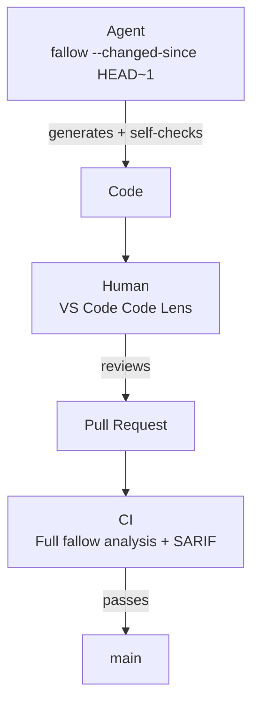

CI catches unused code, duplication, and complexity issues that get past agent workflows and editor review.

<Tabs>
  <Tab title="GitHub Action">
    <Steps>
      <Step title="Add the action">
        Add fallow to your workflow file:

        ```yaml
        name: Fallow analysis
        on: [push, pull_request]

        jobs:
          fallow:
            runs-on: ubuntu-latest
            steps:
              - uses: actions/checkout@v4
              - uses: fallow-rs/fallow@v2
                with:
                  format: sarif
        ```

        This runs all analyses (dead code + duplication + complexity) by default. Use the `command` input to run a specific analysis.
      </Step>
      <Step title="Configure inputs">
        Customize the action with these inputs:

        | Input | Default | Description |
        |:------|:--------|:------------|
        | `command` | -- (all) | Command to run (`check`, `dead-code`, `dupes`, `health`, `fix`, or empty for all) |
        | `root` | `.` | Project root directory |
        | `config` | -- | Path to config file (`.fallowrc.json` or `fallow.toml`) |
        | `format` | `sarif` | Output format |
        | `production` | `false` | Enable production mode for every analysis |
        | `production-dead-code` | `false` | Combined mode only: per-analysis production mode for dead-code |
        | `production-health` | `false` | Combined mode only: per-analysis production mode for health |
        | `production-dupes` | `false` | Combined mode only: per-analysis production mode for duplication |
        | `fail-on-issues` | `true` | Exit with code 1 if issues are found |
        | `changed-since` | -- | Only check files changed since this ref |
        | `auto-changed-since` | `true` | Automatically scope to changed files in PR context using base SHA. Ignored when `changed-since` is set. |
        | `baseline` | -- | Path to baseline file for comparison |
        | `save-baseline` | -- | Save current results as a baseline file |
        | `version` | `latest` | Fallow version to use |
        | `workspace` | -- | Scope output to one or more workspaces (exact names, globs, `!` negation; comma-separated) |
        | `changed-workspaces` | -- | Git-derived monorepo scoping: scope to workspaces containing any file changed since `REF` (e.g. `origin/main`). Requires `fetch-depth: 0`. Mutually exclusive with `workspace`. A missing ref is a hard error (exit 2) rather than silent full-scope fallback. |
        | `comment` | `false` | Post results as a PR comment |
        | `annotations` | `true` | Emit findings as inline PR annotations via workflow commands (no Advanced Security required) |
        | `max-annotations` | `50` | Maximum number of inline annotations to emit |
        | `github-token` | `${{ github.token }}` | GitHub token for PR comments and SARIF upload |
        | `dupes-mode` | `mild` | Detection mode for dupes command |
        | `min-tokens` | -- | Minimum token count for a clone (dupes command) |
        | `min-lines` | -- | Minimum line count for a clone (dupes command) |
        | `threshold` | -- | Fail if duplication exceeds this % (dupes command) |
        | `skip-local` | `false` | Only report cross-directory duplicates (dupes command) |
        | `score` | `false` | Compute health score (0-100 with letter grade). Enables the health delta header in PR comments (health and bare command) |
        | `trend` | `false` | Compare current metrics against the most recent saved snapshot. Implies `score` (health and bare command) |
        | `save-snapshot` | -- | Save vital signs snapshot for trend tracking. Set to `true` for default path or provide a custom path (health and bare command) |
        | `dry-run` | `true` | Preview changes without modifying files (fix command) |
        | `args` | -- | Additional arguments to pass to fallow |
      </Step>
      <Step title="Upload SARIF (optional)">
        Upload results to GitHub Code Scanning to get inline annotations on the PR diff:

        ```yaml
        - uses: fallow-rs/fallow@v2
          with:
            format: sarif

        - uses: github/codeql-action/upload-sarif@v4
          with:
            sarif_file: fallow-results.sarif
        ```
      </Step>
    </Steps>

    ```bash title="GitHub Actions job summary"
    fallow — 8 issues found

    Dead Code (3 issues)
    | Type | File | Symbol | Line |
    |------|------|--------|------|
    | unused-export | src/utils/format.ts | formatCurrency | 12 |
    | unused-export | src/utils/format.ts | formatPercentage | 28 |
    | unused-file | src/legacy/oldApi.ts | — | — |

    Duplication (3 clone groups, 1.8%)
    | Files | Lines | Tokens |
    |-------|-------|--------|
    | src/tax/utils.ts ↔ src/savings/utils.ts | 25 | 92 |

    Complexity (2 hotspots)
    | File | Function | Cyclomatic | Cognitive |
    |------|----------|------------|-----------|
    | src/server/router.ts:42 | handleRequest | 28 | 34 |

    Completed in 48ms
    ```

    <Info>
    SARIF upload to GitHub Code Scanning shows dead code issues as inline annotations directly on the PR diff.
    </Info>

    <Info>
    The action automatically detects your package manager (npm, pnpm, or yarn) from lock files. Review comments and annotations show the correct install/uninstall commands for your project.
    </Info>
  </Tab>
  <Tab title="GitLab CI">
    <Steps>
      <Step title="Include the template">
        Add fallow to your `.gitlab-ci.yml`:

        ```yaml
        include:
          - remote: 'https://raw.githubusercontent.com/fallow-rs/fallow/main/ci/gitlab-ci.yml'

        fallow:
          extends: .fallow
        ```

        This runs all analyses (dead code + duplication + complexity) on every MR and push to the default branch.
      </Step>
      <Step title="Configure variables">
        Customize with CI/CD variables:

        | Variable | Default | Description |
        |:---------|:--------|:------------|
        | `FALLOW_COMMAND` | `""` | Command to run (`check`, `dead-code`, `dupes`, `health`, `fix`, or empty for all) |
        | `FALLOW_ROOT` | `.` | Project root directory |
        | `FALLOW_CONFIG` | -- | Path to config file |
        | `FALLOW_PRODUCTION` | `""` | Set to `"true"` to enable production mode for every analysis. Empty defers to per-analysis env and config. |
        | `FALLOW_PRODUCTION_DEAD_CODE` | `""` | Combined mode only: set to `"true"`/`"false"` to override `FALLOW_PRODUCTION` for dead-code. Empty defers to it. |
        | `FALLOW_PRODUCTION_HEALTH` | `""` | Combined mode only: set to `"true"`/`"false"` to override `FALLOW_PRODUCTION` for health. Empty defers to it. |
        | `FALLOW_PRODUCTION_DUPES` | `""` | Combined mode only: set to `"true"`/`"false"` to override `FALLOW_PRODUCTION` for duplication. Empty defers to it. |
        | `FALLOW_FAIL_ON_ISSUES` | `true` | Fail pipeline if issues found |
        | `FALLOW_CHANGED_SINCE` | -- | Only check files changed since this ref (auto-detected in MR pipelines) |
        | `FALLOW_BASELINE` | -- | Path to baseline file for comparison |
        | `FALLOW_SAVE_BASELINE` | -- | Save current results as a baseline file |
        | `FALLOW_COMMENT` | `false` | Post a rich MR summary comment with collapsible sections for each analysis |
        | `FALLOW_REVIEW` | `false` | Post inline MR discussions on changed lines with suggestion blocks for auto-fixable issues |
        | `FALLOW_MAX_COMMENTS` | `50` | Maximum number of inline review comments to post (applies to `FALLOW_REVIEW`) |
        | `FALLOW_CODEQUALITY` | `true` | Generate Code Quality report (inline MR annotations) |
        | `FALLOW_VERSION` | `latest` | Fallow version to use |
        | `FALLOW_SCRIPTS_REF` | `main` | Pin CI scripts to a specific git ref (tag, branch, or SHA) for reproducible builds |
        | `FALLOW_WORKSPACE` | -- | Scope output to one or more workspaces (exact names, globs, `!` negation; comma-separated) |
        | `FALLOW_CHANGED_WORKSPACES` | -- | Git-derived monorepo scoping: scope to workspaces containing any file changed since `REF`. Requires full git history. Mutually exclusive with `FALLOW_WORKSPACE`. Missing ref is a hard error. |
        | `FALLOW_DUPES_MODE` | `mild` | Detection mode for dupes (`strict`, `mild`, `weak`, `semantic`) |
        | `FALLOW_SCORE` | `false` | Compute health score (0-100 with letter grade). Enables the health delta header in MR comments (health and bare command) |
        | `FALLOW_TREND` | `false` | Compare current metrics against the most recent saved snapshot. Implies `FALLOW_SCORE` (health and bare command) |
        | `FALLOW_SAVE_SNAPSHOT` | -- | Save vital signs snapshot for trend tracking. Set to `true` for default path or provide a custom path (health and bare command) |
        | `FALLOW_ARGS` | -- | Additional arguments (space-separated) |

        <Info>
        In MR pipelines, the template automatically passes `--changed-since` to scope analysis to files changed in the merge request. No manual configuration needed.
        </Info>

        <Info>
        The template automatically detects your package manager (npm, pnpm, or yarn) from lock files. Review comments and suggestions show the correct install/uninstall commands for your project.
        </Info>

        Example: full MR feedback with summary comment and inline review:

        ```yaml
        fallow:
          extends: .fallow
          variables:
            FALLOW_COMMENT: "true"
            FALLOW_REVIEW: "true"
        ```

        Example: dead code only with MR comments:

        ```yaml
        fallow:
          extends: .fallow
          variables:
            FALLOW_COMMAND: "dead-code"
            FALLOW_COMMENT: "true"
        ```
      </Step>
      <Step title="Code Quality reports">
        The template automatically generates a GitLab Code Quality report (CodeClimate format). This shows fallow findings as **inline annotations** directly on the MR diff, the GitLab equivalent of GitHub Code Scanning.

        No additional configuration needed. The report is uploaded as a CI artifact automatically.
      </Step>
      <Step title="Rich MR comments">
        **Summary comment**: Set `FALLOW_COMMENT: "true"` to post a rich MR comment with collapsible sections for dead code, duplication, and complexity findings. The comment is updated on each push (no spam).

        **Inline review**: Set `FALLOW_REVIEW: "true"` to post inline MR discussions directly on changed lines. Auto-fixable issues include GitLab suggestion blocks that can be applied with one click. Use `FALLOW_MAX_COMMENTS` to cap the number of inline comments (default: 50).

        ```yaml
        fallow:
          extends: .fallow
          variables:
            FALLOW_COMMENT: "true"    # Rich summary comment
            FALLOW_REVIEW: "true"     # Inline discussions with suggestions
            FALLOW_MAX_COMMENTS: "30" # Limit inline comments
        ```
      </Step>
      <Step title="Authentication">
        MR comments and inline reviews require API access. Two options:

        - **`GITLAB_TOKEN`** (recommended): a project or personal access token with `api` scope. Set it as a CI/CD variable. Required for full features including comment cleanup on resolved issues.
        - **`CI_JOB_TOKEN`**: works for posting comments but cannot clean up outdated comments when issues are resolved. Requires the project to allow job token API access.

        <Warning>
        `CI_JOB_TOKEN` cannot delete or update comments from previous runs. Use a `GITLAB_TOKEN` with `api` scope for the best experience. Stale comments are automatically removed when issues are fixed.
        </Warning>
      </Step>
    </Steps>

    <Info>
    The GitLab template caches parse results per branch via `.fallow/`, so incremental runs are fast.
    </Info>

    <Accordion title="Complete example configuration">
      A full `.gitlab-ci.yml` setup with summary comments, inline review, and Code Quality:

      ```yaml
      include:
        - remote: 'https://raw.githubusercontent.com/fallow-rs/fallow/main/ci/gitlab-ci.yml'

      fallow:
        extends: .fallow
        variables:
          FALLOW_COMMENT: "true"        # Rich MR summary with collapsible sections
          FALLOW_REVIEW: "true"         # Inline discussions with suggestion blocks
          FALLOW_MAX_COMMENTS: "50"     # Cap inline review comments (default: 50)
          FALLOW_CODEQUALITY: "true"    # Code Quality report for MR annotations
          FALLOW_FAIL_ON_ISSUES: "true" # Fail pipeline on issues
          FALLOW_PRODUCTION: "true"     # Exclude test/dev files
          # FALLOW_SCRIPTS_REF: "v1.0.0" # Pin scripts to a specific version
      ```

      The template automatically:
      - Detects your package manager (npm/pnpm/yarn) from lock files
      - Scopes analysis to changed files in MR pipelines via `--changed-since`
      - Caches parse results per branch for fast incremental runs
      - Uploads Code Quality artifacts for inline MR annotations
    </Accordion>
  </Tab>
  <Tab title="Manual Setup">
    If you prefer not to use the action or template, run fallow directly:

    ```yaml
    - run: npx fallow --ci              # All analyses (dead code + dupes + health)
    - run: npx fallow dead-code --ci    # Dead code only
    - run: npx fallow dupes --ci        # Duplication only
    - run: npx fallow health --ci       # Complexity hotspots only
    ```

    The `--ci` flag enables SARIF output, fail-on-issues, and quiet mode in one flag. Or configure individually:

    ```yaml
    - run: npx fallow --fail-on-issues --format compact
    ```

    <Info>
    The `--ci`, `--fail-on-issues`, and `--sarif-file` flags work on all commands: `dead-code`, `dupes`, `health`, and bare `fallow`.
    </Info>

    ### PR/MR comments

    Post results as a comment using markdown output:

    <Tabs>
      <Tab title="GitHub Actions">
        ```yaml
        - run: npx fallow dead-code --format markdown | gh pr comment ${{ github.event.pull_request.number }} --body-file -
        - run: npx fallow dupes --format markdown | gh pr comment ${{ github.event.pull_request.number }} --body-file -
        - run: npx fallow health --format markdown | gh pr comment ${{ github.event.pull_request.number }} --body-file -
        ```
      </Tab>
      <Tab title="GitLab CI">
        Use the built-in template with `FALLOW_COMMENT`:

        ```yaml
        fallow:
          extends: .fallow
          variables:
            FALLOW_COMMENT: "true"
        ```

        Or manually with the GitLab API:

        ```yaml
        fallow:
          script:
            - npx fallow --format markdown > fallow-report.md
            - |
              curl --request POST \
                --header "PRIVATE-TOKEN: $GITLAB_TOKEN" \
                "$CI_API_V4_URL/projects/$CI_PROJECT_ID/merge_requests/$CI_MERGE_REQUEST_IID/notes" \
                --data-urlencode "body@fallow-report.md"
          rules:
            - if: $CI_MERGE_REQUEST_IID
        ```
      </Tab>
    </Tabs>

    ### Duplication checks

    ```yaml
    - run: npx fallow dupes --threshold 5 --format compact
    ```

    This fails if the overall duplication percentage exceeds 5%.

    Use `--changed-since` to only check duplication in files modified in the PR/MR:

    ```yaml
    - run: npx fallow dupes --changed-since origin/main --format compact
    ```

    ### Health checks

    ```yaml
    - run: npx fallow health --format compact
    ```

    Reports complexity hotspots and circular dependencies. Use `--max-cyclomatic 15` to customize the threshold.
  </Tab>
  <Tab title="Other CI">
    Fallow works in any CI environment that can run Node.js or download a binary. The pattern is the same everywhere:

    ```bash
    # Run all analyses (no install needed)
    npx fallow --format compact

    # Or individual commands
    npx fallow dead-code --format compact
    npx fallow dupes --format compact
    npx fallow health --format compact

    # Or download the binary directly
    curl -fsSL https://get.fallow.dev | sh
    fallow --format compact
    ```

    ### Exit codes

    | Code | Meaning |
    |:-----|:--------|
    | `0` | No error-severity issues found |
    | `1` | Error-severity issues found |
    | `2` | Fatal error (invalid config, parse failure) |
  </Tab>
</Tabs>

<Tip>
Both the GitHub Action and GitLab CI template automatically scope analysis to changed files in PR/MR context. No extra configuration needed.
</Tip>

### PR/MR-only analysis

Only analyze files changed in the current pull request or merge request:

<Tabs>
  <Tab title="GitHub Action">
    The action does this automatically via `auto-changed-since` (enabled by default). To disable and run a full analysis on PRs:

    ```yaml
    - uses: fallow-rs/fallow@v2
      with:
        auto-changed-since: false
    ```

    To use a custom ref instead of the PR base SHA:

    ```yaml
    - uses: fallow-rs/fallow@v2
      with:
        changed-since: origin/main
    ```
  </Tab>
  <Tab title="GitLab CI">
    The template does this automatically in MR pipelines. To use a custom ref instead:

    ```yaml
    fallow:
      extends: .fallow
      variables:
        FALLOW_CHANGED_SINCE: "origin/$CI_MERGE_REQUEST_TARGET_BRANCH_NAME"
    ```
  </Tab>
  <Tab title="Manual">
    ```yaml
    - run: npx fallow --changed-since origin/main
    ```
  </Tab>
</Tabs>

<Accordion title="Incremental adoption with baselines">
  Adopting fallow on a large codebase? Use baselines to ignore pre-existing issues while catching new ones.

  **1. Save a baseline on your main branch:**

  ```bash
  npx fallow --save-baseline fallow-baselines/dead-code.json
  git add fallow-baselines/dead-code.json && git commit -m "chore: add fallow baseline"
  ```

  **2. In your CI workflow, compare against the baseline:**

  <Tabs>
    <Tab title="GitHub Action">
      ```yaml
      - uses: fallow-rs/fallow@v2
        with:
          baseline: fallow-baselines/dead-code.json
      ```
    </Tab>
    <Tab title="GitLab CI">
      ```yaml
      fallow:
        extends: .fallow
        variables:
          FALLOW_BASELINE: "fallow-baselines/dead-code.json"
      ```
    </Tab>
    <Tab title="Manual">
      ```yaml
      - run: npx fallow --baseline fallow-baselines/dead-code.json
      ```
    </Tab>
  </Tabs>

  Only new issues (not in the baseline) get reported. As your team cleans up existing dead code, periodically regenerate the baseline on `main`.

  <Warning>
  Baselines must be committed to your repo. If you regenerate on every CI run, new issues are never reported.
  </Warning>
</Accordion>

## The three tracks together

CI works best when combined with agent and editor integration:

1. **Agent** generates code and runs `fallow --changed-since HEAD~1` to self-check
2. **Human** reviews in VS Code, sees Code Lens annotations on new exports
3. **CI** runs the full analysis and catches anything that slipped through



Fallow analyzes a 20,000-file project in under 2 seconds. It adds negligible time to any pipeline.

## See also

<CardGroup cols={3}>
  <Card title="Agent integration" icon="robot" href="/integrations/mcp">
    How AI agents use fallow via CLI and MCP.
  </Card>
  <Card title="Rule configuration" icon="sliders" href="/configuration/rules">
    Configure severity levels and issue types.
  </Card>
  <Card title="Production mode" icon="rocket" href="/analysis/production-mode">
    Exclude test and dev files from analysis.
  </Card>
  <Card title="Health badges" icon="award" href="/integrations/badges">
    Add a health score badge to your README.
  </Card>
</CardGroup>
