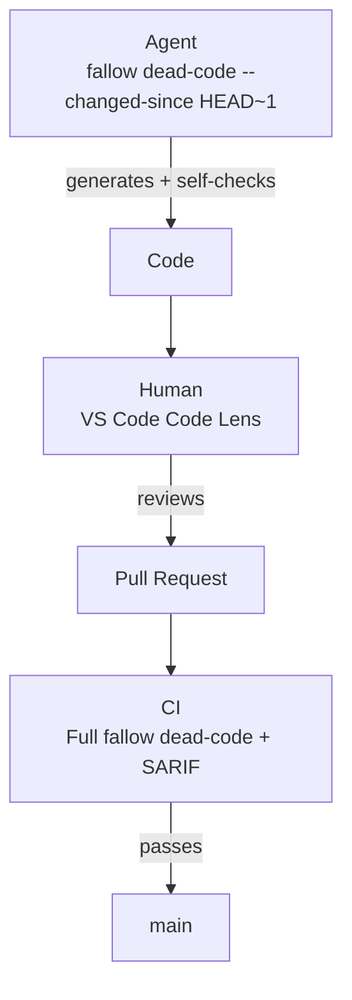

CI is the last line of defense. If dead code slips through agent workflows or editor review, CI catches it before it lands in main.

<Tabs>
  <Tab title="GitHub Action">
    <Steps>
      <Step title="Add the action">
        Add fallow to your workflow file:

        ```yaml
        name: Dead code analysis
        on: [push, pull_request]

        jobs:
          fallow:
            runs-on: ubuntu-latest
            steps:
              - uses: actions/checkout@v4
              - uses: fallow-rs/fallow@v1
                with:
                  format: sarif
        ```
      </Step>
      <Step title="Configure inputs">
        Customize the action with these inputs:

        | Input | Default | Description |
        |:------|:--------|:------------|
        | `command` | `check` | Command to run (`dead-code`, `check`, `dupes`, `fix`) |
        | `root` | `.` | Project root directory |
        | `config` | — | Path to config file (`.fallowrc.json` or `fallow.toml`) |
        | `format` | `sarif` | Output format |
        | `production` | `false` | Enable production mode |
        | `fail-on-issues` | `true` | Exit with code 1 if issues are found |
        | `changed-since` | — | Only check files changed since this ref |
        | `baseline` | — | Path to baseline file for comparison |
        | `save-baseline` | — | Save current results as a baseline file |
        | `version` | `latest` | Fallow version to use |
        | `workspace` | — | Scope output to a single workspace package |
        | `comment` | `false` | Post results as a PR comment |
        | `github-token` | `${{ github.token }}` | GitHub token for PR comments and SARIF upload |
        | `dupes-mode` | `mild` | Detection mode for dupes command |
        | `min-tokens` | — | Minimum token count for a clone (dupes command) |
        | `min-lines` | — | Minimum line count for a clone (dupes command) |
        | `threshold` | — | Fail if duplication exceeds this % (dupes command) |
        | `skip-local` | `false` | Only report cross-directory duplicates (dupes command) |
        | `dry-run` | `true` | Preview changes without modifying files (fix command) |
        | `args` | — | Additional arguments to pass to fallow |
      </Step>
      <Step title="Upload SARIF (optional)">
        Upload results to GitHub Code Scanning to get inline annotations on the PR diff:

        ```yaml
        - uses: fallow-rs/fallow@v1
          with:
            format: sarif

        - uses: github/codeql-action/upload-sarif@v4
          with:
            sarif_file: fallow-results.sarif
        ```
      </Step>
    </Steps>

    ```bash title="GitHub Actions job summary"
    fallow dead-code — 3 issues found

    | Type | File | Symbol | Line |
    |------|------|--------|------|
    | unused-export | src/utils/format.ts | formatCurrency | 12 |
    | unused-export | src/utils/format.ts | formatPercentage | 28 |
    | unused-file | src/legacy/oldApi.ts | — | — |

    Completed in 22ms
    ```

    <Info>
    SARIF upload to GitHub Code Scanning shows dead code issues as inline annotations directly on the PR diff.
    </Info>
  </Tab>
  <Tab title="GitLab CI">
    <Steps>
      <Step title="Include the template">
        Add fallow to your `.gitlab-ci.yml`:

        ```yaml
        include:
          - remote: 'https://raw.githubusercontent.com/fallow-rs/fallow/main/ci/gitlab-ci.yml'

        fallow:
          extends: .fallow
        ```

        This runs all analyses (dead code + duplication + complexity) on every MR and push to the default branch.
      </Step>
      <Step title="Configure variables">
        Customize with CI/CD variables:

        | Variable | Default | Description |
        |:---------|:--------|:------------|
        | `FALLOW_COMMAND` | `""` | Command to run (`dead-code`, `dupes`, `health`, `fix`, or empty for all) |
        | `FALLOW_ROOT` | `.` | Project root directory |
        | `FALLOW_CONFIG` | — | Path to config file |
        | `FALLOW_PRODUCTION` | `false` | Enable production mode |
        | `FALLOW_FAIL_ON_ISSUES` | `true` | Fail pipeline if issues found |
        | `FALLOW_CHANGED_SINCE` | — | Only check files changed since this ref |
        | `FALLOW_BASELINE` | — | Path to baseline file for comparison |
        | `FALLOW_COMMENT` | `false` | Post results as MR comment |
        | `FALLOW_CODEQUALITY` | `true` | Generate Code Quality report (inline MR annotations) |
        | `FALLOW_VERSION` | `latest` | Fallow version to use |
        | `FALLOW_WORKSPACE` | — | Scope to a single workspace package |
        | `FALLOW_DUPES_MODE` | `mild` | Detection mode for dupes (`strict`, `mild`, `weak`, `semantic`) |
        | `FALLOW_ARGS` | — | Additional arguments (space-separated) |

        Example — dead code only with MR comments:

        ```yaml
        fallow:
          extends: .fallow
          variables:
            FALLOW_COMMAND: "dead-code"
            FALLOW_COMMENT: "true"
        ```
      </Step>
      <Step title="Code Quality reports">
        The template automatically generates a GitLab Code Quality report (CodeClimate format). This shows fallow findings as **inline annotations** directly on the MR diff — the GitLab equivalent of GitHub Code Scanning.

        No additional configuration needed. The report is uploaded as a CI artifact automatically.
      </Step>
      <Step title="MR comments (optional)">
        Set `FALLOW_COMMENT: "true"` to post a summary table as an MR comment. The comment is updated on each push (no spam).

        For MR comments, the job needs API access. Either:
        - Set a `GITLAB_TOKEN` CI/CD variable (project access token with `api` scope), or
        - Use the built-in `CI_JOB_TOKEN` (requires the project to allow job token API access)
      </Step>
    </Steps>

    <Info>
    The GitLab template caches parse results per branch via `.fallow/`, so incremental runs are fast.
    </Info>
  </Tab>
  <Tab title="Manual Setup">
    If you prefer not to use the action, run fallow directly:

    ```yaml
    - run: npx fallow dead-code --format sarif > results.sarif
    ```

    Or use `--ci` mode for SARIF + fail-on-issues + quiet in one flag:

    ```yaml
    - run: npx fallow dead-code --ci
    - run: npx fallow --ci    # All analyses
    ```

    Or with specific checks:

    ```yaml
    - run: npx fallow dead-code --fail-on-issues --format compact
    ```

    <Info>
    The `--ci`, `--fail-on-issues`, and `--sarif-file` flags work on all commands: `dead-code`, `dupes`, `health`, and bare `fallow`.
    </Info>

    ### PR comments

    Post results as a PR comment using markdown output:

    ```yaml
    - run: npx fallow dead-code --format markdown | gh pr comment ${{ github.event.pull_request.number }} --body-file -
    ```

    Duplication and health results can also be posted as PR comments:

    ```yaml
    - run: npx fallow dupes --format markdown | gh pr comment ${{ github.event.pull_request.number }} --body-file -
    - run: npx fallow health --format markdown | gh pr comment ${{ github.event.pull_request.number }} --body-file -
    ```

    ### Duplication checks

    ```yaml
    - run: npx fallow dupes --threshold 5 --format compact
    ```

    This fails if the overall duplication percentage exceeds 5%.

    Use `--changed-since` to only check duplication in files modified in the PR:

    ```yaml
    - run: npx fallow dupes --changed-since origin/main --format compact
    ```
  </Tab>
  <Tab title="Other CI">
    Fallow works in any CI environment that can run Node.js or download a binary. The pattern is the same everywhere:

    ```bash
    # Run with npx (no install needed)
    npx fallow dead-code --format compact

    # Or download the binary directly
    curl -fsSL https://get.fallow.dev | sh
    fallow dead-code --format compact
    ```

    ### Exit codes

    | Code | Meaning |
    |:-----|:--------|
    | `0` | No error-severity issues found |
    | `1` | Error-severity issues found |
    | `2` | Fatal error (invalid config, parse failure) |
  </Tab>
</Tabs>

<Tip>
For pull requests, use `--changed-since` to only check files modified in the PR. This keeps CI fast and focuses feedback on new code.
</Tip>

### PR-only analysis

```yaml
- uses: fallow-rs/fallow@v1
  with:
    changed-since: ${{ github.event.pull_request.base.sha }}
```

<Accordion title="Incremental adoption with baselines">
  Adopting fallow on a large codebase? Use baselines to skip pre-existing issues while still catching new ones.

  **1. Save a baseline on your main branch:**

  ```bash
  npx fallow dead-code --save-baseline .fallow-baseline.json
  git add .fallow-baseline.json && git commit -m "chore: add fallow baseline"
  ```

  **2. In your PR workflow, compare against the baseline:**

  ```yaml
  - run: npx fallow dead-code --baseline .fallow-baseline.json
  ```

  Only new issues (not in the baseline) get reported. As your team cleans up existing dead code, periodically regenerate the baseline on `main`.

  <Warning>
  Baselines must be committed to your repo. Don't regenerate on every CI run, or you'll defeat the purpose of incremental adoption.
  </Warning>
</Accordion>

## The three tracks together

CI works best when combined with agent and editor integration:

1. **Agent** generates code and runs `fallow dead-code --changed-since HEAD~1` to self-check
2. **Human** reviews in VS Code, sees Code Lens annotations on new exports
3. **CI** runs the full analysis and catches anything that slipped through



Fallow runs in under a second, so it adds almost no time to your pipeline, even on large monorepos.

## See also

<CardGroup cols={3}>
  <Card title="Agent integration" icon="robot" href="/integrations/mcp">
    How AI agents use fallow via CLI and MCP.
  </Card>
  <Card title="Rule configuration" icon="sliders" href="/configuration/rules">
    Configure severity levels and issue types.
  </Card>
  <Card title="Production mode" icon="rocket" href="/analysis/production-mode">
    Exclude test and dev files from analysis.
  </Card>
</CardGroup>
