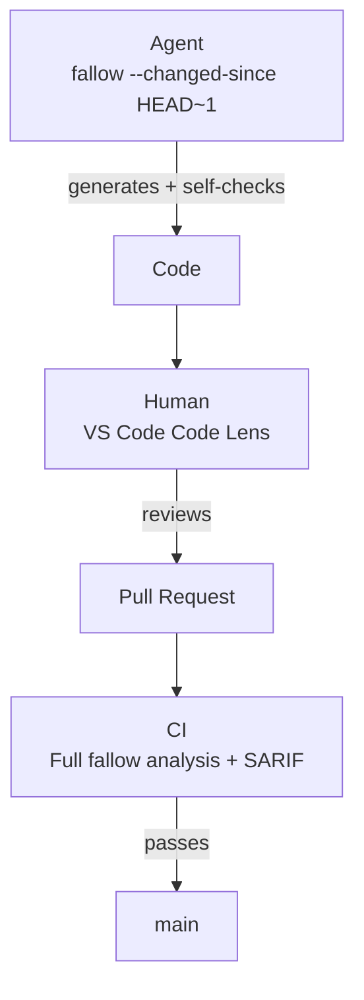

Run fallow in CI to catch changed-code risk, cleanup opportunities, duplication, and complexity issues on every push and pull request. CI catches the issues that get past agent workflows and editor review. You get the results as PR or MR comments, inline review, annotations, and a merge gate.

<Tip>
  To roll out on TypeScript, start with type-aware analysis in `best-effort`
  mode and check `_meta.type_aware` in the JSON output. Switch to `complete`
  only when partial or unavailable semantic evidence must fail the job.
  Type-aware analysis adds a slower semantic pass. See
  [Type-aware TypeScript analysis](/analysis/type-aware).
</Tip>

<Tabs>
  <Tab title="GitHub Action">
    <Steps>
      <Step title="Add the action">
        Add fallow to your workflow file:

        ```yaml
        name: Fallow analysis
        on: [push, pull_request]

        jobs:
          fallow:
            runs-on: ubuntu-latest
            steps:
              - uses: actions/checkout@v4
              - uses: fallow-rs/fallow@v3
                with:
                  format: sarif
        ```

        By default, this runs all analyses (dead code, duplication, and complexity). To run one analysis, set the `command` input.

        <Note>
          When you enable `comment: true` or `review-comments: true`, grant the
          job `contents: read`, `id-token: write`, `pull-requests: write`, and
          `checks: write`. With `id-token: write`, the Action gets a
          short-lived Fallow GitHub App token, and `fallow-cloud[bot]` posts
          the feedback. Without `id-token: write`, the analysis and the posts
          still run, as `github-actions[bot]`.
        </Note>

        ```yaml
        permissions:
          contents: read
          id-token: write
          pull-requests: write
          checks: write
        ```
      </Step>
      <Step title="Configure inputs">
        The action takes these inputs:

        | Input | Default | Description |
        |:------|:--------|:------------|
        | `command` | -- (all) | Command to run (`dead-code`, `dupes`, `health`, `audit`, `security`, `fix`, or empty for all). Legacy alias: `check` = `dead-code`. |
        | `root` | `.` | Project root directory |
        | `config` | -- | Path to config file (`.fallowrc.json`, `.fallowrc.jsonc`, `fallow.toml`, or `.fallow.toml`) |
        | `format` | `sarif` | Output format (`human`, `json`, `sarif`, `compact`, `markdown`, `codeclimate`, `pr-comment-github`, `pr-comment-gitlab`, `review-github`, `review-gitlab`, or `badge`) |
        | `sarif` | `false` | Upload SARIF to GitHub Code Scanning. Needs `permissions: security-events: write`. |
        | `artifacts-dir` | `.` | Directory for the files that the action writes, such as `fallow-results.json` and `fallow-results.sarif`. Relative to the workflow workspace. |
        | `production` | `false` | Turn on production mode for every analysis |
        | `production-dead-code` | `false` | Combined mode only: per-analysis production mode for dead-code |
        | `production-health` | `false` | Combined mode only: per-analysis production mode for health |
        | `production-dupes` | `false` | Combined mode only: per-analysis production mode for duplication |
        | `fail-on-issues` | `true` | Exit with code 1 when there are issues |
        | `issue-types` | -- | Comma-separated issue types to report (dead-code command) |
        | `include-entry-exports` | `false` | Report unused exports in entry files and do not mark them as used. This catches typos in framework exports (dead-code analysis). |
        | `fail-on-regression` | `false` | Exit with code 1 when the issue counts increase compared to the regression baseline (dead-code command) |
        | `tolerance` | `0` | Allowed increase before a regression fails, for example `2%` or `5` (dead-code command) |
        | `regression-baseline` | -- | Path to the regression baseline file to compare against (dead-code command) |
        | `save-regression-baseline` | -- | Save the current results as a regression baseline file (dead-code command) |
        | `changed-since` | -- | Only check files changed since this ref |
        | `auto-changed-since` | `true` | In a PR, check only changed files, compared to the base SHA. Ignored when `changed-since` is set. |
        | `baseline` | -- | Path to a baseline file to compare against. With `command: audit`, the action rejects it with exit 2. Use `dead-code-baseline`, `health-baseline`, or `dupes-baseline` for audit. With `command: fix`, the action also rejects it with exit 2, because `fix` does not load a baseline. |
        | `save-baseline` | -- | Save the current results as a baseline file. With `command: audit`, the action rejects it with exit 2, because audit runs three analyses with different baseline formats. `command: fix` also rejects it with exit 2. The file must be inside the project, its Git work tree, the CI workspace, `RUNNER_TEMP`, or the system temp directory. See [Save destinations](/cli/global-flags#save-destinations). |
        | `fail-on-stale-baseline` | `false` | Fail the job when the loaded `baseline` has entries that match nothing in this run, or when it is a baseline of another `kind`. You get the staleness warning without this input: every run that loads a baseline reports it. A scoped run cannot judge a whole-project baseline, so a narrowed run first reads the baseline again over the whole project. This input only decides if that verdict fails the job. It does not depend on `fail-on-issues`, because a fully stale baseline on a now-clean project reports zero issues. When the run still cannot cover the whole project (`production`, `workspace`, `changed-workspaces`, or a positional path in `args`), the gate warns and does not judge. |
        | `min-score` | -- | `command: health` only: fail when the health score is below this threshold (0-100). Implies `--score`. Unless you set a health section input, the action adds `--complexity`, so annotations, SARIF, and the PR comment still have content. `target_thresholds` and `hotspot_summary` do not come back. With this input, the CLI turns off its own findings rule and the count gate, so only the score decides the run. Any other command rejects it with exit 2. |
        | `min-severity` | -- | `command: health` only: fail when a complexity finding reaches this severity (`moderate`, `high`, or `critical`). A finding whose `complexity-*` rule is `warn` never trips this gate. The `fail-on-issues` count gate is separate and still counts every finding. To gate on severity alone, set `fail-on-issues: false`. |
        | `fail-on-empty-analysis` | `false` | Fail the job when the run analyzed no source file. In that case every count is zero because the run measured nothing, not because the project is clean. By default the run warns and passes, so a repository whose scope has no source on purpose still passes. |
        | `version` | -- | Fallow version to install. The Action ref does not set the fallow CLI version: `uses: fallow-rs/fallow@v3` selects only the Action wrapper code. The action picks the CLI version from this input, then the `fallow` dependency spec in the project `package.json`, then `latest`. |
        | `workspace` | -- | Limit the output to one or more workspaces (exact names, globs, `!` negation; comma-separated) |
        | `changed-workspaces` | -- | Limit a monorepo run to workspaces with a file changed since `REF` (for example `origin/main`). Requires `fetch-depth: 0`. Cannot be used with `workspace`. A missing ref is a hard error (exit 2). The run does not fall back to the full scope. |
        | `comment` | `false` | Post results as a PR comment |
        | `review-comments` | `false` | Post inline PR review comments from typed `review-github` output. Later runs resolve threads for fixed findings |
        | `review-guidance` | `false` | Add collapsed "What to do" guidance blocks to inline PR review comments. Requires `review-comments: true` |
        | `max-comments` | `50` | Maximum number of inline review comments, and of items in the sticky details table |
        | `comment-layout` | `default` | Layout of the sticky PR comment: `default`, `compact`, `gate-only`, or `details`. Use `gate-only` when the Check Run is the main place where you read PR findings. |
        | `comment-id` | -- | Marker id of the sticky comment. The default is `fallow-results`, with the workspace name added when the run covers one workspace. |
        | `summary-scope` | `all` | Scope of the sticky PR summary. Use `diff` to also apply the diff filter to project-level dependency, catalog, and override findings. Inline review comments do not change. |
        | `diff-filter` | `added` | Show line-level findings only on added PR lines. Use `diff_context`, `file`, or `nofilter` for a wider review scope. |
        | `diff-file` | -- | Path to a unified diff file. Fallow then limits source findings to lines in an added hunk. When you also set `changed-since`, the diff filter decides the findings, and `changed-since` still decides the file discovery. |
        | `api-retries` | `3` | Maximum number of HTTP retries for `fallow ci reconcile-review` and the GitHub API calls of the action |
        | `api-retry-delay` | `2` | Minimum delay in seconds between retries after a rate limit. A `Retry-After` header from the server overrides it. |
        | `review-id` | -- | Stable identifier (1-64 characters, `A-Za-z0-9._-`) that keeps the inline review comments of each job separate when more than one fallow review job posts to the same pull request. See [Isolating parallel review jobs](#isolating-parallel-review-jobs). |
        | `annotations` | `true` | Show findings as inline PR annotations through workflow commands (no Advanced Security required). On fallow >= 3.4.2, the action renders them natively with `fallow report --format github-annotations`. Older binaries use a frozen legacy renderer that gets no new finding types, and the step log shows a notice to upgrade. With `version: latest`, you get the native path with no change on your side. The step log line `fallow: annotations rendered via native github-annotations` (or `via jq fallback`) tells you which renderer ran. The job summary follows the same rule with `github-summary`. Each annotation takes its level from the rule severity of the finding, so an `error` finding gives `::error`. See [Levels in CI formats](/configuration/rules#levels-in-ci-formats). |
        | `max-annotations` | `50` | Maximum number of inline annotations. On the native path, the cap applies to the rendered stream. GitHub shows at most 10 annotations per type per step. |
        | `github-token` | `${{ github.token }}` | GitHub token for PR comments and SARIF upload |
        | `branded-token` | `true` | When the workflow grants `id-token: write`, post comments and reviews with a short-lived Fallow GitHub App token. When that token is not available, the action uses `github-token`. |
        | `broker-url` | `https://api.fallow.cloud` | Fallow token broker that exchanges the workflow identity for the branded app token. |
        | `dupes-mode` | `mild` | Detection mode for the dupes command |
        | `min-tokens` | -- | Minimum token count for a clone (dupes command) |
        | `min-lines` | -- | Minimum line count for a clone (dupes command) |
        | `threshold` | -- | Fail when duplication is more than this % (dupes command) |
        | `skip-local` | `false` | Only report cross-directory duplicates (dupes command) |
        | `cross-language` | `false` | Remove TypeScript type annotations, so TypeScript and JavaScript clones match (dupes command) |
        | `ignore-imports` | `false` | Exclude import declarations from clone detection (dupes command) |
        | `top` | -- | Show only the N worst offenders (health and dupes commands) |
        | `max-cyclomatic` | -- | Maximum cyclomatic complexity (health command, CLI default 20) |
        | `max-cognitive` | -- | Maximum cognitive complexity (health command, CLI default 15) |
        | `sort` | -- | Sort order for health results: `cyclomatic` (default), `cognitive`, `lines`, or `severity` (health command) |
        | `complexity` | `false` | Show only the complexity findings section (health command) |
        | `file-scores` | `false` | Compute the maintainability index for each file (health command) |
        | `hotspots` | `false` | Find files that are complex and change often (health command) |
        | `targets` | `false` | Show ranked refactoring recommendations (health command) |
        | `since` | -- | Git history window for hotspots: a duration (`6m`, `90d`, `1y`) or an ISO date (health command) |
        | `min-commits` | -- | Minimum number of commits for a file in the hotspot ranking (health command, CLI default 3) |
        | `score` | `false` | Compute the health score (0-100 with letter grade). Adds the health delta header to PR comments (health and bare command) |
        | `trend` | `false` | Compare the current metrics with the most recent saved snapshot. Implies `score` (health and bare command) |
        | `save-snapshot` | -- | Save a vital signs snapshot for trend tracking. Set `true` for the default path, or give a custom path (health and bare command) |
        | `type-aware` | `auto` | Optional project-wide TypeScript semantic evidence: `true`, `false`, or `auto`. With `auto`, the action installs the matching `fallow-type-aware` sidecar when your fallow config turns on `typeAware`, and the config decides. `true` also passes `--type-aware`. `false` skips the sidecar and passes `--no-type-aware`. Does not report compiler diagnostics or generic typed lint findings. |
        | `type-aware-projects` | `""` | Comma-separated tsconfig paths. Empty uses automatic project discovery. |
        | `type-aware-require` | `""` | `best-effort` or `complete`. When empty, the action passes no value, and your config or the CLI default (`best-effort`) decides. Use `complete` to fail when semantic analysis is partial or unavailable, including valid zero-finding runs. The action passes the value to fallow only with `type-aware: true`. With `auto` or `false`, the action checks the result itself after the run, so `complete` also fails a run in which type-aware analysis did not run. |
        | `dry-run` | `true` | Preview changes without modifying files (fix command) |
        | `coverage` | -- | Path to Istanbul `coverage-final.json` for accurate per-function CRAP scores (health and audit commands) |
        | `coverage-root` | -- | Absolute prefix to remove from Istanbul file paths before matching (health and audit commands). Use it when CI or Docker generated the coverage under a different checkout root, for example `/home/runner/work/myapp`. |
        | `runtime-coverage` | -- | Path to runtime coverage input for the health command: a V8 coverage directory, a V8 JSON file, or an Istanbul `coverage-final.json`. A single local capture is free. Continuous or multi-capture monitoring needs a license. See [fallow license](/cli/license). |
        | `min-invocations-hot` | -- | Hot-path threshold for runtime coverage findings (health command, CLI default 100) |
        | `min-observation-volume` | -- | Minimum observation volume for high-confidence runtime coverage verdicts (health command) |
        | `low-traffic-threshold` | -- | Share of the total trace volume below which an invoked function is `low_traffic` and not `active` (health command) |
        | `max-crap` | `30.0` | CRAP score threshold (health and audit commands). Functions at or above this score count toward the verdict. |
        | `gate` | `new-only` | Audit verdict gate. `new-only` fails only on findings that the changeset introduces. `all` fails on every finding in changed files. |
        | `security-gate` | -- | Security delta gate for `command: security`. `new` fails only on changed-line candidates. `newly-reachable` fails only on candidates that became reachable from entry points, and needs a base ref from `changed-since` or PR auto-scoping. A gated security failure exits with code 8, and the `issues` output counts only the candidates that match the gate. The PR comment and review renderers do not support security envelopes yet, so the action skips them for this command. |
        | `dead-code-baseline` / `health-baseline` / `dupes-baseline` | -- | Baseline file paths for each analysis in the audit command (saved by `fallow dead-code|health|dupes --save-baseline`). With these, old issues in touched files do not decide the verdict. |
        | `no-cache` | `false` | Turn off the incremental parse cache and parse all files again |
        | `threads` | -- | Number of parser threads (default: the number of CPU cores) |
        | `only` | -- | Without `command`: run only these analyses (comma-separated: `dead-code`, `dupes`, `health`) |
        | `skip` | -- | Without `command`: skip these analyses (comma-separated: `dead-code`, `dupes`, `health`) |
        | `args` | -- | More arguments to pass to fallow. With `command: audit`, the action rejects `--fail-on-stale-baseline` with exit 2. An audit analyzes only the files that changed against its base, so it cannot judge a whole-project baseline. |
      </Step>
      <Step title="Upload SARIF (optional)">
        To get inline annotations on the PR diff, upload the results to GitHub Code Scanning:

        ```yaml
        - uses: fallow-rs/fallow@v3
          with:
            format: sarif

        - uses: github/codeql-action/upload-sarif@v4
          with:
            sarif_file: fallow-results.sarif
        ```
      </Step>
    </Steps>

    ```bash title="GitHub Actions job summary"
    fallow: 8 issues found

    Dead Code (3 issues)
    | Type | File | Symbol | Line |
    |------|------|--------|------|
    | unused-export | src/utils/format.ts | formatCurrency | 12 |
    | unused-export | src/utils/format.ts | formatPercentage | 28 |
    | unused-file | src/legacy/oldApi.ts | n/a | n/a |

    Duplication (3 clone groups, 1.8%)
    | Files | Lines | Tokens |
    |-------|-------|--------|
    | src/tax/utils.ts ↔ src/savings/utils.ts | 25 | 92 |

    Complexity (2 hotspots)
    | File | Function | Cyclomatic | Cognitive |
    |------|----------|------------|-----------|
    | src/server/router.ts:42 | handleRequest | 28 | 34 |

    Completed in 48ms
    ```

    <Info>
    GitHub Code Scanning is free on public repositories (no GitHub Advanced Security needed). On private or internal repositories, it needs GitHub Advanced Security. On a public repository, the action always tries the upload, and the first upload sets up Code Scanning. On a private or internal repository without Advanced Security, the action warns and skips the SARIF upload. The job summary and the main fallow output are still available.

    The upload needs `permissions: security-events: write` on the job. Without it, the upload step fails. On a public repository the job fails, so add the permission together with `sarif: true`.
    </Info>

    <Info>
    PR summary comments use the native fallow `pr-comment-github` format. Inline review comments use `review-github`. When findings go away, `fallow ci reconcile-review --provider github` marks the old fallow review threads as resolved.
    </Info>

    <Info>
    GitHub inline review comments point to the current state of the PR file (`side: RIGHT`). Fallow does not yet model findings on deleted lines. In normal use, fallow diagnostics describe the current state of the code.
    </Info>

    <Info>
    The action detects your package manager (npm, pnpm, or yarn) from the lock files. Review comments and annotations show the correct install and uninstall commands for your project.
    </Info>
  </Tab>
  <Tab title="GitLab CI">
    <Steps>
      <Step title="Include the template">
        Add fallow to your `.gitlab-ci.yml`:

        ```yaml
        include:
          - remote: 'https://raw.githubusercontent.com/fallow-rs/fallow/main/ci/gitlab-ci.yml'

        fallow:
          extends: .fallow
        ```

        This runs all analyses (dead code, duplication, and complexity) on every MR and on every push to the default branch.
      </Step>
      <Step title="Configure variables">
        Set these CI/CD variables to change the behavior:

        | Variable | Default | Description |
        |:---------|:--------|:------------|
        | `FALLOW_COMMAND` | `""` | Command to run (`dead-code`, `dupes`, `health`, `audit`, `security`, `fix`, or empty for all). Legacy alias: `check` = `dead-code`. |
        | `FALLOW_ROOT` | `.` | Project root directory |
        | `FALLOW_CONFIG` | -- | Path to config file |
        | `FALLOW_PRODUCTION` | `""` | Set to `"true"` to turn on production mode for every analysis. When empty, the per-analysis env and config decide. |
        | `FALLOW_PRODUCTION_DEAD_CODE` | `""` | Combined mode only: set to `"true"` or `"false"` to override `FALLOW_PRODUCTION` for dead-code. When empty, `FALLOW_PRODUCTION` decides. |
        | `FALLOW_PRODUCTION_HEALTH` | `""` | Combined mode only: set to `"true"` or `"false"` to override `FALLOW_PRODUCTION` for health. When empty, `FALLOW_PRODUCTION` decides. |
        | `FALLOW_PRODUCTION_DUPES` | `""` | Combined mode only: set to `"true"` or `"false"` to override `FALLOW_PRODUCTION` for duplication. When empty, `FALLOW_PRODUCTION` decides. |
        | `FALLOW_FAIL_ON_ISSUES` | `true` | Fail the pipeline when there are issues |
        | `FALLOW_ISSUE_TYPES` | `""` | Comma-separated issue types to report (dead-code command) |
        | `FALLOW_INCLUDE_ENTRY_EXPORTS` | `"false"` | Report unused exports in entry files and do not mark them as used (same as `--include-entry-exports`) |
        | `FALLOW_FAIL_ON_REGRESSION` | `"false"` | Fail when the issue counts increase compared to the regression baseline (dead-code command) |
        | `FALLOW_TOLERANCE` | `"0"` | Allowed increase before a regression fails (dead-code command) |
        | `FALLOW_REGRESSION_BASELINE` / `FALLOW_SAVE_REGRESSION_BASELINE` | `""` | Regression baseline file to compare against, and the file to save the current results to (dead-code command) |
        | `FALLOW_TYPE_AWARE` | `""` | Set to `"true"` to turn on semantic evidence or `"false"` to turn it off. When empty, the repository config decides. |
        | `FALLOW_TYPE_AWARE_PROJECTS` | `""` | Comma-separated tsconfig paths. Empty uses automatic project discovery. The template passes each path as a separate CLI flag. |
        | `FALLOW_TYPE_AWARE_REQUIRE` | `""` | `best-effort` or `complete`. When empty, the repository config decides. `complete` fails on partial or unavailable semantic evidence. A value turns on type-aware analysis. Together with `FALLOW_TYPE_AWARE: "false"`, the job stops with exit code 2. |
        | `FALLOW_CHANGED_SINCE` | -- | Only check files changed since this ref (auto-detected in MR pipelines) |
        | `FALLOW_BASELINE` | -- | Path to a baseline file to compare against. With `FALLOW_COMMAND=audit`, the template rejects it with exit 2. Use `FALLOW_AUDIT_DEAD_CODE_BASELINE`, `FALLOW_AUDIT_HEALTH_BASELINE`, or `FALLOW_AUDIT_DUPES_BASELINE` for audit. With `FALLOW_COMMAND=fix`, the template also rejects it with exit 2. |
        | `FALLOW_SAVE_BASELINE` | -- | Save the current results as a baseline file. With `FALLOW_COMMAND=audit`, the template rejects it with exit 2, because audit runs three analyses with different baseline formats. `FALLOW_COMMAND=fix` also rejects it with exit 2. |
        | `FALLOW_FAIL_ON_STALE_BASELINE` | `"false"` | Fail the pipeline when the loaded `FALLOW_BASELINE` has entries that match nothing in this run, or when it is a baseline of another `kind`. You get the staleness warning without this variable: every run that loads a baseline reports it. A scoped run cannot judge a whole-project baseline, so a narrowed pipeline first reads the baseline again over the whole project. This variable only decides if that verdict fails the pipeline. It does not depend on `FALLOW_FAIL_ON_ISSUES`, because a fully stale baseline on a now-clean project reports zero issues. When the run still cannot cover the whole project (`FALLOW_PRODUCTION`, `FALLOW_WORKSPACE`, `FALLOW_CHANGED_WORKSPACES`, or a positional path in `FALLOW_ARGS`), the gate warns and does not judge. |
        | `FALLOW_MIN_SCORE` | `""` | `FALLOW_COMMAND: health` only: fail when the health score is below this threshold (0-100). Implies `--score`. Unless a health section variable is set, the template adds `--complexity`, so the Code Quality report and the MR note still have content. With this variable, the CLI turns off its own findings rule and the count gate. |
        | `FALLOW_MIN_SEVERITY` | `""` | `FALLOW_COMMAND: health` only: fail when a complexity finding reaches this severity (`moderate`, `high`, or `critical`). `FALLOW_FAIL_ON_ISSUES` is a separate count gate. |
        | `FALLOW_FAIL_ON_EMPTY_ANALYSIS` | `"false"` | Fail the pipeline when the run analyzed no source file. By default, the run warns and passes. |
        | `FALLOW_SECURITY_GATE` | `""` | Security delta gate for `FALLOW_COMMAND: "security"`. `new` fails only on changed-line candidates. `newly-reachable` fails only on candidates that became reachable from entry points, and needs a base ref from `FALLOW_CHANGED_SINCE` or MR auto-detection. A gated security failure exits with code 8. The MR comment and review renderers do not support security envelopes yet, so the template skips them for this command. |
        | `FALLOW_COMMENT` | `false` | Post an MR summary comment with a collapsible section for each analysis |
        | `FALLOW_REVIEW` | `false` | Post inline MR discussions on changed lines with suggestion blocks for auto-fixable issues |
        | `FALLOW_REVIEW_GUIDANCE` | `false` | Add collapsed "What to do" guidance blocks to inline MR discussions |
        | `FALLOW_REVIEW_ID` | -- | Stable identifier (1-64 characters, `A-Za-z0-9._-`) that keeps the inline review discussions of each job separate when more than one fallow review job posts to the same MR. See [Isolating parallel review jobs](#isolating-parallel-review-jobs). |
        | `FALLOW_COMMENT_ID` | `""` | Marker id of the sticky comment. When empty and the run covers one workspace, the template adds the workspace name. |
        | `FALLOW_SUMMARY_SCOPE` | `all` | Scope of the sticky MR summary. Use `diff` to also apply the diff filter to project-level dependency, catalog, and override findings. Inline review discussions do not change |
        | `FALLOW_PR_COMMENT_LAYOUT` | `default` | Layout of the sticky MR comment: `default`, `compact`, `gate-only`, or `details`. Use `gate-only` when Code Quality is the main place where you read MR findings |
        | `FALLOW_MAX_COMMENTS` | `50` | Maximum number of inline review comments (applies to `FALLOW_REVIEW`) |
        | `FALLOW_CODEQUALITY` | `true` | Generate a Code Quality report (inline MR annotations) |
        | `FALLOW_VERSION` | -- | Fallow version to use. When empty, the template uses the `fallow` dependency in the project `package.json`, or else `latest`. Set it to override the local pin. |
        | `FALLOW_SCRIPTS_REF` | -- | Pin the CI scripts to a git ref (tag, branch, or SHA) for reproducible builds. When empty, the template uses vendored scripts first. Else it uses the ref of the exact installed fallow version, when it can. |
        | `FALLOW_SKIP_INSTALL` | `""` | Set to `"true"` to skip `npm install -g fallow` and use the `fallow` that is already on the `PATH` of the job shell. If there is none, the job fails at once. See the setup gotchas step below. |
        | `FALLOW_DIFF_FILTER` | `added` | Show line-level findings only in added diff hunks. Use `diff_context`, `file`, or `nofilter` for a wider review scope. |
        | `FALLOW_DIFF_FILE` | `""` | Path to a unified diff file. When empty in an MR pipeline, the comment and review scripts make the diff with `git diff`. |
        | `FALLOW_API_RETRIES` | `"3"` | Maximum number of HTTP retries for `fallow ci reconcile-review` and the API calls of the scripts |
        | `FALLOW_API_RETRY_DELAY` | `"2"` | Minimum delay in seconds between retries after a rate limit. A `Retry-After` header from the server overrides it. |
        | `FALLOW_WORKSPACE` | -- | Limit the output to one or more workspaces (exact names, globs, `!` negation; comma-separated) |
        | `FALLOW_CHANGED_WORKSPACES` | -- | Limit a monorepo run to workspaces with a file changed since `REF`. Requires full git history. Cannot be used with `FALLOW_WORKSPACE`. A missing ref is a hard error. |
        | `FALLOW_DUPES_MODE` | `mild` | Detection mode for dupes (`strict`, `mild`, `weak`, `semantic`) |
        | `FALLOW_MIN_TOKENS` / `FALLOW_MIN_LINES` | `""` | Minimum token count and minimum line count for a clone (dupes command) |
        | `FALLOW_THRESHOLD` | `""` | Fail when duplication is more than this % (dupes command) |
        | `FALLOW_SKIP_LOCAL` / `FALLOW_CROSS_LANGUAGE` / `FALLOW_IGNORE_IMPORTS` | `"false"` | Same as the `--skip-local`, `--cross-language`, and `--ignore-imports` flags (dupes command) |
        | `FALLOW_MAX_CYCLOMATIC` / `FALLOW_MAX_COGNITIVE` | `""` | Maximum cyclomatic and cognitive complexity (health command) |
        | `FALLOW_TOP` | `""` | Show only the N worst offenders (health and dupes commands) |
        | `FALLOW_SORT` | `""` | Sort order for health results: `cyclomatic` (default), `cognitive`, `lines`, or `severity` |
        | `FALLOW_COMPLEXITY` / `FALLOW_FILE_SCORES` / `FALLOW_HOTSPOTS` / `FALLOW_TARGETS` | `"false"` | Turn on single health report sections, the same as `--complexity`, `--file-scores`, `--hotspots`, and `--targets` |
        | `FALLOW_SINCE` / `FALLOW_MIN_COMMITS` | `""` | Git history window and minimum commit count for hotspots (health command) |
        | `FALLOW_SCORE` | `false` | Compute the health score (0-100 with letter grade). Adds the health delta header to MR comments (health and bare command) |
        | `FALLOW_TREND` | `false` | Compare the current metrics with the most recent saved snapshot. Implies `FALLOW_SCORE` (health and bare command) |
        | `FALLOW_SAVE_SNAPSHOT` | -- | Save a vital signs snapshot for trend tracking. Set `true` for the default path, or give a custom path (health and bare command) |
        | `FALLOW_COVERAGE` | -- | Path to Istanbul `coverage-final.json` for accurate per-function CRAP scores (health, audit, and default combined commands) |
        | `FALLOW_COVERAGE_ROOT` | -- | Rebase Istanbul file paths before matching (health, audit, and default combined commands). Use it when CI or Docker generated the coverage under a different checkout root. |
        | `FALLOW_PRODUCTION_COVERAGE` | `""` | Path to runtime coverage input: a V8 coverage directory, a V8 JSON file, or an Istanbul `coverage-final.json`. A single local capture is free. Continuous or multi-capture monitoring needs a license. See [fallow license](/cli/license). |
        | `FALLOW_MIN_INVOCATIONS_HOT` / `FALLOW_MIN_OBSERVATION_VOLUME` / `FALLOW_LOW_TRAFFIC_THRESHOLD` | `""` | Thresholds for runtime coverage verdicts (health command) |
        | `FALLOW_MAX_CRAP` | `30.0` | CRAP score threshold (health and audit commands) |
        | `FALLOW_AUDIT_GATE` | `new-only` | Audit verdict gate (`new-only` or `all`) |
        | `FALLOW_AUDIT_DEAD_CODE_BASELINE` / `FALLOW_AUDIT_HEALTH_BASELINE` / `FALLOW_AUDIT_DUPES_BASELINE` | -- | Baseline file paths for each analysis in the audit command (saved by `fallow dead-code|health|dupes --save-baseline`) |
        | `FALLOW_DRY_RUN` | `"true"` | Preview changes without modifying files (fix command) |
        | `FALLOW_NO_CACHE` | `"false"` | Turn off the incremental parse cache |
        | `FALLOW_THREADS` | `""` | Number of parser threads |
        | `FALLOW_ONLY` / `FALLOW_SKIP` | `""` | Without `FALLOW_COMMAND`: run only, or skip, these analyses (comma-separated) |
        | `FALLOW_ARGS` | -- | More arguments (space-separated). With `FALLOW_COMMAND=audit`, the template rejects `--fail-on-stale-baseline` with exit 2. An audit analyzes only the files that changed against its base, so it cannot judge a whole-project baseline. |

        <Info>
        In MR pipelines, the template passes `--changed-since`, so the analysis covers only the files that the merge request changes. You do not need to configure this.
        </Info>

        <Info>
        The template detects your package manager (npm, pnpm, or yarn) from the lock files. Review comments and suggestions show the correct install and uninstall commands for your project.
        </Info>

        Example: full MR feedback with a summary comment and inline review:

        ```yaml
        fallow:
          extends: .fallow
          variables:
            FALLOW_COMMENT: "true"
            FALLOW_REVIEW: "true"
        ```

        Example: dead code only, with MR comments:

        ```yaml
        fallow:
          extends: .fallow
          variables:
            FALLOW_COMMAND: "dead-code"
            FALLOW_COMMENT: "true"
        ```
      </Step>
      <Step title="Code Quality reports">
        The template generates a GitLab Code Quality report (CodeClimate format). GitLab shows the fallow findings as **inline annotations** on the MR diff. This is the GitLab equivalent of GitHub Code Scanning.

        You do not need to configure this. The template uploads the report as a CI artifact. If you run fallow yourself outside the template, `--format codeclimate` and its alias `--format gitlab-codequality` give the same JSON array that GitLab reads.
      </Step>
      <Step title="Rich MR comments">
        **Summary comment**: Set `FALLOW_COMMENT: "true"` to post an MR comment with collapsible sections for dead code, duplication, and complexity findings. Each push updates the same comment, so the MR does not fill up with comments. To hide old project-level dependency, catalog, and override findings outside the diff in the sticky summary, set `FALLOW_SUMMARY_SCOPE: "diff"`. When you read MR findings mainly in GitLab Code Quality, set `FALLOW_PR_COMMENT_LAYOUT: "gate-only"` to keep the sticky comment compact.

        **Inline review**: Set `FALLOW_REVIEW: "true"` to post inline MR discussions on changed lines. Auto-fixable issues have GitLab suggestion blocks that you apply with one click. To cap the number of inline comments, use `FALLOW_MAX_COMMENTS` (default: 50). To add collapsed "What to do" guidance to each inline finding, set `FALLOW_REVIEW_GUIDANCE: "true"`. The template renders native `review-gitlab` envelopes with `position_type`, `base_sha`, `start_sha`, and `head_sha` from the GitLab diff refs. It then runs `fallow ci reconcile-review --provider gitlab`, which resolves old fallow discussions after you fix the findings.

        ```yaml
        fallow:
          extends: .fallow
          variables:
            FALLOW_COMMENT: "true"    # Rich summary comment
            FALLOW_SUMMARY_SCOPE: "diff" # Filter project-level findings in the summary too
            FALLOW_PR_COMMENT_LAYOUT: "gate-only" # Keep the sticky summary compact
            FALLOW_REVIEW: "true"     # Inline discussions with suggestions
            FALLOW_REVIEW_GUIDANCE: "true" # Collapsed "What to do" blocks
            FALLOW_MAX_COMMENTS: "30" # Limit inline comments
        ```
      </Step>
      <Step title="Authentication">
        MR summary comments (`FALLOW_COMMENT`) and inline review (`FALLOW_REVIEW`) need a `GITLAB_TOKEN` (project access token or PAT) with `api` scope. Set it as a CI/CD variable.

        <Warning>
        The documented GitLab `CI_JOB_TOKEN` permissions allow you to read MR notes, but not to create, update, or delete them. When `GITLAB_TOKEN` is not set, the template skips the MR comment and review posts with a warning. The pipeline does not fail. You can still use `CI_JOB_TOKEN` to authenticate with the GitLab package registry.
        </Warning>
      </Step>
      <Step title="Vendoring (offline runners)">
        If your runners cannot reach `raw.githubusercontent.com`, vendor the template and helper scripts into your repo. Run this command once on your machine:

        ```bash
        npx fallow ci-template gitlab --vendor
        ```

        The command writes `ci/gitlab-ci.yml` and two helper scripts (`ci/scripts/comment.sh`, `ci/scripts/review.sh`) under `ci/`. Commit the generated files and change to a local include:

        ```yaml
        include:
          - local: 'ci/gitlab-ci.yml'

        fallow:
          extends: .fallow
        ```

        The vendored template uses the local scripts and fetches nothing remote. To overwrite files that no longer match the bundled template, pass `--force`.
      </Step>
      <Step title="Setup gotchas">
        - The template sets `GIT_STRATEGY: "fetch"`. A shared template that sets `GIT_STRATEGY=none` then cannot leave fallow without a working tree.
        - The template sets `GIT_DEPTH: "0"`, so `--changed-since` can diff against the MR base SHA without shallow-clone problems.
        - For a private GitLab npm registry, create `.npmrc` during the job with `${CI_PROJECT_ID}` and `${CI_JOB_TOKEN}`. Do not commit tokens.
        - For pnpm projects with `minimumReleaseAge`, add `fallow` and `@fallow-cli/*` to `minimumReleaseAgeExclude` when you need a just-published fallow release at once.

        To run the template with a fallow that you install yourself (for example a pnpm-catalog pin), do these steps:

        - Set `FALLOW_SKIP_INSTALL: "true"`.
        - Override `image:` with your base image.
        - Make sure that your install step puts `fallow` on the `PATH` of the job shell.

        A plain `pnpm install` or `npm install` only writes `node_modules/.bin/fallow`. GitLab does **not** add that directory to `PATH`, so add it yourself. A job that uses `extends: .fallow` and defines its own `before_script` **replaces** the `before_script` of the template, because GitLab does not merge them. Use `!reference` to keep the install and script-prep block of the template:

        ```yaml
        fallow:
          extends: .fallow
          before_script:
            - export PATH="$CI_PROJECT_DIR/node_modules/.bin:$PATH"
            - !reference [.fallow, before_script]
          variables:
            FALLOW_SKIP_INSTALL: "true"
        ```

        The job then skips `npm install -g fallow` and runs your exact binary, so CI gives the same result as your local lint gate. If you also enable `FALLOW_COMMENT` or `FALLOW_REVIEW` and your binary is a dev build whose `--version` is not an exact release (for example `2.3.0-dev`), pin `FALLOW_SCRIPTS_REF` to a real tag or vendor `ci/scripts/`, so the template can still fetch the MR-integration scripts.
      </Step>
    </Steps>

    <Info>
    The GitLab template caches parse results for each branch in `.fallow/`, so incremental runs are fast.
    </Info>

    <Accordion title="Complete example configuration">
      A full `.gitlab-ci.yml` setup with summary comments, inline review, and Code Quality:

      ```yaml
      include:
        - remote: 'https://raw.githubusercontent.com/fallow-rs/fallow/main/ci/gitlab-ci.yml'

      fallow:
        extends: .fallow
        variables:
          FALLOW_COMMENT: "true"        # Rich MR summary with collapsible sections
          FALLOW_REVIEW: "true"         # Inline discussions with suggestion blocks
          FALLOW_MAX_COMMENTS: "50"     # Cap inline review comments (default: 50)
          FALLOW_CODEQUALITY: "true"    # Code Quality report for MR annotations
          FALLOW_FAIL_ON_ISSUES: "true" # Fail pipeline on issues
          FALLOW_PRODUCTION: "true"     # Exclude test/dev files
          # FALLOW_SCRIPTS_REF: "v1.0.0" # Pin scripts to a specific version
      ```

      The template also does these things for you:

      - It detects your package manager (npm, pnpm, or yarn) from the lock files.
      - In MR pipelines, it limits the analysis to changed files with `--changed-since`.
      - It caches parse results for each branch, so incremental runs are fast.
      - It uploads Code Quality artifacts for inline MR annotations.
    </Accordion>
  </Tab>
  <Tab title="Manual Setup">
    To run fallow without the action or the template, call it directly:

    ```yaml
    - run: npx fallow --ci              # All analyses (dead code + dupes + health)
    - run: npx fallow dead-code --ci    # Dead code only
    - run: npx fallow dupes --ci        # Duplication only
    - run: npx fallow health --ci       # Complexity hotspots only
    ```

    The `--ci` flag turns on SARIF output, fail-on-issues, and quiet mode together. You can also set them one by one:

    ```yaml
    - run: npx fallow --fail-on-issues --format compact
    ```

    <Info>
    The `--ci` and `--fail-on-issues` flags work on all commands: `dead-code`, `dupes`, `health`, and bare `fallow`. `--sarif-file` works only when the dead-code analysis runs. For `dupes` and `health`, use `--format sarif --output-file <PATH>`.
    </Info>

    ### PR/MR comments

    To post the results as a comment, use markdown output:

    <Tabs>
      <Tab title="GitHub Actions">
        ```yaml
        - run: npx fallow dead-code --format markdown | gh pr comment ${{ github.event.pull_request.number }} --body-file -
        - run: npx fallow dupes --format markdown | gh pr comment ${{ github.event.pull_request.number }} --body-file -
        - run: npx fallow health --format markdown | gh pr comment ${{ github.event.pull_request.number }} --body-file -
        ```
      </Tab>
      <Tab title="GitLab CI">
        Use the built-in template with `FALLOW_COMMENT`:

        ```yaml
        fallow:
          extends: .fallow
          variables:
            FALLOW_COMMENT: "true"
        ```

        You can also post it yourself with the GitLab API:

        ```yaml
        fallow:
          script:
            - npx fallow --format markdown > fallow-report.md
            - |
              curl --request POST \
                --header "PRIVATE-TOKEN: $GITLAB_TOKEN" \
                "$CI_API_V4_URL/projects/$CI_PROJECT_ID/merge_requests/$CI_MERGE_REQUEST_IID/notes" \
                --data-urlencode "body@fallow-report.md"
          rules:
            - if: $CI_MERGE_REQUEST_IID
        ```
      </Tab>
    </Tabs>

    ### Consuming review envelopes from your own code

    Use this path when your CI runners cannot use remote includes, do not have `jq`, or cannot give API tokens to third-party binaries. Run fallow to get the typed `review-github` or `review-gitlab` envelope. Then POST the comments yourself from the job that already has the token. Fallow does the rendering, the fingerprints, and the DiffNote positions. Your code only loops over the comments and POSTs each one.

    #### Envelope shape

    ```bash
    gh pr diff $PR_NUMBER | npx fallow audit --diff-stdin --format review-github
    glab mr diff $CI_MERGE_REQUEST_IID | npx fallow audit --diff-stdin --format review-gitlab
    ```

    Output (v2 envelope, fallow >= 2.77.0):

    ```json
    {
      "event": "COMMENT",
      "body": "### Fallow audit\n\n3 inline findings selected for GitHub review.\n\n<!-- fallow-review -->\n\n<!-- fallow-fingerprint:v2: 06bf55db1c35210d -->",
      "summary": {
        "body": "### Fallow audit\n\n3 inline findings selected for GitHub review.\n\n<!-- fallow-review -->\n\n<!-- fallow-fingerprint:v2: 06bf55db1c35210d -->",
        "fingerprint": "06bf55db1c35210d"
      },
      "comments": [
        {
          "path": "src/utils.ts",
          "line": 42,
          "side": "RIGHT",
          "body": "**error** `fallow/unused-export`: ...\n\n<!-- fallow-fingerprint:v2: 9a8b7c6d5e4f3a2b -->",
          "fingerprint": "9a8b7c6d5e4f3a2b"
        },
        {
          "path": "package.json",
          "line": 5,
          "side": "RIGHT",
          "body": "**error** `fallow/unused-dependency`: ...\n\n**warn** `fallow/unused-dev-dependency`: ...\n\n<!-- fallow-fingerprint:v2: merged:37df0011a9d7ac87 -->",
          "fingerprint": "merged:37df0011a9d7ac87"
        }
      ],
      "marker_regex": "^<!-- fallow-fingerprint:v2: ((?:[a-z]+:)?[0-9a-f]{16}) -->\\s*$",
      "marker_regex_flags": "m",
      "meta": {
        "schema": "fallow-review-envelope/v2",
        "provider": "github",
        "check_conclusion": "failure"
      }
    }
    ```

    Each entry under `comments[]` is fully rendered Markdown that you can POST as-is. Each body has a `<!-- fallow-fingerprint:v2: <fingerprint> -->` marker. This marker is the stable identifier that matches comments across runs. The top-level `marker_regex` is the canonical pattern to extract it. Run it (with one capture group) against an existing PR or MR comment to get the fingerprint string. Fallow puts the multiline `m` flag in a separate field, `marker_regex_flags`, and not as `(?m)` in the pattern, because JavaScript RegExp rejects standalone inline flag groups. Pass both fields to your regex engine:

    ```js
    const re = new RegExp(env.marker_regex, env.marker_regex_flags);
    ```

    ```rust
    let re = regex::RegexBuilder::new(&env.marker_regex)
        .multi_line(env.marker_regex_flags.contains('m'))
        .build()?;
    ```

    The top-level `summary: { body, fingerprint }` block has the sticky-summary comment. `summary.body` is byte-identical to the legacy top-level `body` field, which stays for v1 consumers. Match `summary.fingerprint` against existing comments to update the sticky summary in place, or create it. One fallow run gives both the summary and the inline comments, so you do not need a second `fallow --format pr-comment-{github,gitlab}` run.

    When more than one finding is on the same `path:line` (for example, three `unused-dependency` variants on `package.json:5`), fallow merges them into one comment. The body has one paragraph for each finding, and the comment has `fingerprint = "merged:<16-char hash of sorted constituent fingerprints>"`. This fingerprint changes when the set of findings changes. So the bundled wrappers (and `fallow ci reconcile-review`), which read only the primary fingerprint, skip the comment when its content is the same and post it again when the set changes. A comment with one finding keeps the bare 16-hex `fingerprint` shape.

    To update comments in place and keep reviewer reply threads when the content changes, track the identity yourself:

    1. Extract the fingerprint with `marker_regex`.
    2. Run fallow again against the new HEAD and compare the findings in each comment.
    3. When the findings differ from the existing comment, call the edit endpoint of the provider: `PATCH /pulls/comments/{id}` on GitHub, or `PUT /discussions/.../notes/{note_id}` on GitLab.

    The bundled fallow scripts do not do this. Only a consumer that needs to keep threads has to handle the extra work: auth scopes, retry semantics, and the 422 error when you edit a resolved thread.

    A comment can also have a `truncated: bool` field. When it is `true`, fallow cut the body to fit under a conservative 65,536-byte cap. In practice, GitHub PR review comments reject larger bodies. GitLab note bodies accept up to 1,000,000 characters, as the [GitLab application limits docs](https://docs.gitlab.com/administration/instance_limits/) state. A truncated body always has all three of these signals: the typed `truncated: true` flag, an inline `<!-- fallow-truncated -->` HTML marker, and a `> Body truncated by fallow.` blockquote. Fallow keeps the closing fallow-fingerprint marker, so matching across runs still works.

    For GitLab, each comment also has a `position` block with `base_sha`, `start_sha`, `head_sha`, `position_type`, `old_path`, `new_path`, and `new_line`. These are the fields that the GitLab discussions API expects. **For renamed files** (when you run fallow with `--diff-file` or `--diff-stdin`), `old_path` is the base-side filename from the `rename from` and `rename to` extended headers of the diff. Inline comments on renamed files then attach to the correct line through the GitLab discussion-position API. When the diff has no rename (the usual case), `old_path` is the head-side path.

    #### Environment variables that feed the envelope

    | Variable | Provider | Purpose |
    |:---------|:---------|:--------|
    | `FALLOW_MAX_COMMENTS` | Both | Caps the number of inline comments (default 50). |
    | `FALLOW_REVIEW_GUIDANCE` | Both | When set to a truthy value, adds collapsed "What to do" guidance blocks to each inline finding. |
    | `FALLOW_SUMMARY_SCOPE` | Both | Sets the scope of the sticky PR or MR summary only. `all` keeps project-level findings outside the diff. `diff` also applies the diff filter to them. |
    | `FALLOW_PR_COMMENT_LAYOUT` | Both | Sets the layout of the sticky PR or MR summary: `default`, `compact`, `gate-only`, or `details`. |
    | `CI_MERGE_REQUEST_DIFF_BASE_SHA` | GitLab | Fills `position.base_sha`. |
    | `CI_COMMIT_SHA` | GitLab | Fills `position.head_sha`. |
    | `FALLOW_GITLAB_BASE_SHA` / `FALLOW_GITLAB_START_SHA` / `FALLOW_GITLAB_HEAD_SHA` | GitLab | Override the filled SHAs when you run outside a standard GitLab MR pipeline. |

    If neither `CI_MERGE_REQUEST_DIFF_BASE_SHA` nor `FALLOW_GITLAB_BASE_SHA` is set, the `position` block has `null` SHAs. You must then fill them from the `diff_refs` of the MR before you POST.

    #### Minimal consumer (GitLab)

    ```bash
    fallow audit --diff-stdin --format review-gitlab < diff.patch > plan.json

    jq -c '.comments[]' plan.json | while read -r comment; do
      curl --silent --request POST \
        --header "PRIVATE-TOKEN: $GITLAB_TOKEN" \
        --header "Content-Type: application/json" \
        --data "$comment" \
        "$CI_API_V4_URL/projects/$CI_PROJECT_ID/merge_requests/$CI_MERGE_REQUEST_IID/discussions"
    done
    ```

    If your runner also has no `jq`, parse the JSON in the language of your CI (Node, Python, Go) and POST each entry as-is. The shape under `comments[].position` matches the GitLab discussions API field for field, so you do not need to map fields.

    #### Reconciliation across runs

    To prevent duplicate threads on later pushes, fetch the existing MR discussions before you POST, and extract their fingerprints from the marker. The simplest sed extraction matches the marker prefix `<!-- fallow-fingerprint:v2: ` and the fingerprint token. Then compare the results with `comments[].fingerprint`:

    ```bash
    existing=$(curl --silent --header "PRIVATE-TOKEN: $GITLAB_TOKEN" \
      "$CI_API_V4_URL/projects/$CI_PROJECT_ID/merge_requests/$CI_MERGE_REQUEST_IID/discussions?per_page=100")

    existing_fps=$(echo "$existing" | jq -r '.[].notes[].body? // empty' \
      | sed -n 's|.*fallow-fingerprint:v2: \([^ ]*\) .*|\1|p' \
      | sort -u)

    # For each comment in plan.json, only POST when its fingerprint
    # is not already present in $existing_fps.
    ```

    To resolve threads when a finding goes away between runs, use `fallow ci reconcile-review --provider gitlab`, if you can give fallow a token. If you cannot, use the same fingerprint comparison in your own script. Both paths use the same marker, so they give the same result. During the migration window, the bundled reconciler accepts v1 (`<!-- fallow-fingerprint: <hash> -->`) and v2 (`<!-- fallow-fingerprint:v2: <fingerprint> -->`) markers. After an upgrade, it processes old v1 comments with no extra steps.

    The reconciler stops at the first failed provider change. When a provider target is gone or a change fails, the JSON output keeps the `apply_errors` array. It can also add `apply_hint`, `failed_fingerprints`, and `unapplied_fingerprints`. CI wrappers and custom integrations can then show a retry hint and know which old findings are still unresolved.

    #### Schema stability

    The envelope has the tag `meta.schema: "fallow-review-envelope/v2"`. New fields are backwards-compatible, so ignore fields that you do not know. Fallow computes the fingerprint hash from `rule_id + path + snippet`, so it stays the same when only whitespace or the body Markdown changes. Code written for v1 still works on v2 output, because the v1 top-level `body` field stays. Code written for v2 should validate the schema marker against `^fallow-review-envelope/v[0-9]+$`, so it keeps working when fallow moves to v3.

    ### Duplication checks

    ```yaml
    - run: npx fallow dupes --threshold 5 --format compact
    ```

    The job fails when the overall duplication percentage is more than 5%.

    To check duplication only in files that the PR or MR changes, use `--changed-since`:

    ```yaml
    - run: npx fallow dupes --changed-since origin/main --format compact
    ```

    ### Health checks

    ```yaml
    - run: npx fallow health --format compact
    ```

    Reports complexity findings, the health score, file scores, hotspots, and refactoring targets. Circular dependencies lower the health score and can show as refactoring targets. To list each cycle, run `fallow dead-code --circular-deps`. To change the threshold, use `--max-cyclomatic 15`.
  </Tab>
  <Tab title="Other CI">
    Fallow works in any CI environment that can run Node.js or [install fallow](/installation). The commands are the same everywhere:

    ```bash
    # Run all analyses (no install needed)
    npx fallow --format compact

    # Or individual commands
    npx fallow dead-code --format compact
    npx fallow dupes --format compact
    npx fallow health --format compact

    # Or download the binary directly
    curl -fsSL https://get.fallow.dev | sh
    fallow --format compact
    ```

    ### Exit codes

    | Code | Meaning |
    |:-----|:--------|
    | `0` | No error-severity issues found, or an audit verdict of `pass` or `warn` |
    | `1` | Error-severity issues found, or an audit verdict of `fail` |
    | `2` | Validation or runtime error (invalid config, parse failure). With `--format json`, stdout has a JSON error envelope. |
    | `3` | A requested resource is not available: `config --path` found no config, or a license is missing or not valid |
    | `4` | The runtime coverage sidecar is not available, cannot be verified, is not compatible, or stopped unexpectedly |
    | `5` | Fallow could not prepare or parse the runtime coverage input |
    | `6` | The runtime coverage sidecar reported an internal error |
    | `7` | Network failure (license, cloud, and PR or MR comment operations) |
    | `8` | Security gate hit (`fallow security --gate`) |
    | `10` to `13` | Upload of a coverage inventory or static findings failed. See [upload exit codes](/cli/coverage#exit-codes). |
  </Tab>
</Tabs>

<Tip>
In a PR or MR, the GitHub Action and the GitLab CI template check only the changed files. You do not need to configure this.
</Tip>

### Isolating parallel review jobs

When more than one fallow review job posts to the same pull request or merge request (for example, one job per workspace in a CI matrix), give each job a stable review id. On GitHub, use the `review-id` Action input. On GitLab, use the `FALLOW_REVIEW_ID` variable. The id must be 1-64 characters from `A-Za-z0-9._-`.

A run only deduplicates and resolves comments with the same review id. A run without an id only sees comments without an id. So when you add an id to a new job, the threads of existing jobs do not change.

```yaml
# GitHub Actions matrix: one review scope per workspace
- uses: fallow-rs/fallow@v3
  with:
    review-comments: true
    workspace: ${{ matrix.workspace }}
    review-id: ${{ matrix.workspace }}
```

Without different ids, parallel jobs share one scope. Each job then deduplicates against the comments of the other jobs and resolves their threads as stale.

### Binary verification

Fallow checks that the binary you run is the binary that the fallow release built. The `fallow-rs/fallow` GitHub Action and the GitLab CI template both install fallow with `npm install -g fallow@<spec>`. Each `@fallow-cli/<platform>` npm package has an Ed25519 `.sig` file next to each binary, and a SHA-256 digest in its `package.json#fallowDigests` field. Verification has two layers, and it runs in two separate places:

1. **Ed25519 signature** (offline, based on the signing key of the release workflow): the public key in the fallow npm wrapper verifies all three binaries (`fallow`, `fallow-lsp`, `fallow-mcp`). A tampered binary fails closed with a specific failure code (`sig-invalid`, `digest-mismatch`, `binary-missing`, `sig-missing`, or `digest-unavailable`).
2. **SHA-256 digest** (offline, based on the `fallowDigests` field of the platform package): the verifier checks that the SHA-256 of each binary matches the digest that the release wrote into the `package.json` of the platform package. A swapped binary with a valid signature would still fail the digest check.

Both layers run in these two places:

- **First run of `fallow`, `fallow-lsp`, or `fallow-mcp`**: on the first run after an install or upgrade, the bin wrapper runs the Ed25519 and SHA-256 checks before it starts the platform binary. A small JSON sentinel file caches the verified state, so later runs skip verification on a cache hit. The sentinel is next to the platform binary, or in `$XDG_CACHE_HOME/fallow/sentinels/` when the platform package directory is read-only (for example with yarn PnP or Docker layered images). `fallow --version` adds a last line `verified: yes (<sentinel-path>)`, so vendor questionnaires and CI logs can confirm the integrity status with one command.
- **The Action installer runs both layers again** (`action/scripts/install.sh`) after `npm install -g --ignore-scripts`. It loads the verifier from the checked-out Action tree, not from the installed npm package, so a tampered installer cannot validate itself. This adds defense in depth on CI runners, where the risk of secrets exposure is highest.

A failed verification writes a `::error::` annotation to the Action log and exits with a non-zero code. The workflow stops before any user code reads a swapped binary.

<Note>
The npm wrapper used to run verification during `postinstall`. Fallow removed that hook before [npm RFC 868](https://github.com/npm/rfcs/pull/868) (`npm/cli#9360`) Phase 2. Phase 2 will block postinstall hooks by default, unless you add fallow to `package.json#allowScripts`. The first-run check gives exactly the same cryptographic guarantee: the same public key, the same offline `fallowDigests` lookup, and the same fail-closed behavior.
</Note>

Three environment variables change how the first-run check works:

- `FALLOW_SKIP_BINARY_VERIFY=1` skips the Ed25519 and SHA-256 checks. Use it only when you replace the published binary on purpose (source builds, airgapped mirrors, signed-repack registries). `fallow --version` then shows `verified: skipped (FALLOW_SKIP_BINARY_VERIFY is set)`, so CI logs and vendor audits still show the bypass.
- `FALLOW_VERIFY_CACHE_DIR=<path>` puts the sentinel file in a writable directory when the platform package directory is read-only. The order is: the platform package directory, then this override, then `$XDG_CACHE_HOME/fallow/sentinels/` (or `%LOCALAPPDATA%\fallow\sentinels\` on Windows).
- `FALLOW_VERIFY_LOG=1` writes one structured stderr line for each outcome (`fallow-verify outcome=ok cache=hit sentinel=...`) for CI diagnostic logs.

To skip verification in the Action:

```yaml
- uses: fallow-rs/fallow@v3
  env:
    FALLOW_SKIP_BINARY_VERIFY: '1'
```

Do not set this in normal CI configurations. The public key fingerprint and the steps for manual out-of-band verification are in [`SECURITY.md`](https://github.com/fallow-rs/fallow/blob/main/SECURITY.md) in the main repo. The VS Code extension does its own Ed25519 verification on the binary it downloads. See [the extension docs](/integrations/vscode) for details.

### PR/MR-only analysis

Analyze only the files that the current pull request or merge request changes:

<Tabs>
  <Tab title="GitHub Action">
    The action does this with `auto-changed-since`, which is on by default. To turn it off and run a full analysis on PRs:

    ```yaml
    - uses: fallow-rs/fallow@v3
      with:
        auto-changed-since: false
    ```

    To compare against a custom ref in place of the PR base SHA:

    ```yaml
    - uses: fallow-rs/fallow@v3
      with:
        changed-since: origin/main
    ```
  </Tab>
  <Tab title="GitLab CI">
    The template does this in MR pipelines. To use a custom ref:

    ```yaml
    fallow:
      extends: .fallow
      variables:
        FALLOW_CHANGED_SINCE: "origin/$CI_MERGE_REQUEST_TARGET_BRANCH_NAME"
    ```
  </Tab>
  <Tab title="Manual">
    ```yaml
    - run: npx fallow --changed-since origin/main
    ```
  </Tab>
</Tabs>

Does your codebase already have findings? With a baseline, fallow reports only new issues. See [PR enforcement in the adoption guide](/adoption#7-turn-on-pr-enforcement).

### Gates

Each gate that the run turned on writes a verdict to the analysis envelope. Both integrations read that verdict, not the CLI exit code. They ignore the exit code when stdout parses as JSON. A gate fails the build only when all three of these are true:

- The input or variable for the gate asked for it.
- The CLI concluded `fail`.
- The CLI marked the verdict as enforced.

Each gate has its own input:

| Gate | Input |
|:-----|:------|
| Regression | `fail-on-regression` |
| Duplication | `threshold` |
| Health (two gates) | `min-score` and `min-severity` |
| Security | `security-gate` |
| Baseline | `fail-on-stale-baseline` |
| Semantic completeness | `type-aware-require` |
| Parse error | None. Set `failOnParseError` in the config, or pass `--fail-on-parse-error` in `args` or `FALLOW_ARGS`. The gate entry exists only when you arm it, so a failure always fails the job. See [Parse error gate](/cli/global-flags#parse-error-gate). |

These gates do not depend on `fail-on-issues` or `FALLOW_FAIL_ON_ISSUES`, which still gates on the issue count. `command: audit` is the exception: it gates on its verdict through `fail-on-issues`. So an audit job with `fail-on-issues: false` only reports.

When a gate concludes `fail` but its input is not set, it warns and does not fail. So a flag in `args` cannot override `fail-on-issues: false`. When a gate did not judge the run, it warns if its input asked for it. Each failing gate prints its own error line. The step exits once at the end, after it writes the outputs and artifacts, so the comment, annotation, and summary steps still run. The security gate keeps its documented exit code 8.

The step has these outputs:

- `gates-failed`, `gates-warned`, `gates-skipped`, and `gates-passed` list the gate names, comma-separated. The list always includes the default rule of the command (`error-severity-findings`, `health-findings` or `audit-verdict`). A run with findings names that rule in `gates-failed`, also when `fail-on-issues: false` keeps the job green. To act on one gate, read its name. Do not treat a non-empty `gates-failed` as a failed job.
- `analysis-degraded` tells you if the findings cover less than the whole project.
- `requests-unapplied` names the requests that the run could not apply, each with its reason in parentheses, for example `changed-since (git-failed)`.
- `baseline-path` is the baseline that the run compared against, as the `baseline` input wrote it. It is empty for a baseline passed through `args`.

GitLab writes the same names, and `FALLOW_REQUESTS_UNAPPLIED`, to `fallow-gates.env`, and publishes that file through `artifacts:reports:dotenv`.

The sticky PR comment, the MR note, the inline review bodies, and the Check Run show the same verdict. They show the baseline notice as a blockquote, and one row for each gate that the run turned on. Each row gives the value that the gate measured and the threshold it compared against. A gate that the run did not enforce shows as neutral and does not change the Check Run conclusion. To make each gate a separate required check, post the decision sidecar yourself with `fallow ci post-check-run --split-gates`. That flag creates one `Fallow / <gate>` status context for each gate, in place of a single `Fallow` check. Neither integration passes this flag.

In combined mode, the CLI does not enforce the duplication threshold and says so in the envelope. The integrations then warn and do not fail. To gate on the threshold, run the `dupes` command.

On a fallow older than 3.27.0, the envelope has no gate verdicts. For the regression, security, baseline, and semantic gates, both integrations then read the fields that those releases already had. `threshold`, `min-score`, and `min-severity` had no field, so these gates fail open with one warning. That warning shows only when the matching input is set.

On a fallow older than 3.28.0, the envelope has no `request_outcomes`, and `baseline_staleness` has no `scope_reasons` or `unrecognised_format`. `requests-unapplied`, `baseline-scope-reasons`, and `baseline-unrecognised` are then empty, and the warnings that read them do not show. The whole-project baseline re-read then uses the `production`, `workspace`, and `changed-workspaces` inputs.

### Degraded and empty analysis

When the findings of a run cover less than the whole project, the run warns once with `Fallow ran with degraded inputs:`, followed by the diagnostic kinds and their counts. Both integrations filter on `degrades_analysis` in `workspace_diagnostics`, so they also handle a kind that a later release adds. A run that analyzed no source file gets its own sentence. Its clean result means that the run measured nothing, not that it found nothing. By default, such a run warns and passes. To make it fail, set `fail-on-empty-analysis` or `FALLOW_FAIL_ON_EMPTY_ANALYSIS`.

When the run cannot apply a request that narrows the report, it warns with `Fallow could not apply:` and names each request with its reason. The report then covers more of the project than you asked for, so do not read it as limited to the change. The warning filters on `affects: "scope"`, so a request that writes a file next to the report never shows in it. For the request names, statuses, and reasons, see [`request_outcomes`](/cli/global-flags).

The action gives a separate warning when `format: sarif` or `sarif: true` produced no SARIF document. The warning says that the action uploads nothing, and that code scanning keeps the alerts of the previous upload. When the binary gives a reason in `request_outcomes["sarif-file"]`, the warning shows it.

In the opposite case, the run warns with `Fallow applied <request> over an empty scope`. The run applied the request, and the remaining scope was empty. An empty scope cannot have findings, so a clean report there covered nothing. For example, a `--changed-since` run where only a README changed gives `scope_size: 0`. Check the diff or the ref that you gave the run before you trust a clean result. Both integrations check for `scope_size: 0` together with `status: "applied"`, and for `affects: "scope"`. So a file written next to the report never triggers this warning. The comment, review, job summary, and annotation bodies also state this, on their request-outcome line.

A run that loads a baseline reports how much of the baseline still matches. When entries are stale, it warns in the log and the job summary. A scoped run cannot judge a whole-project baseline, so for a narrowed run the integrations first read the baseline again over the whole project. `baseline_staleness.scope_reasons` controls this:

- The integrations read the baseline again when they added each narrowing channel themselves: `diff`, `changed-since`, `changed-files`, `scope`, `file`, and `issue-type-filter`.
- For `production`, `workspace`, and `changed-workspaces`, they do not judge the baseline and they name the channel, because these inputs define what you consider the project to be. The same rule applies to a scope that comes in through `args` or `FALLOW_ARGS`.

The action publishes the list as `baseline-scope-reasons`. To fail the build on a stale baseline, set `fail-on-stale-baseline` (GitHub) or `FALLOW_FAIL_ON_STALE_BASELINE` (GitLab). The baseline input and the save-baseline input must not name the same file, because the run saves before it compares. The integrations warn when they see this. The PR comment and the MR note show the gate line from `fallow report`, which states what each gate concluded.

A baseline that the command cannot read as its own format (`baseline_staleness.unrecognised_format`) suppresses nothing. It is a baseline that another command saved, or a file with no content for this command. Fallow does not report a baseline that you saved correctly on a project with nothing to record. `dead-code`, `dupes`, and `health` all report an unrecognised baseline, and all keep their exit code. The step log, the job summary, the PR comment, the MR note, and the Check Run show the sentence. The action publishes `baseline-unrecognised`, and the job summary names the file through `baseline-path`. When the file names the command that saved it, the action publishes that command as `baseline-saved-by` (`dead-code`, `dupes`, or `health`), and the step log, the job summary, and the comments name it. The GitLab template names it in the job log and the MR note. Such a file trips the baseline gate, which `baseline-gate-trips` also reports, so `fail-on-stale-baseline` fails the job. Each command has its own baseline format. See [dead-code](/cli/dead-code), [dupes](/cli/dupes), and [health](/cli/health).

`command: audit` does not judge the baselines it loads, because it analyzes only the files that changed against its base. For each loaded baseline, it prints one notice with the entry count and the unscoped command that can judge it. It rejects `--fail-on-stale-baseline` in `args` or `FALLOW_ARGS` with exit 2. For the baseline inputs of each analysis, see [audit](/cli/audit).

#### Where each advisory lands

A run limited to the change says nothing about staleness, because it cannot judge a whole-project baseline. The PR comment, the MR note, and the Check Run come from the envelope of that run, so they show no baseline notice on a pull request. The step log and the job summary show the verdict of the whole-project re-read. The baseline rows below describe a run that could judge the baseline it loaded. The job summary and the Check Run exist on GitHub only. On GitLab, read the job log, the MR note, and the Code Quality report.

| Advisory | Step or job log | Job summary | PR comment or MR note | Check Run |
|:---------|:----------------|:------------|:----------------------|:----------|
| Baseline partially stale, or matched nothing | Yes | Yes | Yes | Yes |
| Baseline has stale entries on a project that is now clean | Yes | Yes | Yes | Yes |
| Baseline recognises nothing | Yes | Yes | Yes | Yes |
| Why fallow could not judge the baseline, and which channel narrowed the run | Yes | No | No | No |
| Gate inventory, one entry per armed gate and the default rule of the command | Yes | Yes | Yes | Yes |
| Degraded inputs | Yes | Yes | No | No |
| No source file analyzed | Yes | No | No | No |
| Requests the run could not apply | Yes | Yes | Yes | Yes |
| A request that applied over an empty scope | Yes | Yes | Yes | Yes |
| SARIF requested and not produced (GitHub) | Yes | No | No | No |

When the `stale-baseline` gate does not judge the run, every place in the table shows this through the gate inventory. Only the sentence that says why, and which channel narrowed the run, stays in the log.

### Severity-aware PR gate (audit)

The default combined run gates on the raw issue count: any finding in the changed files fails CI. This gives fast feedback, but it ignores rule severity. A project with `unused-exports: warn` (or any warn-tier rule) still fails CI when a PR touches a file with old warn-tier findings.

`fallow audit` gates on severity. It runs dead-code, complexity, and duplication analysis on the changed files and returns a verdict (`pass`, `warn`, or `fail`):

- **`pass`**: no issues in changed files
- **`warn`**: only warn-tier issues; CI does not fail
- **`fail`**: error-tier issues found; CI fails

By default, audit runs in `gate: new-only` mode, so only findings that the current changeset *introduces* change the verdict. Old findings show in the PR comment as inherited (with a count), but they do not block the merge.

<Tabs>
  <Tab title="GitHub Action">
    ```yaml
    - uses: fallow-rs/fallow@v3
      with:
        command: audit
        gate: new-only        # default; fails only on findings introduced by this PR
        fail-on-issues: true
    ```

    The action has the outputs `outputs.verdict` (`pass`, `warn`, or `fail`) and `outputs.gate`, so later steps can act on the verdict:

    ```yaml
    - uses: fallow-rs/fallow@v3
      id: fallow
      with:
        command: audit

    - name: Block release on regression
      if: steps.fallow.outputs.verdict == 'fail'
      run: exit 1
    ```
  </Tab>
  <Tab title="GitLab CI">
    ```yaml
    fallow:
      extends: .fallow
      variables:
        FALLOW_COMMAND: "audit"
        FALLOW_AUDIT_GATE: "new-only"
        FALLOW_FAIL_ON_ISSUES: "true"
    ```
  </Tab>
  <Tab title="Manual">
    ```bash
    npx fallow audit --base origin/main --gate new-only --quiet
    ```

    Exits 0 on `pass` or `warn`, and 1 on `fail`.
  </Tab>
</Tabs>

### Detecting silent failures

When the GitHub or GitLab API returns a 5xx, a rate-limit response, or a partial-pagination failure, a CI integration can do less than it should without an error. Structured signals tell you when this happens:

<Tabs>
  <Tab title="GitHub Actions">
    The action sets three outputs on every run, also when nothing failed. Each output has a default value, so a later `if:` can match on a value (`== 'false'` or `== 'none'`) and does not have to tell an absent output from `false`:

    | Output | Values | Meaning |
    | --- | --- | --- |
    | `changed-files-unavailable` | `false` (default) / `true` | The analyze step could not list the files that the PR changed, so the analysis ran on the full codebase. Usual causes: a temporary GitHub API failure, or a token without `pull_requests: read` scope. |
    | `post-skipped-reason` | `none` (default) / `pagination_failure` | The Post review comments step stopped the inline-review POST. The value is `pagination_failure` only when the fingerprint dedup lookup for the comments failed, and the action did not post, to prevent duplicate threads. |
    | `dedup-lookup-failed` | `false` (default) / `true` | A dedup lookup failed in the Post PR comment step or the Post review comments step. This is not the same as `post-skipped-reason`: when the lookup fails, the summary-only paths still post a new comment (possible duplicate). Check this output to find either problem. |

    ```yaml
    - uses: fallow-rs/fallow@v3
      id: fallow

    - name: Alert on degraded scoping
      if: steps.fallow.outputs.changed-files-unavailable == 'true'
      run: echo "::warning::Fallow ran unscoped; PR scoping disabled by API failure"

    - name: Alert on dedup degradation
      if: steps.fallow.outputs.dedup-lookup-failed == 'true'
      run: echo "::warning::Fallow PR comments may be duplicated"
    ```

    A 4xx response (auth, scope, or permission error) on the multi-comment review path causes `exit 1` and fails the action step, because a new run cannot fix a configuration error. 5xx responses, 429s after all retries, and network errors return `exit 0` with the warning, so a temporary problem does not break PRs.
  </Tab>
  <Tab title="GitLab CI">
    `comment.sh` and `review.sh` write two sidecar artifacts with the same signals. The template lists both in `artifacts: paths:`, so later jobs can read them:

    | Artifact | Values | Meaning |
    | --- | --- | --- |
    | `fallow-skip-reason.txt` | `none` (default) / `pagination_failure` | The template stopped the inline-review POST, because the dedup lookup against `/discussions` failed and a post could create N duplicate threads. |
    | `fallow-dedup-lookup-failed.txt` | `false` (default) / `true` | A dedup lookup failed in `comment.sh` or `review.sh`. The summary-only paths still post (possible duplicate). Read this file to find the problem. |

    ```yaml
    alert-degraded-fallow:
      stage: notify
      needs: [fallow]
      script: |
        if [ "$(cat fallow-skip-reason.txt)" = "pagination_failure" ]; then
          echo "WARNING: Fallow inline review skipped to avoid duplicates"
        fi
        if [ "$(cat fallow-dedup-lookup-failed.txt)" = "true" ]; then
          echo "WARNING: Fallow MR comments may be duplicated; re-run the fallow job"
        fi
    ```

    A 4xx response on the multi-discussion review path returns `exit 1`, but the `bash review.sh || echo "WARNING: ..."` line in the template hides it. To fail CI on an auth misconfiguration, remove the `|| echo` from your template, or gate on the sidecar files.
  </Tab>
</Tabs>

#### Migrating from combined to audit

To gate on severity when your project uses the default combined run, add `command: audit` (`FALLOW_COMMAND: audit`). The PR comment, annotations, and review comments still work. The audit run adds a verdict banner at the top of the PR comment:

```
> :x: Audit failed · gate: `new-only` · 2 new findings introduced by this PR · 5 inherited (not gated)
```

To gate on every finding in changed files, inherited or introduced, use `gate: all` (`FALLOW_AUDIT_GATE: "all"`). This is the strict mode. No new finding gets in, but old findings in touched files block the merge until you clean them up.

<Tip>
Audit needs a base ref. The action and the GitLab CI template detect the PR or MR base, so PR and MR pipelines need no extra configuration. On other pipelines (pushes, release branches, scheduled jobs), set `changed-since` (`FALLOW_CHANGED_SINCE`). Without it, fallow looks for a base itself: the upstream branch, then `origin/HEAD`, `origin/main` or `origin/master`, then a local `main` or `master`. When it finds none, the run stops with exit code 2. When the base it finds is the commit itself, for example on a push to `main`, audit has no changed files and returns `pass` without analyzing anything.
</Tip>

## The three tracks together

CI works best together with the agent and editor integrations:

1. **Agent** writes code and runs `fallow --changed-since HEAD~1` to check its own work
2. **Human** reviews in VS Code and sees Code Lens annotations on new exports
3. **CI** runs the full analysis and catches what the first two steps missed


```mermaid
flowchart TB
  A["Agent<br/>fallow --changed-since HEAD~1"] -->|generates + self-checks| B["Code"]
  B --> C["Human<br/>VS Code Code Lens"]
  C -->|reviews| D["Pull Request"]
  D --> E["CI<br/>Full fallow analysis + SARIF"]
  E -->|passes| F["main"]
```

## See also

<CardGroup cols={3}>
  <Card title="Agent integration" icon="robot" href="/integrations/mcp">
    Use fallow from AI agents through the CLI and MCP.
  </Card>
  <Card title="Rule configuration" icon="sliders" href="/configuration/rules">
    Configure severity levels and issue types.
  </Card>
  <Card title="Production mode" icon="rocket" href="/analysis/production-mode">
    Exclude test and dev files from analysis.
  </Card>
  <Card title="Health badges" icon="award" href="/integrations/badges">
    Add a health score badge to your README.
  </Card>
</CardGroup>
