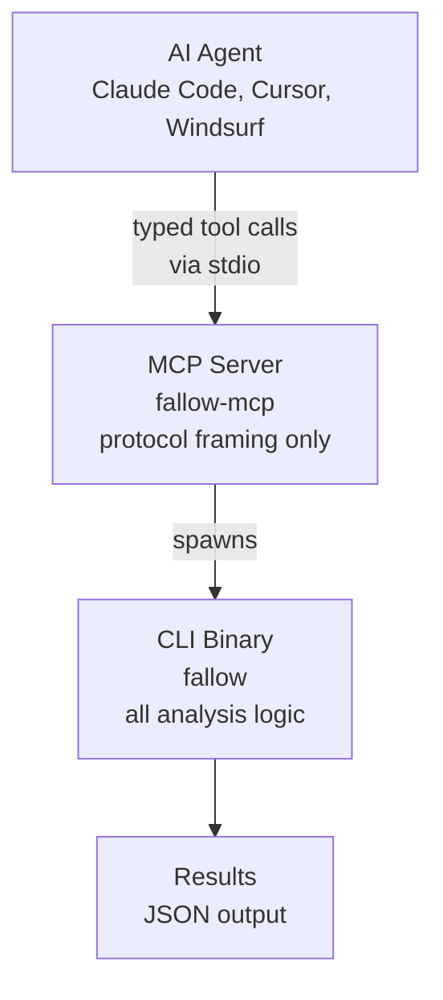

AI coding agents generate code at scale, but they don't perform static analysis. Building a module graph, tracing re-export chains through barrel files, finding unused exports across thousands of files: these require a dedicated tool. Fallow provides deterministic, exhaustive static analysis that agents call via CLI or MCP.

<Info>
  Every agent that can run shell commands can use fallow. The CLI is the primary interface. MCP is an optional structured layer on top.
</Info>

## Why agents need fallow

Static analysis means building and traversing a graph, not reading files in a context window. Here's what that looks like in practice:

| What agents can't do | What fallow does |
|:---------------------|:-----------------|
| Build a complete module graph across 5,000+ files | Builds the full graph in ~200ms |
| Track re-export chains through barrel files | Resolves `export *` chains through unlimited levels |
| Know if an export is used somewhere outside their context window | Exhaustively checks every import in the entire codebase |
| Detect code duplication across files they haven't seen | Suffix array algorithm catches clones across all files |
| Determine which `package.json` dependencies are actually unused | Traces imports and script binaries to actual usage |
| Guarantee completeness (no missed files, no false negatives) | Deterministic: same input always produces same output |

<Info>
  Even with an infinite context window, an LLM reading files one by one can't replicate what a graph traversal algorithm does. The issue isn't context size. Static analysis is an algorithmic problem, not a comprehension problem.
</Info>

## CLI: the primary agent interface

Every AI coding agent can run shell commands. No MCP required:

```bash
# Full dead code analysis with JSON output
fallow dead-code --format json

# Only check changed files (great for agent PR workflows)
fallow dead-code --changed-since main --format json

# Find code duplication
fallow dupes --format json

# Preview what auto-fix would remove
fallow fix --dry-run --format json

# Apply fixes (agents should use --yes to skip confirmation)
fallow fix --yes --format json

# List project info (plugins, entry points, file count)
fallow list --format json
```

<Tip>
  Always use `--format json` when agents run fallow. JSON output is structured, machine-readable, and easy for LLMs to parse. The human-readable format works too, but JSON eliminates parsing ambiguity.
</Tip>

### Agent workflow examples

**After generating code:**
```bash
# Agent generates a new feature, commits, then checks its own work
fallow dead-code --changed-since main --format json
# → finds that the old utility file is now unused
# → agent removes it
```

**Codebase cleanup:**
```bash
# Agent is asked to clean up dead code
fallow dead-code --format json
# → returns 401 issues: unused files, exports, dependencies
fallow fix --yes --format json
# → auto-removes unused exports and dependencies
# Agent then deletes unused files from the JSON output
```

**Before a PR:**
```bash
# Agent verifies its changes don't introduce dead code
fallow dead-code --changed-since main --format json
# → clean: no new issues introduced
```

## MCP: structured tool calling

For agents that support <Tooltip tip="An open standard that lets AI agents call external tools through structured, typed interfaces">[MCP (Model Context Protocol)](https://modelcontextprotocol.io)</Tooltip>, `fallow-mcp` exposes analysis as structured tools. Agents get typed inputs and outputs instead of parsing CLI text.

The MCP server uses <Tooltip tip="Communication via standard input/output streams between parent and child processes">stdio transport</Tooltip> and wraps the `fallow` CLI binary. Set the `FALLOW_BIN` environment variable to point to the fallow binary (defaults to `fallow` in `PATH`).

<Tabs>
  <Tab title="Claude Code">
    Add to your `.claude/settings.json`:

    ```json
    {
      "mcpServers": {
        "fallow": {
          "command": "fallow-mcp"
        }
      }
    }
    ```
  </Tab>
  <Tab title="Cursor">
    Add to your Cursor MCP settings:

    ```json
    {
      "mcpServers": {
        "fallow": {
          "command": "fallow-mcp"
        }
      }
    }
    ```
  </Tab>
  <Tab title="Other MCP clients">
    Any MCP-compatible client can connect to `fallow-mcp`. The server uses stdio transport:

    ```bash
    # Start the MCP server directly
    fallow-mcp

    # With a custom fallow binary path
    FALLOW_BIN=/usr/local/bin/fallow fallow-mcp
    ```

    Configure your client to launch `fallow-mcp` as a stdio subprocess.
  </Tab>
</Tabs>

### Available MCP tools

| Tool | Description |
|:-----|:------------|
| `analyze` | Full dead code analysis (`fallow dead-code --format json`) |
| `check_changed` | Incremental analysis of changed files (`fallow dead-code --changed-since`) |
| `find_dupes` | Code duplication detection (`fallow dupes --format json`) |
| `fix_preview` | Dry-run auto-fix preview (`fallow fix --dry-run --format json`) |
| `fix_apply` | Apply auto-fixes (`fallow fix --yes --format json`) |
| `check_health` | Complexity metrics, file health scores, hotspots, and refactoring targets (`fallow health --format json`). Set `file_scores: true` for maintainability index, `hotspots: true` for churn analysis, `targets: true` for ranked recommendations sorted by efficiency. |
| `project_info` | Project metadata, including plugins, files, and entry points (`fallow list --format json`) |

<CodeGroup>
```json Example request
{
  "tool": "analyze",
  "arguments": {
    "production": true,
    "issue_types": ["unused-exports", "unused-files"]
  }
}
```

```json Example response
{
  "schema_version": 3,
  "version": "2.2.2",
  "elapsed_ms": 42,
  "total_issues": 1,
  "unused_exports": [
    {
      "path": "src/utils/format.ts",
      "export_name": "formatCurrency",
      "is_type_only": false,
      "line": 12,
      "col": 0,
      "span_start": 280,
      "is_re_export": false
    }
  ]
}
```
</CodeGroup>

<Tip>
The MCP server wraps the CLI, so all fallow features are available: production mode, baselines, and incremental analysis.
</Tip>

## Combined output from bare `fallow`

Running bare `fallow` (no subcommand) executes all analyses in one pass and returns a combined JSON object with `dead_code`, `duplication`, and `health` sections:

```bash
fallow --format json
```

This is the most efficient way for agents to get a full picture of the codebase in a single call. The combined output includes all issue types from dead code, duplication findings, and health metrics.

## CLI vs MCP: when to use which

| | CLI | MCP |
|:--|:---|:----|
| **Works with** | Any agent that can run shell commands | Agents with MCP support |
| **Setup** | None (just install fallow) | MCP server configuration needed |
| **Output** | Any format (JSON, SARIF, human, compact, markdown) | JSON only (structured) |
| **Best for** | Universal compatibility, CI-like workflows | Typed tool calling, agent frameworks |

## Architecture

The MCP server is a thin subprocess wrapper. All analysis logic stays in the CLI binary. The MCP crate only handles protocol framing and argument mapping, built with `rmcp` (Rust MCP SDK).



- CLI and MCP always produce identical results
- Any fallow CLI update automatically improves MCP
- Install with `cargo install fallow-mcp` or grab a binary from [GitHub Releases](https://github.com/fallow-rs/fallow/releases)

## See also

<CardGroup cols={2}>
  <Card title="Agent Skills" icon="wand-magic-sparkles" href="/integrations/agent-skills">
    Install fallow skills for Claude Code, Cursor, Windsurf, and more.
  </Card>
  <Card title="CI integration" icon="shield-check" href="/integrations/ci">
    Catch what agents and humans miss in CI.
  </Card>
  <Card title="VS Code extension" icon="window" href="/integrations/vscode">
    Real-time feedback for human developers.
  </Card>
  <Card title="Dead code analysis" icon="skull-crossbones" href="/analysis/dead-code">
    Learn about the 13 issue types fallow detects.
  </Card>
</CardGroup>
